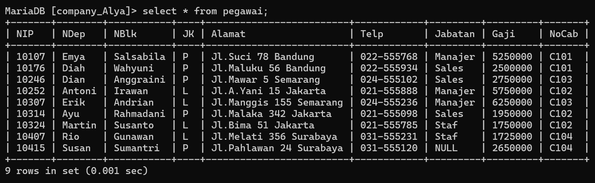
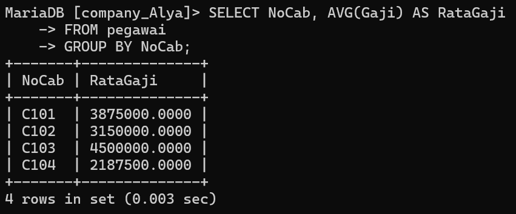

___

| No  | Nama                 | Skor Keaktifan | Peran                                                    |
| --- | -------------------- | -------------- | -------------------------------------------------------- |
| 1   | Rezky Awalya         | 3              | Menyiapkan basecamp, post praktikum                      |
| 2   | A. Ashadelah M.A     | 3              | kerja PPT                                                |
| 3   | Fatsa Akhwani        | 3              | mencari soal,  beli gorengan                             |
| 4   | Nur Afni Ramadani    | 3              | mencari soal, menghapus repository yang tidak dibutuhkan |
| 5   | Nur Inayah Athaillah | 3              | Memilah" soal yang akan di masukkan ke ppt               |
| 6   | Siti Nur Hasiza.A    | 3              | bikin github kelompok                                    |

# Praktikum 5
# Struktur Table


# Tabel Pegawai


# Query 1
## Contoh Query

```sql
SELECT COUNT(NIP) AS JumlahPegawai, COUNT(Jabatan) AS JumlahJabatan FROM pegawai;
```
## Hasil

## Analisis 
- `SELECT` : Untuk memilih kolom apa saja yang ingin dipilih (untuk dihitung)
- `COUNT(NIP)` : Untuk menghitung jumlah barisan data yang mempunyai isi data dari kolom yang dipilih. `NIP` adalah nama kolom yang dipilih untuk dihitung 
- `AS` : Untuk mengubah nama dari suatu kolom untuk sementara 
- "JumlahPegawai" : merupakan nama ubahan dari perintah AS yang digunakan merupakan nama sementara dari perintah `COUNT(NIP)`
- `COUNT(jabatan)` : untuk menghitung jumlah barisan data yang mempunyai isi data dari kolom yang dipilih `jabatan` adalah nama kolom yang dipilih untuk dihitung
- `AS` : Untuk mengubah nama dari suatu kolom untuk sementara 
- "JumlahJabatan" : merupakan nama sementara dari perintah `COUNT(jabatan)`
- `FROM` "pegawai2" : merupakan dari tabel mana datanya yang digunakan "pegawai2" adalah nama tabel yang datanya ingin digunakan
- Hasilnya : karena ada 9 barisan data, yang ingin dihitung adalah kolom `NIP`, jumlah dari kolom `NIP` (isi datanya) ada 9, ditampilkan sebagai "JumlahPegawai". Kolom "jabatan" juga dihitung, akan tetapi ada satu data yang berisi `NULL`(kosong) oleh karena itu hanya ada 8 data ditampilkan sebagai "JumlahJabatan"
---
# Query 2
## Contoh query
```sql
	SELECT COUNT(NIP) AS JumlahPegawai
    -> FROM pegawai
    -> WHERE NoCab = 'C102';
```
## Hasil

## Analisis 
 - `SELECT` = untuk memilih kolom mana saja yang ingin dipilih untuk dihitung.
 - `COUNT(NIP)` = untuk menghitung jumlah barisan data  yang mempunyai data dari kolom yang dipilih.
 - `NIP` adalah nama kolom yang dipilih untuk dihitung.
 - `AS` = untuk mengubah nama dari suatu kolom sementara.
 - `JumlahPegawai` = nama sementara yang dipilih untuk kolom COUNT(NIP)
 - `FROM pegawai` = dari tabel mana datanya akan digunakan. Pegawai adalah nama tabel yang dipilih untuk digunakan.
 - `WHERE` = merupakan kondisi yang harus dipenuhi agar datanya dapat dihitung dengan query COUNT(NIP).
 - `NoCab = 'C102'` = adalah kondisi dari where yang harus dipenuhi, jadi hanya barisan data yang memiliki 'C102' di kolom "NoCab" yang bisa dihitung.
 - `Hasilnya` = di 9 barisan data yang ada pada tabel pegawai, kita ingin menghitung jumlah barisan data yang memiliki nilai 'C102' pada kolom "Nocab"nya dengan menggunakan COUNT. Jadi yang muncul adalah 3 barisan data. Kita juga ingin mengubah nama dari kolom hasil perintah COUNT secara sementara dengan perintah AS namanya adalah JumlahPegawai.
 
# Query 3
## Contoh query
```sql
	SELECT NoCab, COUNT(NIP) AS Jumlah_Pegawai
    -> FROM pegawai
    -> GROUP BY NoCab;
```
## Hasil

## Analisis 
- `SELECT` = untuk memilih kolom mana saja yang ingin dihitung atau ditampilkan.
- `NoCab` = merupakan nama kolom yang ingin ditampilkan.
- `COUNT(NIP)` = untuk menghitung jumlah barisan data yang mempunyai isi data dari kolom yang dipilih. Nip adalah nama kolom yang ingin dipilih untuk dihitung.
- `AS` = untuk mengubah nama dari suatu kolom untuk sementara.
- `Jumlah_Pegawai` = merupakan nama sementara dari kolom hasil COUNT(NIP).
- `FROM pegawai` = dari tabel mana yang data kodomnya ingin digunakan. Pegawai adalah nama tabel yang dipilih untuk digunakan.
- `GROUP BY` = untuk mengelompokkan data berdasarkan nilai data yang telah ditentuka Pada kolom yang dipilih.
- `NoCab` = nama kolom Yang dipilih untuk datanya dikelompokkan.
- `Hasilnya` = Berdasarkan 9 barisan data, masing-masing nilai dalam kolom Nocab dikelompokkan berdasarkan nilainya sendiri. Jadi Nocab clol bersama Nocab yang nilai nya sama Yaitu clol. Jadi Nocab Yang memiliki C101 ada 2, C102 ada 3, C103 ada 2, C104 ada 2. Total semuanya 9, sesuai densan Jumlah barisan data Yand ada. Adapun nama dari kolom hasil Yaitu Jumlah-Pegawai dari Perintah AS.
# Query 4
## Contoh query 
```sql
	SELECT NoCab, COUNT(NIP) AS Jumlah_Pegawai 
	-> FROM pegawai 
	-> GROUP BY NoCab HAVING COUNT(NIP) >= 3;
```
## Hasil

## Analisis 
- `SELECT` = untuk memilih kolom mana saja yang ingin dihitung atau ditampilkan.
- `NoCab` = merupakan nama kolom yang ingin ditampilkan.
- `COUNT(NIP)` = untuk menghitung Jumlah barisan data yang mempunyai isi data dari kolom Yang dipilih.NIP adalah nama kolom Yang dipilih untuk dihitung.
- `AS` = untuk mengubah nama dari suatu kolom untuk sementara.
- `Jumlah_Pegawai` = nama sementara dati kolom hasil COUNT (NIP).
- `FROM pegawai` = untuk memilih dari tabel mana Yand duta kolomnya ingin digunakan.Pegawai adalah nama tabel Xang dipilih untuk digunakan.
- `GROUP BY` = untuk menjelompokkan data berdasarkan nilai data Yang telah ditentukan Pada kolom Yang dipilih.
- `NoCab` = nama kolom Yang dipilih untuk dikelompokkan datanya.
- `HAVING` = untuk menentukan kondisi (Yand hans dipenuti) oleh suatu kelompok data agar bisa ditampilkun.
- `COUNT(NIP) >= 3` = merupakan kondisi Yand harus dipenuhi oleh suatu kelompor data. Jadi hanya kelompok data Yang hasil hitungannya lebih atau Sama dengan 3.
- `Hasilnya` seperti sebelumnya, ada 9 barisan data dibagi sesuai Nocab nya masing- -masing. Namun Yand ingin ditampilkan adalah hasil hitungan yang lebih dari atau sama dengan 3. Yaitu NoCab C102 Yang ada 3. Yand Jain C101 ada 2, C103 ada 2, C104 ada 2.
# Query 5
## Contoh Query
```sql
	SELECT SUM(Gaji) AS Total_Gaji
  -> FROM pegawai;
```
## Hasil

## Analisis
- `SELECT` = Untuk memilih kolom mana saja yang dipilih untuk dijumlahkan. 
- `SUM(Gaji)` = Untuk menghitung jumlah data (khusus angka) pada kolom yang harus dipilh. Gaji merupakan nama kolom yang dipilih untuk dihitung jumlah isi datanya. 
- `AS` = Untuk mengganti nama dari kolom hasil SUM(Gaji) untuk sementara. 
- `Total_Gaji` = Merupakan nama sementara dari perintah AS. 
- `FROM pegawai` = Untuk memilih dari table mana yang kolom datanya akan digunakan. Pegawai adalah nama dari table yang dipilih. 
- `Hasilnya` = kolom Gaji yang isi datanya berupa angka-angka, semuanya dijumlahkan menjadi satu seperti ditotalkan (sama seperti matematika pada umumnya). Dan hasilnya adalah 30575000. Adapun nama kolom dari hasil jumlah tersebut diubah dari SUM(Gaji) menjadi Total_Gaji.
# Query 6
## Contoh Query
```sql
	SELECT SUM(Gaji) AS Gaji_Manager 
	FROM pegawai 
	WHERE Jabatan = 'Manajer';
```
## Hasil

## Analisis
- `SELECT` = untuk memiliki kolom mana saja yang dipilih untuk digunakan.
- `SUM` = untuk menghitung jumlah isi data (khusus angka) pada kolom yang dipilih. gaji yang dipilih untuk dijumlahkan isi datanya.
- `AS` = mengganti nama dari kolom hasil SUM(Gaji) secara sementara.
- `Gaji_Manajer` = mengubah nama sementara dari perintah AS.
- `FROM pegawai` = untuk memilih dari tabel mana yang kolom datanya akan digunakan pegawai adalah nama dari tabel yang dipilih.
- `WHERE` = kondisi yang harus dipenuhi oleh suatu kolom agar datanya bisa dijumlah
- `Jabatan= 'Manajer' ` = merupakan kondisi dari WHERE. hanya barisan data yang kolom Gaji-nya bisa dijumlahkan.
- `Hasilnya` = barisan data yang kolom jumlahnya berisi manager akan dijumlah kolom Gaji-nya menjadi 17.250.000. jadi hanya beberapa kolom saja yang dijumlah.
# Query 7
## Contoh Query
```sql
	SELECT NoCab, SUM(Gaji) TotalGaji
  ->FROM pegawai
  ->GROUP BY NoCab;
```
## Hasil

## Analisis
- `SELECT` = untuk memilih kolom mana saja yang dipilih untuk ditampilkan atau dijumlahkan.
- `SUM(Gaji)` = untuk menghitung jumlah data (khusus angka) pada kolom yang dipilih. Gaji adalah nama kolom yang dipilih untuk dijumlahkan isi datanya.
- `AS = untuk mengganti nama dari kolom hasil SUM(Gaji) untuk sementara.
- `TotalGaji` = merupakan nama sementara dari perintah AS.
- `FROM pegawai` = untuk memilih dari tabel mana yang data kolomnya akan digunakan. pegawai adalah nama tabel yang dipilh.
- `GROUP BY` = untuk mengelompokkan data berdasarkan nilai data yang telah ditentukan pada kolo yang dipilih.
- `NoCab` = nama kolom yang datanya dipilih untuk dikelompokkan.
- `Hasilnya` = jadi berdasarkan kolom NoCab, barisan data yang kolom NoCab-nya berisi C102 maka kolom gaji dari barisan data itu digunakan bersama barisan data yang meiliki NoCab C101 juga. maka kolom gaji dijumlahkan sesuai dengan kolom NOCab masing-masing, mulai dari C101 memiliki 2 kolom gaji yang bisa dijumlahkan. sama denfan C103 dand C104. adapun C102 memiliki 3 kolom Gaji yanf dapat dijumlahkan. TotalGaji merupakan hasil perintah dari AS untuk mengubah nama kolom gasil dari SUM(Gaji).
# Query 8
## Contoh Query
```mysql
	SELECT NoCab, SUM(Gaji) AS Total_Gaji 
	-> FROM pegawai 
	-> GROUP BY NoCab HAVING SUM(Gaji) >= 8000000;
```
## Hasil

## Analisis
- `SELECT` = untuk memilih kolom mana saja yang dipilih untuk di tampilkan atau di jumlah.
- `NoCab` = nama kolom yang dipilih untuk ditampilkan.
- `SUM(Gaji)` = untuk menghitung jumlah data (Khusus Angka) pada kolom yang dipilih.Gaji adalah nama kolom yang dipilih untuk dijumlahkan isi datanya.
- `AS` = untuk mengganti nama dari SUM(Gaji) untuk sementara.
- `Total_Gaji` = adalah nama sementara dari perintah AS.
- `FROM pegawai` = untuk memilih dari tabel mana yang data kolomnya akan di gunakan, Pegawai Adalah Nama Tabel Yang akan di pilih.
- `GROUP BY` = untuk mengelompokkan data berdasarkan nilai data Yang telah ditentukan Pada kolom yang dipilih.
- `NoCab` = nama kolom Yang dipilih untuk datanya dikelompokkan.
- `HAVING` = kondisi yang harus dipenuhi oleh suatu kelompok data agar bisa ditampilkan. 
- `SUM (Gaji) >= 800000` = kondisi dari HAVING, Hasil dari Penjumlahan Gai yang hanya bisa ditampilkan adalah Hasil yang lebih dari atau sama dengan 8000000.
- `Hasilnya` = Sama seperti sebelumnya, tetapi Nocab Yang memenuhi kondisi tersebut hanyalah C102 dan C103 karena hasil Jumlah kolom Gaji nya lebih dari atau sama dengan 8000000. Adapun hasil kolom Sum(Gaji) diganti Jadi Total_Gaji.
___
# Query 9
## Contoh Query
```sql
SELECT AVG(Gaji) AS Rata_rata 
FROM pegawai;
```
## Hasil

## Analisis
- `SELECT` = untuk memilih kolom mana data Yang dipilih untuk ditampilkan.
- `AVG(Gaji)` = untuk menghitung rata-rata dari data yang ada Pada kolom Yang dipilih. Gaji adalah nama kolom Yang dipilih untuk dihitung rata-ratanya.
- `AS` = untuk mengganti nama dari kolom hasil AVG (Gaji) untuk sementara.
- `Rata-rata` =nama sementara dari Perintah AS.
- `FROM pegawai` = untuk memilih dari tabel mana Yang data kolomnya ingin digunakan
- `pegawai` = adalah nama dari tabel yang dipilih.
- `Hasilnya` = 3397222.2222 merupakan hasil rata-rata dari semua 9 barisan data Pada kolom Gaji. Adapun nama kolom hasil dari AVG (Gaji) Yaitu Rata-rata
___
# Query 10
## Contoh Query
```sql
	SELECT AVG(Gaji) AS GajiRataMgr 
	-> FROM pegawai 
	-> WHERE Jabatan = 'Manajer';
```
## Hasil

## Analisis
- `SELECT` = untuk memilih kolom mana saja yang dipilih untuk ditampilkan.
- `AVG (Gaji)` = untuk menghitung rata-rata dari data yang ada pada kolom Yang dipilih. Gaji adalah nama kolom Yang dipilih untuk dihitung rata-ratanya.
- `AS` = untuk mengganti nama dari kolom hasil AVG (Gaji) untuk sementara.
- `GajiRataManager` = nama sementara dari Perintah AS.
- `FROM pegawai` = untuk memilih dari tabel mana Yang data kolomnya ingin Pegawai adalah nama dari tabel Yang diingin digunakan.
- `WHERE =` Kondisi yang harus dipenuhi oleh suatu kolom agar datanya bisa dihitung rata-ratanya
- `(Jabatan = 'Manajer')` = kondisi dari WHERE. Barisan data yang kolom Jabatannya Manajer akan dihitung rata-rata kolom Gaji nya.
- `Hasilnya` = 5750000.0000 merupakan hasil hitung rata-rata dari barisan data yang memiliki manajer di kolom Jabatan nya,dari situ kolom Gajinya di hitung.
___
# Query 11
## Contoh Query 
```mysql
	SELECT NoCab, AVG(Gaji) AS RataGaji
	-> FROM pegawai 
	-> GROUP BY NoCab;
```
## Hasil

## Analisis 
- `SELECT` untuk memilih kolom mana saja yang dipilih untuk ditampilkan/dihitung.
- `NoCab` kolom yang dipilih untuk ditampilkan.
- `AVG(Gaji)` untuk menghitung rata-rata dari data yang ada pada kolom yang dipilih. `Gaji` adalah nama kolom yang dipilih untuk dihitung rata-ratanya.
- `AS` untuk mengganti nama dari kolom hasil `AVG(Gaji)` untuk sementara.
- `RataGaji` adalah nama sementara dari perintah `AS`.
- `FROM pegawai` untuk memilih dari tabel mana yang data kolomnya ingin digunakan. Pegawai adalah nama dari tabel yang dipilih.
- `GROUP BY` untuk mengelompokkan data berdasarkan nilai data yang telah ditentukan pada kolom yang dipilih.
- `NoCab` nama kolom yang dipilih untuk datanya dikelompokkan.
- `hasilnya` hampir sama seperti no.7 masing-masing kolom NoCab dihitung rata-ratanya. Sesuai dengan isi NoCab,jadi yang `C101` dihitung dengan `C101` yang lainnya juga (yang sama) adapun RataGaji merupakan nama sementara dari kolom hasil `AVG(Gaji)`.
---
# Query 12
## Contoh Query 
```mysql
	SELECT NoCab, AVG(Gaji) AS RataGaji 
	-> FROM pegawai 
	-> GROUP BY NoCab HAVING NoCab = 'C101' OR NoCab = 'C102';
```
## Hasil

## Analisis 
- `SELECT` untuk memilih kolom mana saja yang dipilih untuk ditampilkan/dihitung.
- `NoCab` kolom yang dipilih untuk ditampilkan.
- `AVG(Gaji)` untuk menghitung rata-rata dari data yang ada pada kolom yang dipilih. `Gaji` adalah nama kolom yang dipilih untuk dihitung rata-ratanya.
- `AS` untuk mengganti nama dari kolom hasil `AVG(Gaji)` untuk sementara.
- `RataGaji` adalah nama sementara dari perintah `AS`.
- `FROM pegawai` untuk memilih dari tabel mana yang data kolomnya ingin digunakan. Pegawai adalah nama dari tabel yang dipilih.
- `GROUP BY` untuk mengelompokkan data berdasarkan nilai data yang telah ditentukan pada kolom yang dipilih.
- `NoCab` nama kolom yang dipilih untuk datanya dikelompokkan.
- `HAVING` kondisi yang harus dipenuhi oleh suatu kelompok data.
- `NocCab = 'C101' OR NoCab = 'C102'` merupakan kondisi dari HAVING. Jadi kolom NoCab yang memiliki C101 atau C102 yang hanya akan ditampilkan OR adalah kondisi yang hanya salah satu datanya yang harus dipenuhi.
---
# Query 13
## Contoh Query 
```mysql
	SELECT MAX(Gaji) AS GajitTerbesar, MIN(Gaji) AS GajiTerkecil 
	-> FROM pegawai;
```
## Hasil

## Analisis 
- `SELECT` untuk memilih kolom mana saja yang dipilih untuk ditampilkan/dihitung.
- `MAX(Gaji)` untuk menampilkan nilai maksimum atau terbesar/tertinggi dari suatu data dalam kolom yang dipilih. Gaji adalah nama kolom yang dipilih.
- `AS GajiTerbesar` untuk mengganti nama dari kolom hasil MAX(Gaji) menjadi nama sementaranya yaitu gajiterbesar.
- `MIN(Gaji)` untuk menampilkan nilai minimum atau terkecil/terendah dari suatu data dalam kolom yang dipilih. Gaji adalah nama kolom yang dipilih.
- `AS GajiTerkecil` untuk mengganti nama dari kolom hasil MIN(Gaji) menjadi "GajiTerkecil" untuk sementara.
- `FROM pegawai` untuk memilih dari tabel mana yang data kolomnya ingin digunakan. Pegawai adalah nama dari tabel yang dipilih.
- `hasilnya` jadi dari 9 nilai yang ada di kolom gaji,gaji maksimumnya adalah `6250000` dan namanya diubah menjadi GajiTerbesar, bagi minimumnya adalah `1725000` dan namanya diubah menjadi GajiTerkecil.
---
# Query 14
## Contoh Query
```sql
	SELECT MAX(Gaji) AS GajiTerbesar, MIN(Gaji) AS GajiTerkecil
	-> FROM pegawai
	-> WHERE Jabatan = 'Manajer';
```
## Hasil

## Analisis
- `SELECT`= Untuk memilih kolom nama mana saja yang dipilih untuk ditampilkan l.
- `MAX(Gaji)`= Untuk menampilkan nilai terbesar dari suatu data dalam kolom yang dipilih. Gaji  adalah nama kolom yang dipilih.
- `AS GajiTerbesar`= Untuk Menganti nama dari kolom hasil `MAX(Gaji)` menjadi `GajiTerbesar` untuk sementara.
- `MIN(Gaji)`= Untuk menampilkan nilai terkecil dari suatu data dalam kolom yang dipilih. Gaji adalah nama kolom yang dipilih.
- `AS GajiTerkecil`= Untuk Menganti nama dari kolom hasil `MIN(Gaji)` menjadi `GajiTerkecil` untuk sementara.
- `FROM pegawai`= Untuk memilih dari tabel mana yang data kolomnya ingin ditampilkan.
- `WHERE`= Kondisi yang harus dipenuhi oleh suatu kolom data agar bisa ditampilkan.
- `(Jabatan = "Manajer")`= Kondisi dari `WHERE` yang harus dipenuhi. Barisan data yang kolom jabatannya berisi manajer akan ditampilkan kolom Gajinya.
- **Hasilnya** = Jabatan Manajer yang memiliki nilai maksimum adalah 6250000 kolom hasil `MAX`nya diubah jadi `GajiTerbesar`.  
  Sedangkan nilai minimumnya adalah 5250000 kolom hasil `MIN`nya diubah jadi `GajiTerkecil`
---
# Query 15
## Contoh Query
```sql
	SELECT NoCab, MAX(Gaji) AS GajiTerbesar, MIN(Gaji) AS GajiTerkecil
	-> FROM pegawai
	-> GROUP BY NoCab;
```
## Hasil

## Analisis
- `SELECT`= Untuk memilih kolom nama mana saja yang dipilih untuk ditampilkan.
- `NoCab`= Nama kolom yang ingin ditampilkan.
- `MAX(Gaji)`= Untuk menampilkan nilai terbesar dari suatu data dalam kolom yang dipilih. Gaji  adalah nama kolom yang dipilih.
- `AS GajiTerbesar`= Untuk Menganti nama dari kolom hasil `MAX(Gaji)` menjadi `GajiTerbesar` untuk sementara.
- `MIN(Gaji)`= Untuk menampilkan nilai terkecil dari suatu data dalam kolom yang dipilih. Gaji adalah nama kolom yang dipilih.
- `AS GajiTerkecil`= Untuk Menganti nama dari kolom hasil `MIN(Gaji)` menjadi `GajiTerkecil` untuk sementara.
- `FROM pegawai`= Untuk memilih dari tabel mana yang data kolomnya ingin ditampilkan.
- `GROUP BY`= Untuk mengelompokkan data berdasarkan nilai data yang telah ditentukan pada kolom yang dipilih.
- `NoCab`= Nama kolom yang ingin dikelompokkan.
- **Hasilnya** = Masing-masing `NoCab` dicari nilai maksimum dan minimumnya. Mulai dari "C101, C102, C103, C104" dan nama hasil kolomnya diubah menjadi `GajiTerbesar` dan `GajiTerkecil`.
---
# Query 16
## Contoh Query
```sql
	SELECT NoCab, MAX(Gaji) AS GajiTerbesar, MIN(Gaji) AS GajiTerkecil
	-> FROM pegawai
	-> GROUP BY NoCab HAVING COUNT(NIP) >= 3;
```
## Hasil

## Analisis
- `SELECT`= Untuk memilih kolom nama mana saja yang dipilih untuk ditampilkan.
- `NoCab`= Nama kolom yang ingin ditampilkan.
- `MAX(Gaji)`= Untuk menampilkan nilai terbesar dari suatu data dalam kolom yang dipilih. Gaji  adalah nama kolom yang dipilih.
- `AS GajiTerbesar`= Untuk Menganti nama dari kolom hasil `MAX(Gaji)` menjadi `GajiTerbesar` untuk sementara.
- `MIN(Gaji)`= Untuk menampilkan nilai terkecil dari suatu data dalam kolom yang dipilih. Gaji adalah nama kolom yang dipilih.
- `AS GajiTerkecil`= Untuk Menganti nama dari kolom hasil `MIN(Gaji)` menjadi `GajiTerkecil` untuk sementara.
- `FROM pegawai`= Untuk memilih dari tabel mana yang data kolomnya ingin ditampilkan.
- `GROUP BY`= Untuk mengelompokkan data berdasarkan nilai data yang telah ditentukan pada kolom yang dipilih.
- `NoCab`= Nama kolom yang ingin dikelompokkan.
- `HAVING`= Kondisi yang harus dipenuhi oleh suatu kelompok data.
- `(COUNT(NIP) >= 3`= Kondisi dari `HAVING` hanya hasil hitung kolom `NIP` yang lebih dari atau sama dengan 3 yang muncul.
- **Hasilnya** = Seperti no.4, yang mempunyai hasil hitung lebih dari atau sama dengan 3 adalah `NoCab C102`. Jadi hanya itu yang dicari nilai maksimum dan minimumnya pada kolom `Gaji`.
---
# Query 17
## Contoh Query
```Sql
	SELECT COUNT(NIP) AS JumlahPegawai, SUM(Gaji) AS totalGaji,
    -> AVG(Gaji) AS RataGaji, MAX(Gaji) AS GajiMaks, MIN(Gaji) AS GajiMin
    -> FROM pegawai;
```
## Hasil

## Analisis
- `Select`= untuk memilih kolom mana saja yang dipilih untuk di tampilkan. 
- `COUNT(NIP)` = untuk menghitung jumlah barisan data yang ada pada kolom yang dipilih. 
- `AS JumlahPegawai`= untuk mengganti nama kolom hasil `COUNT(NIP)` menjadi Jumlah `Pegawai`. 
- `SUM(Gaji)`= untuk Menjumlah data yang ada pada kolom yang dipilih. `Gaji` adalah kolom yang dipilih. 
- `AS TotalGaji`= untuk mengganti nama kolom hasil `sum(gaji)` menjadi total `Gaji`. 
- `AVG(Gaji)`= untuk menghitung rata-ratanya suatu data dalam kolom yang dipilih. `Gaji` adalah nama kolom yang dipilih untuk dihitung. 
- `AS RataGaji`= untuk mengganti nama kolom hasil `AVG(Gaji)` menjadi `RataGaji`. 
- `MAX(Gaji)`= untuk menampilkan nilai terbesar dari suatu data dalam kolom yang dipilih `Gaji` adalah nama kolom yang dipilih. 
- `AS Gajimaks`= untuk menampilkan nama dari kolom hasil `MAX(Gaji)` menjadi `Gajimaks` untuk sementara. 
- `MIN(Gaji)`= untuk menampilkan nilai terkecil dari suatu kolom yang dipilih Gaji nama kolom yang dipilih. 
- `AS Gaji min`= untuk mengganti nama dari kolom hasil `min(gaji)` menjadi Gajimin untuk sementara. 
- `From Pegawai`= untuk memilih tabel mana yang dipilih untuk ditampilkan pegawai adalah nama tabel yang dipilih. 
- Hasil Dihitung berapa `NIP`, dijumlahkan semua data pada kolom `Gaji`, Dihitung Rata-Rata dari kolom `Gaji`, Ditampilkan Nilai terbesar pada kolom `Gaji`, dan nilai terkecil dalam kolom `Gaji`. 
___
# Query 18
## Contoh Query
```sql
    SELECT COUNT(NIP) AS JumlahPegawai, SUM(Gaji) AS TotalGaji,
    -> AVG(Gaji) AS RataGaji, MAX(Gaji) AS GajiMaks, MIN(Gaji) AS GajiMin
    -> FROM pegawai
    -> WHERE Jabatan = 'Staf' OR Jabatan = 'Sales'
    -> GROUP BY NoCab HAVING SUM(Gaji) <= 2600000;
```
## Hasil 


## Analisis
- `Select`= untuk memilih kolom mana saja yang ingin digunakan. 
- `COUNT(NIP)`= untuk menghitung barisan data yang ada pada kolom yang dipilih. 
- `AS JumlahPegawai`= untuk mengganti nama dari kolom hasil `COUNT(NIP)` menjadi jumlah pegawai untuk sementara
- `SUM(Gaji) `= untuk Menjumlah data yang ada pada kolom yang dipilih. Gaji adalah nama kolom yang dipilih
- `AS TotalGaji`= untuk mengganti nama dari kolom hasil `Sum(Gaji)` menjadi `totalGaji` untuk sementara. 
- `AVG(Gaji) `= untuk menghitung Rata-Rata dari kolom yang di pilih. Gaji adalah nama kolom yang di pilih. 
-  `AS Rata_gaji`=  untuk  mengganti nama dari kolom `AVG(Gaji)` menjadi `ratagaji` untuk sementara.  
- `MAX(Gaji)`=  untuk menampilkan nilai terbesar dari suatu data dalam kolom yang dipilih. Gaji adalah nama kolom yang dipilih. 
- `AS Gajimaks`= untuk mengganti nama dari kolom `Max(Gaji)`menjadi `Gajimaks` sementara. 
- `MIN(Gaji)`= untuk menampilkan nilai minimum dari suatu data dalam kolom yang dipilih. Gaji adalah nama kolom yang dipilih. 
- `AS Gajimin`= untuk mengganti nama dari kolom `Min(Gaji)` menjadi `Gajimin` untuk sementara
- `From pegawai`= untuk memilih dari tabel mana yang datanya ingin digunakan Pegawai adalah nama tabel yang dipilih. 
- `Where`= kondisi yang harus dipenuhi oleh suatu kolom 
- `(jabatan = staf OR jabatan = sales)`= Kondisi dari `where`. 
- jadi hanya jabatan staf atau jabatan sales,  hanya salah satunya saja yang harus dipenuhi agar bisa tampil. OR (hanya salah satu kondisi yang harus dipenuhi)
- `GRUP BY`= untuk mengelompokkan data sesuai dengan kolom yang ingin di pilih 
- `Nocab`= nama kolom yang di pilih untuk dikelompokkan
- `HAVING`= kondisi yang harus dipenuhi oleh suatu kelompok data agar bisa di tampilkan
- `(Sum(Gaji)) <= 2.600.000)`= kondisi dari `Having`, hanya data yang hasil jumlah gajinya kurang dari atau sama dengan `2600000` yang bisa tampil
- `Hasilnya`= ada 2 barisan data yang memenuhi kondisi `<= 2600000` Adapun kondisi where yang juga dipenuhi oleh barisan data tersebut. Masing-masing namanya diubah sesuai Perintah `AS`. 

# GROUP BY & HAVING
## Tantangan 7 Nomor 
### 1.tampilkan jumlah data mobil dan kelompok kan berdasarkan warna nya sesuai dengan tabel mobil kalian.

#### Struktur Query
```sql
select nama_data,COUNT(nama_data) AS nama_sementara FROM nama_tabel GROUP BY nama_data;
```

#### Contoh Query
```sql
select warna,COUNT(id_mobil) AS Jumlah_Data_Mobil FROM daftar_mobil GROUP BY warna;
```

#### Hasil


#### Analisis
- `SELECT warna`: Memilih kolom warna dari tabel data_mobil.
- `COUNT(id_mobil) AS Jumlah_Data_Mobil`: Menghitung jumlah baris (mobil) untuk setiap warna unik dan memberi alias Jumlah_Data_Mobil pada hasil hitungan tersebut.
- `FROM daftar_mobil`: Menentukan tabel daftar_mobil sebagai sumber data.
- `GROUP BY warna`: Mengelompokkan hasil query berdasarkan nilai di kolom warna. Setiap nilai unik dalam kolom warna akan menjadi satu grup.

#### Kesimpulan
1. Mengelompokkan Data Berdasarkan Warna: Data dalam tabel daftar_mobil dikelompokkan berdasarkan kolom warna.
2. Menghitung Jumlah Mobil untuk Setiap Warna: Menggunakan fungsi COUNT(id_mobil) untuk menghitung jumlah mobil dalam setiap grup warna.
3. Memberikan Hasil yang Jelas: Hasil dari query ini menunjukkan jumlah mobil untuk setiap warna dalam tabel data_mobil, dengan kolom Jumlah_Data_Mobil menunjukkan hitungan tersebut.

### 2.berdasarkan query ini tampilkan yang lebih BESAR dari 3 atau sama dengan 3 pemilik mobil nya
#### Struktur Query
```sql
select nama_data,COUNT(nama_data) AS nama_sementara from nama_tabel GROUP BY nama_data HAVING COUNT(nama_data) >= 3;
```

#### Contoh Query
```sql
select pemilik,COUNT(id_mobil) AS jumlah_mobil from daftar_mobil GROUP BY pemilik HAVING COUNT(id_mobil) >= 3;
```

#### Hasil


#### Analisis
1. `SELECT Klausa pemilik` : Kolom ini dipilih dari tabel data_mobil. Kolom pemilik berisi data tentang pemilik mobil.
2. `COUNT(id_mobil) AS jumlah_mobil` : Fungsi agregat COUNT digunakan untuk menghitung jumlah baris dalam setiap grup yang memiliki pemilik yang sama. Hasil hitungan ini diberi alias jumlah_mobil, sehingga dalam hasil akhir, kolom ini akan diberi nama jumlah_mobil.
3. `FROM Klausa daftar_mobil` : Tabel ini merupakan sumber data dari query. Tabel ini diasumsikan berisi data mobil, termasuk kolom pemilik dan id_mobil.
4. `GROUP BY pemilik` : Pernyataan ini mengelompokkan baris-baris data berdasarkan nilai dalam kolom pemilik. Semua baris yang memiliki nilai pemilik yang sama akan dimasukkan ke dalam grup yang sama.
5. `HAVING COUNT(id_mobil) >= 3` : Pernyataan ini menyaring grup-grup yang terbentuk berdasarkan hasil agregat. Hanya grup yang memiliki jumlah baris (mobil) setidaknya 3 yang akan dimasukkan dalam hasil akhir. HAVING digunakan setelah pengelompokan data, berbeda dengan WHERE yang digunakan sebelum pengelompokan.

#### Kesimpulan
1. Mengelompokkan Data Berdasarkan Pemilik: Data dalam tabel daftar_mobil dikelompokkan berdasarkan kolom pemilik.
2. Menghitung Jumlah Mobil untuk Setiap Pemilik: Menggunakan fungsi COUNT(id_mobil) untuk menghitung jumlah mobil dalam setiap grup pemilik. Hasil hitungan ini diberi alias jumlah_mobil.
3. Menyaring Grup dengan Klausa HAVING: Menggunakan klausa HAVING untuk menyaring dan hanya menampilkan grup yang memiliki jumlah mobil (baris) setidaknya 3.

### 3.tampilkan semua pemilik dengan jumlah mobilnya yang memiliki atau sama dengan 3 mobil
#### Struktur Query
```sql
SELECT nama_data,COUNT(nama_data) AS nama_sementara FROM nama_tabel GROUP BY nama_data;
```

#### Contoh Query
```sql
SELECT pemilik, 
COUNT(id_mobil) AS jumlah_mobil 
FROM daftar_mobil GROUP BY pemilik;
```

#### Hasil


#### Analisis
- `SELECT` merupakan perintah SQL yang digunakan untuk memilih data dari database.
- `pemilik` adalah nama kolom yang akan diambil dari tabel `data_mobil`.
- `COUNT(id_mobil)` adalah fungsi yang digunakan untuk menghitung jumlah baris dalam kolom `id_mobil`.
- `AS jumlah_mobil` memberikan alias pada hasil perhitungan `COUNT(id_mobil)` sehingga hasilnya akan diberi nama `jumlah_mobil`.
- `FROM daftar_mobil` menentukan tabel `daftar_mobil` sebagai sumber data.
- `GROUP BY pemilik` mengelompokkan data berdasarkan kolom `pemilik` dan melakukan perhitungan `COUNT` untuk setiap kelompok.

#### Kesimpulan
Perintah SQL ini akan menghasilkan daftar pemilik mobil beserta jumlah mobil yang dimiliki oleh masing-masing pemilik. Hasil query akan menampilkan dua kolom: `pemilik` yang berisi nama pemilik, dan `jumlah_mobil` yang berisi jumlah mobil yang dimiliki oleh pemilik tersebut. Perintah `GROUP BY` memastikan bahwa perhitungan `COUNT(id_mobil)` dilakukan untuk setiap pemilik secara terpisah.

### 4.berdasarkan query yang ada pada praktikum 5 bagian 7 tampilkan data pada table mobil dengan mengelompokkan berdasarkan pemiliknya.hitung menggunakan sum total pendapatan pemilik berdasarkan harga rental
#### Struktur Query
```sql
select data 3,SUM(data 5) AS nama_sementara from nama_tabel GROUP BY data 3;
```

#### Contoh Query
```sql
select pemilik,SUM(harga_rental) AS jumlah_pendapatan from daftar_mobil GROUP BY pemilik;
```

#### Hasil


#### Analisis
- `SELECT` merupakan perintah yang digunakan untuk memilih data dari database.
- `pemilik` adalah nama kolom yang akan diambil dari tabel `data_mobil`.
- `SUM(harga_rental)` adalah fungsi yang digunakan untuk menghitung total nilai dari kolom `harga_rental`.
- `AS jumlah_pendapatan` memberikan alias pada hasil perhitungan `SUM(harga_rental)` sehingga hasilnya akan diberi nama `jumlah_pendapatan`.
- `FROM daftar_mobil` menentukan tabel `daftar_mobil` sebagai sumber data.
- `GROUP BY pemilik` mengelompokkan data berdasarkan kolom `pemilik` dan melakukan perhitungan `SUM` untuk setiap kelompok.

#### Kesimpulan
Perintah SQL ini akan menghasilkan daftar pemilik mobil beserta total pendapatan dari harga rental yang mereka miliki. Hasil query akan menampilkan dua kolom: `pemilik` yang berisi nama pemilik, dan `jumlah_pendapatan` yang berisi total pendapatan dari harga rental mobil untuk setiap pemilik.

### 5. Berdasarkan praktikum 5 query no 8 tampilkan jumlah pemasukan pemilik berdasarkan harga rental kelompokkan berdasarkan pemiliknya dan seleksi yang total pemasukannya atau harga rentalnya mencapai lebih besar atau sama dengan 300k
#### Struktur Query
```sql
select data_mobil,SUM(data_mobil) AS nama_sementara from nama_tabel GROUP BY data_mobil HAVING SUM(data_mobil) >= 300000;
```

#### Contoh Query
```sql
select pemilik,SUM(harga_rental) AS jumlah_pemasukan from daftar_mobil GROUP BY pemilik HAVING SUM(harga_rental) >= 300000;
```

#### Hasil


#### Analisis
- `SELECT` merupakan perintah yang digunakan untuk memilih data dari database.
- `pemilik` adalah nama kolom yang akan diambil dari tabel `daftar_mobil`.
- `SUM(harga_rental)` adalah fungsi yang digunakan untuk menghitung total nilai dari kolom `harga_rental`.
- `AS jumlah_pemasukan` memberikan alias pada hasil perhitungan `SUM(harga_rental)` sehingga hasilnya akan diberi nama `jumlah_pemasukan`.
- `FROM daftar_mobil` menentukan tabel `daftar_mobil` sebagai sumber data.
- `GROUP BY pemilik mengelompokkan data berdasarkan kolom `pemilik` dan melakukan perhitungan `SUM` untuk setiap kelompok.
- `HAVING SUM(harga_rental) >= 300000` merupakan klausa yang digunakan untuk menyaring kelompok hasil perhitungan `SUM(harga_rental)` yang nilainya lebih besar atau sama dengan 300000.

#### Kesimpulan
Perintah SQL ini akan menghasilkan daftar pemilik mobil beserta total pendapatan dari harga rental yang mereka miliki, tetapi hanya untuk pemilik yang total pendapatannya sama dengan atau lebih dari 300000. Hasil query akan menampilkan dua kolom: `pemilik` yang berisi nama pemilik, dan `jumlah_pemasukan` yang berisi total pendapatan dari harga rental mobil untuk setiap pemilik yang memenuhi kriteria `HAVING` tersebut.

### 6. Berdasarkan praktikum 6 no 12 tampilkan rata rata pemasukan pemilik mobil kelompokkan berdasarkan pemiliknya

#### Struktur Query
```sql
select nama_data,AVG(nama_data) AS nama_sementara from nama_tabel GROUP BY nama_data;
```

#### Contoh Query
```sql
select pemilik,AVG(harga_rental) AS rata_pemasukan from daftar_mobil GROUP BY pemilik;
```

#### Hasil


#### Analisis
- `SELECT` merupakan perintah yang digunakan untuk memilih data dari database.
- `pemilik` adalah nama kolom yang akan diambil dari tabel `daftar_mobil`. Kolom ini menyimpan informasi tentang pemilik mobil.
- `AVG(harga_rental)` adalah fungsi yang digunakan untuk menghitung nilai rata-rata dari kolom `harga_rental`.
- `AS rata_pemasukan` memberikan alias pada hasil perhitungan `AVG(harga_rental)` sehingga hasilnya akan diberi nama `rata_pemasukan`.
- `FROM data_mobil` menentukan tabel `daftar_mobil` sebagai sumber data.
- `GROUP BY pemilik` mengelompokkan data berdasarkan kolom `pemilik` dan melakukan perhitungan `AVG` untuk setiap kelompok.

#### Kesimpulan
Perintah SQL ini akan menghasilkan daftar pemilik mobil beserta nilai rata-rata pendapatan dari harga rental yang mereka miliki. Hasil query akan menampilkan dua kolom: `pemilik` yang berisi nama pemilik, dan `rata_pemasukan` yang berisi rata-rata pendapatan dari harga rental mobil untuk setiap pemilik.

### 7. Berdasarkan praktikum 5 no 16 tampilkan pemasukan terbesar dan pemasukan terkecil kelompokkan berdasarkan pemiliknya dan seleksi data pemilik yg tampil atau memiliki jumlah mobil lebih besar dari 1
#### Struktur Query
```sql
select nama_data,MAX(nama_data) AS nama_sementara,MIN(nama_data) AS nama_sementara from nama_tabel GROUP BY nama_data HAVING COUNT(nama_data) >= 1;
```

#### Contoh Query
```sql
select pemilik,MAX(harga_rental) AS Pemasukan_Terbesar ,MIN(harga_rental) AS pemasukan_terkecil from daftar_mobil GROUP BY pemilik HAVING COUNT(harga_rental) > 1;
```

#### Hasil


#### Analisis
- `SELECT` merupakan perintah yang digunakan untuk memilih data dari database.
- `pemilik` adalah nama kolom yang akan diambil dari tabel `data_mobil`. Kolom ini menyimpan informasi tentang pemilik mobil.
- `MAX(harga_rental)` adalah fungsi yang digunakan untuk menghitung nilai maksimum dari kolom `harga_rental`.
- `AS Pemasukan_Terbesar` memberikan alias pada hasil perhitungan `MAX(harga_rental)` sehingga hasilnya akan diberi nama `Pemasukan_Terbesar`.
- `MIN(harga_rental)` adalah fungsi yang digunakan untuk menghitung nilai minimum dari kolom `harga_rental`.
- `AS pemasukan_terkecil` memberikan alias pada hasil perhitungan `MIN(harga_rental)` sehingga hasilnya akan diberi nama `pemasukan_terkecil`.
- `FROM daftar_mobil` menentukan tabel `daftar_mobil` sebagai sumber data.
- `GROUP BY pemilik` mengelompokkan data berdasarkan kolom `pemilik` dan melakukan perhitungan `MAX` dan `MIN` untuk setiap kelompok.
- `HAVING COUNT(harga_rental) > 1` merupakan klausa yang digunakan untuk menyaring kelompok yang memiliki lebih dari satu baris data di kolom `harga_rental`.

#### Kesimpulan
Perintah SQL ini akan menghasilkan daftar pemilik mobil beserta nilai pemasukan terbesar dan pemasukan terkecil dari harga rental yang mereka miliki. Hasil query akan menampilkan 4 kolom: `pemilik` yang berisi nama pemilik, `Pemasukan_Terbesar` yang berisi nilai tertinggi dari harga rental, dan `pemasukan_terkecil` yang berisi nilai terendah dari harga rental untuk setiap pemilik yang memiliki lebih dari satu data rental.