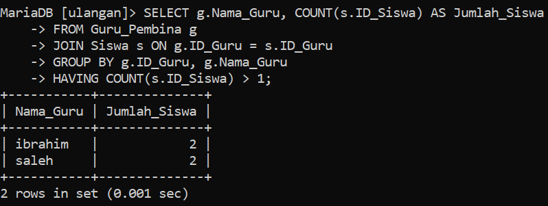

| No  | Nama                       | Skor Keaktifan | Peran                                            |
| :-: | -------------------------- | -------------- | ------------------------------------------------ |
|  1  | Rezky Awalya               | 3              | menguploand ke github dan google drive           |
|  2  | A. Ashadelah M.A           | 3              | membantu mambuat struktur                        |
|  3  | Fatsa Akhwani              | 3              | Mengerjakan penjelasan dan analisis soal nomor 1 |
|  4  | Nur Afni Ramadani          | 3              | mengerjakan penjelasan dan analisis soal nomor 2 |
|  5  | Nur Inayah Athaillah Abadi | 3              | mengerjakan di Obsidian                          |
|  6  | Siti Nur Hasiza. A         | 3              | mengerjakan soal nomor 1 dan 2                   |

# Soal 1
Setiap kelompok merancang database di MySQL dari hasil perencanaan ERD-nya masing-masing. Di dalam database tersebut wajib menjadikan tabel berelasi, dengan menambah foreign key.


## Query

```mysql
CREATE TABLE Guru_Pembina (
    ->     ID_Guru INT PRIMARY KEY,
    ->     Nama_Guru VARCHAR(100),
    ->     Jabatan VARCHAR(50)
    -> );
```

```mysql
CREATE TABLE Ekstrakulikuler (
    -> ID_ekstra INT PRIMARY KEY,
    ->  Nama_Ekstr VARCHAR(100),
    ->  Deskripsi TEXT
    -> );
```

```mysql
CREATE TABLE Siswa (
    -> ID_Siswa INT PRIMARY KEY,
    -> Alamat VARCHAR(255),
    -> Telepon VARCHAR(15),
    -> Nomor_Induk VARCHAR(20),
    -> Kelas VARCHAR(50),
    -> ID_Guru INT,
    -> ID_ekstra INT,
    -> FOREIGN KEY (ID_Guru) REFERENCES Guru_Pembina(ID_Guru),
    -> FOREIGN KEY (ID_ekstra) REFERENCES Ekstrakulikuler(ID_ekstra)
    -> );
```

## Hasil

## Analisis Diagram ERD

Diagram ERD ini menggambarkan hubungan antara tiga entitas utama dalam sistem informasi yang mengelola data siswa dan kegiatan ekstrakurikuler di sebuah sekolah:

1. **Entitas Siswa**: 
   Mewakili data`siswa`, seperti` ID siswa`,` alamat`, `nomor telepon`, `nomor induk`, dan `kelas`. Siswa memiliki hubungan dengan guru pembina dan ekstrakurikuler yang diikuti.

2. **Entitas Ekstrakurikuler**: 
   Mewakili kegiatan `ekstrakurikuler`, seperti`ID ekstrakurikuler`, `nama`, dan `deskripsi kegiatan`.

3. **Entitas Guru Pembina**: 
   Mewakili data `guru` yang menjadi `pembina ekstrakurikuler`, termasuk `ID guru`, `nama`, dan `jabatan`.

### Hubungan Antar Entitas

- **Siswa dan Ekstrakurikuler**: 
  Hubungan ini bersifat `many-to-many`, yang ditunjukkan oleh garis penghubung antara kedua entitas. Simbol `#` di depan atribut `ID_Ekstra` pada entitas `Siswa` menunjukkan bahwa satu siswa dapat mengikuti banyak ekstrakurikuler, dan satu ekstrakurikuler dapat diikuti oleh banyak siswa.

- **Siswa dan Guru Pembina**: 
  Hubungan ini juga bersifat `many-to-many`. Garis penghubung antara `Siswa` dan `Guru Pembina`  serta simbol `#` di depan atribut `ID_Guru` menunjukkan bahwa satu siswa dapat memiliki banyak guru pembina, dan satu guru dapat membina banyak siswa.
  
### Kesimpulan:

Model ERD ini cocok buat mengatur hubungan rumit antara siswa, ekstrakurikuler, sama guru pembina. Karena ada hubungan `many-to-many`, butuh tabel tambahan biar data tetap rapi. Desain ini gampang dipake dan fleksibel, jadi mudah mengatur data siswa sama kegiatan tanpa susah ubah-ubah struktur.

# Soal 2
Selanjutnya tampilkan datanya secara kontekstual dengan menggunakan query relasi, group by, dan having secara bersamaan *dalam satu query*. Buatlah minimal sebanyak 2 contoh.
## Contoh 1
### Query

```mysql
SELECT g.Nama_Guru, COUNT(s.ID_Siswa) AS Jumlah_Siswa
    -> FROM Guru_Pembina g
    -> JOIN Siswa s ON g.ID_Guru = s.ID_Guru
    -> GROUP BY g.ID_Guru, g.Nama_Guru
    -> HAVING COUNT(s.ID_Siswa) > 1;

```
### Hasil


### Analisis
1. **`SELECT g.Nama_Guru, COUNT(s.ID_Siswa) AS Jumlah_Siswa`:**
    - `Pilih` kolom `Nama_Guru` dari tabel `Guru_Pembina` (diberi alias `g`) dan hitung jumlah `ID_Siswa` yang unik dari tabel `Siswa` (diberi alias `s`) untuk setiap kelompok data. Hasil hitungan ini kemudian diberi alias `Jumlah_Siswa`.
2. **`FROM Guru_Pembina g`:**
    - `Dari` tabel `Guru_Pembina`, berikan alias `g` untuk tabel ini. Tabel ini menjadi titik awal untuk mengambil data.
3. **`JOIN Siswa s ON g.ID_Guru = s.ID_Guru`:**
    - `Gabungkan` tabel `Siswa` (diberi alias `s`) dengan tabel `Guru_Pembina` berdasarkan kesamaan nilai pada kolom `ID_Guru`. Artinya, data dari kedua tabel akan digabungkan jika ID guru pada kedua tabel sama.
4. **`GROUP BY g.ID_Guru, g.Nama_Guru`:**
    - `Kelompokkan` hasil query berdasarkan `ID_Guru` dan `Nama_Guru`. Ini berarti data akan dikelompokkan berdasarkan setiap guru yang berbeda.
5. **`HAVING COUNT(s.ID_Siswa) > 1`:**
	-  `Filter` hasil kelompokkan. Hanya kelompok (guru) yang memiliki jumlah siswa lebih dari 1 yang akan ditampilkan.

### Kesimpulan:

Hasil yang ditampilkan dalam gambar menunjukkan daftar guru beserta jumlah siswa yang dibimbingnya. Karena ada kondisi `HAVING COUNT(s.ID_Siswa) > 1`, maka hanya guru yang memiliki lebih dari satu siswa yang tertampil.
## Contoh 2
### Query

```mysql
SELECT g.Nama_Guru, COUNT(s.ID_Siswa) AS Jumlah_Siswa
    -> FROM Guru_Pembina g
    -> JOIN Siswa s ON g.ID_Guru = s.ID_Guru
    -> GROUP BY g.Nama_Guru;

```
### Hasil


### Analisis
- **`SELECT g.Nama_Guru, COUNT(s.ID_Siswa) AS Jumlah_Siswa`:*
    - `Pilih` kolom `Nama_Guru` dari tabel `Guru_Pembina` (diberi alias `g`) dan hitung jumlah `ID_Siswa` yang unik dari tabel `Siswa` (diberi alias `s`) untuk setiap kelompok data. Hasil hitungan ini kemudian diberi alias `Jumlah_Siswa`.
- **`FROM Guru_Pembina g`:**
    - `Dari` tabel `Guru_Pembina`, berikan alias `g` untuk tabel ini. Tabel ini menjadi titik awal untuk mengambil data.
- **`JOIN Siswa s ON g.ID_Guru = s.ID_Guru`:**
    - `Gabungkan` tabel `Siswa` (diberi alias `s`) dengan tabel `Guru_Pembina` berdasarkan kesamaan nilai pada kolom `ID_Guru`. Artinya, data dari kedua tabel akan digabungkan jika ID guru pada kedua tabel sama.
- **`GROUP BY g.Nama_Guru`:**
    - `Kelompokkan` hasil query berdasarkan `Nama_Guru`. Ini berarti data akan dikelompokkan berdasarkan setiap guru yang berbeda.

### Kesimpulan:

query ini memberikan informasi jumlah siswa yang dibina oleh setiap guru. Dengan cara ini, kita bisa melihat seberapa banyak siswa yang dibimbing oleh masing-masing guru secara jelas dan terorganisir.


