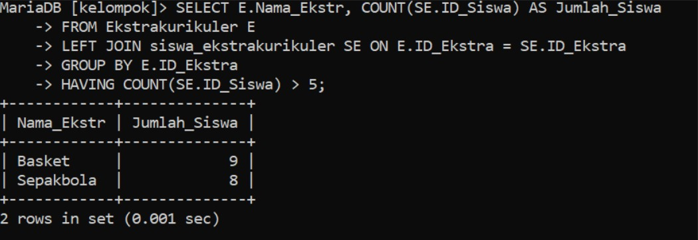

| No  | Nama                       | Skor Keaktifan | Peran                                            |
| :-: | -------------------------- | -------------- | ------------------------------------------------ |
<<<<<<< HEAD
|  1  | Rezky Awalya               | 3              | membantu membuat ERD                             |
|  2  | A. Ashadelah M.A           | 3              | membantu membuat struktur                        |
|  3  | Fatsa Akhwani              | 3              | Mengerjakan penjelasan dan analisis soal nomor 1 |
|  4  | Nur Afni Ramadani          | 3              | mengerjakan penjelasan dan analisis soal nomor 2 |
|  5  | Nur Inayah Athaillah Abadi | 2              | mengerjakan di Obsidian                          |
|  6  | Siti Nur Hasiza. A         | 3              | mengerjakan soal nomor 1 dan 2                   |
## Tabel Keseluruhan


# Soal 1

Setiap kelompok merancang database di MySQL dari hasil perencanaan ERD-nya masing-masing. Di dalam database tersebut wajib menjadikan tabel berelasi, dengan menambah foreign key.

## Query

```mysql
CREATE TABLE GuruPembina ( 
	-> ID_Guru INT AUTO_INCREMENT PRIMARY KEY, 
	-> Nama_Guru VARCHAR(100) NOT NULL, 
	-> Jabatan VARCHAR(100),
	-> ID_Ekstra INT,
-> );
```

**Tujuan Query :**
- Membuat Tabel GuruPembina : Query ini bertujuan untuk membuat tabel GuruPembina yang menyimpan informasi tentang guru, termasuk nama, jabatan, dan ekstrakurikuler yang mereka bimbing.

**Cara Relasi :**
- `FOREIGN KEY` : Menambahkan kolom `ID_Ekstra` sebagai foreign key yang mengacu pada kolom `ID_Ekstra` di tabel `Ekstrakurikuler` . Ini menciptakan relasi one-to-many di mana satu ekstrakurikuler dapat diasuh oleh banyak guru, dan satu guru dapat membimbing satu ekstrakurikuler.

```mysql
CREATE TABLE Ekstrakurikuler ( 
	-> ID_Ekstra INT AUTO_INCREMENT PRIMARY KEY, 
	-> Nama_Ekstr VARCHAR(100) NOT NULL, 
	-> Deskripsi TEXT 
-> );

```

**Tujuan Query :**
- Membuat Tabel Ekstrakurikuler : Query ini bertujuan untuk membuat tabel `Ekstrakurikuler` yang menyimpan informasi tentang kegiatan ekstrakurikuler yang tersedia di sekolah.

**Cara Relasi :**
- `FOREIGN KEY` : Menambahkan kolom `ID_Ekstra` sebagai foreign key yang mengacu pada kolom `ID_Ekstra` di tabel `Ekstrakurikuler` . Ini menciptakan relasi one-to-many di mana satu ekstrakurikuler dapat diasuh oleh banyak guru, dan satu guru dapat membimbing satu ekstrakurikuler.

```mysql

CREATE TABLE Siswa ( 
	-> ID_Siswa INT AUTO_INCREMENT PRIMARY KEY, 
	-> Nama_Siswa VARCHAR(100) NOT NULL, 
	-> Nomor_Induk VARCHAR(50) UNIQUE, 
	-> Kelas VARCHAR(50), 
	-> Alamat VARCHAR(255), 
	-> Telepon VARCHAR(20)  
-> );

```

**Tujuan Query :**
- Membuat Tabel Siswa : Query ini bertujuan untuk membuat tabel `Siswa` yang menyimpan informasi tentang siswa di sekolah, termasuk identitas dan kontak mereka.

**Cara Relasi :**
- `Primary Key` : Kolom `ID_Siswa` berfungsi sebagai primary key, yang menjamin bahwa setiap siswa memiliki identifier unik. Ini menjadi referensi untuk tabel lain, seperti tabel `siswa_ekstrakurikuler` .


```mysql
CREATE TABLE Siswa_Ekstrakurikuler ( 
	-> ID_Siswa INT, 
	-> ID_Ekstra INT, 
	-> PRIMARY KEY (ID_Siswa, ID_Ekstra), 
	-> FOREIGN KEY (ID_Siswa) REFERENCES Siswa(ID_Siswa) ON DELETE CASCADE, 
	-> FOREIGN KEY (ID_Ekstra) REFERENCES Ekstrakurikuler(ID_Ekstra) ON DELETE CASCADE 
-> );

```

**Tujuan Query :**
- `Membuat Tabel Relasi` : Query ini bertujuan untuk membuat tabel relasi `Siswa_Ekstrakurikuler` yang menyimpan informasi mengenai keterlibatan siswa dalam berbagai ekstrakurikuler, mendukung hubungan many-to-many antara tabel `Siswa` dan `Ekstrakurikuler` .

**Cara Relasi :**
- `Primary Key` : Kolom gabungan ID_Siswa dan ID_Ekstra berfungsi sebagai primary key, memastikan bahwa setiap kombinasi siswa dan ekstrakurikuler adalah unik, sehingga satu siswa tidak dapat terdaftar lebih dari sekali dalam kegiatan yang sama. 
- `Foreign Key` : 
	- `FOREIGN KEY (ID_Siswa) REFERENCES Siswa(ID_Siswa) ON DELETE CASCADE` : Menghubungkan kolom `ID_Siswa` dengan kolom `ID_Siswa` di tabel Siswa . Jika siswa dihapus dari tabel Siswa , maka semua entri terkait di tabel ini juga akan dihapus. 
	- `FOREIGN KEY (ID_Ekstra) REFERENCES Ekstrakurikuler(ID_Ekstra) ON DELETE CASCADE` : Menghubungkan kolom `ID_Ekstra` dengan kolom `ID_Ekstra` di tabel `Ekstrakurikuler` . Jika ekstrakurikuler dihapus, maka semua entri terkait di tabel ini juga akan dihapus.

## Diagram ERD

## Analisis Diagram ERD
Diagram ERD ini menggambarkan hubungan antara tiga entitas utama dalam sistem informasi yang mengelola data siswa dan kegiatan ekstrakurikuler di sebuah sekolah:
1. **Entitas Siswa**:
   Mewakili data`siswa`, seperti` ID siswa`,`Nama_Siswa`,`alamat`, `nomor telepon`, `nomor induk`, dan `kelas`. Siswa memiliki hubungan dengan guru pembina dan ekstrakurikuler yang diikuti.
2. **Entitas Ekstrakurikuler**:
   Mewakili kegiatan `ekstrakurikuler`, seperti`ID ekstrakurikuler`, `nama`, dan `deskripsi kegiatan`.
3. **Entitas Guru Pembina**:
   Mewakili data `guru` yang menjadi `pembina ekstrakurikuler`, termasuk `ID guru`, `nama`, dan `jabatan`.
## Hasil Relasi

### Hubungan Antar Entitas
-  **Hubungan Siswa dan Ekstrakurikuler**
     `Many-to-Many` : Melalui entitas `Siswa_Ekstrakurikuler` , hubungan ini menunjukkan bahwa satu siswa dapat terlibat dalam beberapa ekstrakurikuler, dan satu ekstrakurikuler dapat diikuti oleh banyak siswa. Ini memungkinkan fleksibilitas bagi siswa untuk memilih kegiatan yang diminati.
- **Hubungan GuruPembina dan Ekstrakurikuler**
    `One-to-Many`: Setiap `guruPembina` dapat membimbing lebih dari satu ekstrakurikuler, tetapi setiap ekstrakurikuler hanya memiliki satu guru pembina yang ditunjuk. Ini menunjukkan struktur hierarki di mana guru bertanggung jawab atas kegiatan tertentu.

### Kesimpulan :
Diagram ERD di atas menggambarkan struktur basis data untuk mengelola informasi siswa, ekstrakurikuler, dan guru pembina di sekolah.
- `Hubungan Siswa dan Ekstrakurikuler` bersifat `many-to-many` , memungkinkan siswa untuk mengikuti beberapa kegiatan, sementara satu kegiatan dapat diikuti oleh banyak siswa. 
- `Hubungan Guru Pembina dan Ekstrakurikuler` bersifat `one-to-many` , di mana setiap guru dapat membimbing beberapa ekstrakurikuler, tetapi satu ekstrakurikuler hanya memiliki satu guru pembina.
=======
|  1  | Rezky Awalya               | 3              | menguploand ke github dan google drive           |
|  2  | A. Ashadelah M.A           | 3              | membantu mambuat struktur                        |
|  3  | Fatsa Akhwani              | 3              | Mengerjakan penjelasan dan analisis soal nomor 1 |
|  4  | Nur Afni Ramadani          | 3              | mengerjakan penjelasan dan analisis soal nomor 2 |
|  5  | Nur Inayah Athaillah Abadi | 3              | mengerjakan di Obsidian                          |
|  6  | Siti Nur Hasiza. A         | 3              | mengerjakan soal nomor 1 dan 2                   |

# Soal 1
Setiap kelompok merancang database di MySQL dari hasil perencanaan ERD-nya masing-masing. Di dalam database tersebut wajib menjadikan tabel berelasi, dengan menambah foreign key.


## Query

```mysql
CREATE TABLE Guru_Pembina (
    ->     ID_Guru INT PRIMARY KEY,
    ->     Nama_Guru VARCHAR(100),
    ->     Jabatan VARCHAR(50)
    -> );
```

```mysql
CREATE TABLE Ekstrakulikuler (
    -> ID_ekstra INT PRIMARY KEY,
    ->  Nama_Ekstr VARCHAR(100),
    ->  Deskripsi TEXT
    -> );
```

```mysql
CREATE TABLE Siswa (
    -> ID_Siswa INT PRIMARY KEY,
    -> Alamat VARCHAR(255),
    -> Telepon VARCHAR(15),
    -> Nomor_Induk VARCHAR(20),
    -> Kelas VARCHAR(50),
    -> ID_Guru INT,
    -> ID_ekstra INT,
    -> FOREIGN KEY (ID_Guru) REFERENCES Guru_Pembina(ID_Guru),
    -> FOREIGN KEY (ID_ekstra) REFERENCES Ekstrakulikuler(ID_ekstra)
    -> );
```

## Hasil

## Analisis Diagram ERD

Diagram ERD ini menggambarkan hubungan antara tiga entitas utama dalam sistem informasi yang mengelola data siswa dan kegiatan ekstrakurikuler di sebuah sekolah:

1. **Entitas Siswa**: 
   Mewakili data`siswa`, seperti` ID siswa`,` alamat`, `nomor telepon`, `nomor induk`, dan `kelas`. Siswa memiliki hubungan dengan guru pembina dan ekstrakurikuler yang diikuti.

2. **Entitas Ekstrakurikuler**: 
   Mewakili kegiatan `ekstrakurikuler`, seperti`ID ekstrakurikuler`, `nama`, dan `deskripsi kegiatan`.

3. **Entitas Guru Pembina**: 
   Mewakili data `guru` yang menjadi `pembina ekstrakurikuler`, termasuk `ID guru`, `nama`, dan `jabatan`.

### Hubungan Antar Entitas

- **Siswa dan Ekstrakurikuler**: 
  Hubungan ini bersifat `many-to-many`, yang ditunjukkan oleh garis penghubung antara kedua entitas. Simbol `#` di depan atribut `ID_Ekstra` pada entitas `Siswa` menunjukkan bahwa satu siswa dapat mengikuti banyak ekstrakurikuler, dan satu ekstrakurikuler dapat diikuti oleh banyak siswa.

- **Siswa dan Guru Pembina**: 
  Hubungan ini juga bersifat `many-to-many`. Garis penghubung antara `Siswa` dan `Guru Pembina`  serta simbol `#` di depan atribut `ID_Guru` menunjukkan bahwa satu siswa dapat memiliki banyak guru pembina, dan satu guru dapat membina banyak siswa.
  
### Kesimpulan:

Model ERD ini cocok buat mengatur hubungan rumit antara siswa, ekstrakurikuler, sama guru pembina. Karena ada hubungan `many-to-many`, butuh tabel tambahan biar data tetap rapi. Desain ini gampang dipake dan fleksibel, jadi mudah mengatur data siswa sama kegiatan tanpa susah ubah-ubah struktur.
>>>>>>> 2e30600ca9f28b03f0d4ee471d1bce818bda16b2

# Soal 2
Selanjutnya tampilkan datanya secara kontekstual dengan menggunakan query relasi, group by, dan having secara bersamaan *dalam satu query*. Buatlah minimal sebanyak 2 contoh.
## Contoh 1
### Query

```mysql
<<<<<<< HEAD

SELECT S.Nama_Siswa, COUNT(SE.ID_Ekstra) AS Jumlah_Ekstra
    -> FROM Siswa S
    -> LEFT JOIN siswa_ekstrakurikuler SE ON S.ID_Siswa = SE.ID_Siswa
    -> GROUP BY S.ID_Siswa
    -> HAVING COUNT(SE.ID_Ekstra) > 2;
```

  
**Tujuan Query :**
- `Menampilkan Nama Siswa`: Query ini bertujuan untuk menampilkan daftar siswa dan jumlah ekstrakurikuler yang mereka ikuti.
- `Menyaring Siswa Aktif`: Hanya siswa yang terdaftar di lebih dari 2 ekstrakurikuler yang akan ditampilkan.

** Cara Relasi :**
- `LEFT JOIN`: Menghubungkan tabel `Siswa` (alias S) dengan tabel `siswa_ekstrakurikuler` (alias SE) berdasarkan kolom `ID_Siswa`. Ini memungkinkan kita untuk mendapatkan semua siswa, bahkan jika mereka tidak terdaftar di ekstrakurikuler manapun

**Cara Agregasi :**
- `COUNT(SE.ID_Ekstra)`: Menghitung jumlah ekstrakurikuler yang diikuti oleh setiap siswa. Fungsi `COUNT` di sini menghitung jumlah baris yang terhubung dengan setiap siswa.
- `GROUP BY S.ID_Siswa`: Mengelompokkan hasil berdasarkan ID siswa, sehingga kita dapat menghitung jumlah ekstrakurikuler untuk setiap siswa secara terpisah.
- `HAVING COUNT(SE.ID_Ekstra) > 2`: Menyaring hasil agregasi untuk hanya menampilkan siswa yang terdaftar di lebih dari 2 ekstrakurikuler.
### Hasil


### Analisis
1. **`SELECT S.Nama_Siswa, COUNT(SE.ID_Ekstra) AS Jumlah_Ekstra`:**
    - `Pilih` kolom `Nama_Siswa` dari tabel `Siswa` (diberi alias `S`) dan hitung jumlah `ID_Ekstra` yang terdaftar untuk setiap siswa dari tabel `siswa_ekstrakurikuler` (diberi alias `SE`). Hasil hitungan ini diberi alias `Jumlah_Ekstra`.
2. **`FROM Siswa S`:**
    - `Dari` tabel `Siswa`, berikan alias `S` untuk tabel ini. Tabel ini menjadi titik awal untuk pengambilan data mengenai siswa.
3. **`LEFT JOIN siswa_ekstrakurikuler SE ON S.ID_Siswa = SE.ID_Siswa`:**
    - `Gabungkan` tabel `siswa_ekstrakurikuler` (diberi alias `SE`) dengan tabel `Siswa` berdasarkan kesamaan nilai pada kolom `ID_Siswa`. Artinya, data dari kedua tabel akan digabungkan jika ID siswa pada kedua tabel sama. `LEFT JOIN` memastikan semua siswa ditampilkan, bahkan yang tidak terdaftar di ekstrakurikuler manapun.
4. **`GROUP BY S.ID_Siswa`:**
    - `Kelompokkan` hasil query berdasarkan `ID_Siswa`. Ini berarti data akan dikelompokkan berdasarkan setiap siswa yang berbeda, sehingga jumlah ekstrakurikuler yang diikuti dapat dihitung untuk setiap siswa.
5. **`HAVING COUNT(SE.ID_Ekstra) > 2`:**
    - `Filter` hasil kelompokkan. Hanya kelompok (siswa) yang memiliki jumlah ekstrakurikuler lebih dari 2 yang akan ditampilkan. Ini membantu mengidentifikasi siswa yang aktif dalam kegiatan ekstrakurikuler.
### Kesimpulan
Hasil yang ditampilkan menunjukkan nama siswa beserta jumlah ekstrakurikuler yang diikutinya. Karena ada kondisi `HAVING COUNT(SE.ID_Ekstra) > 2`, maka hanya siswa yang terdaftar di lebih dari dua ekstrakurikuler yang akan muncul. Ini memberikan wawasan tentang siswa yang aktif terlibat dalam berbagai kegiatan, yang dapat menjadi fokus perhatian untuk pengembangan program ekstrakurikuler lebih lanjut.

## Contoh 2
### Query
```mysql
 SELECT E.Nama_Ekstr, COUNT(SE.ID_Siswa) AS Jumlah_Siswa
	-> FROM Ekstrakurikuler E
    -> LEFT JOIN siswa_ekstrakurikuler SE ON E.ID_Ekstra = SE.ID_Ekstra
    -> GROUP BY E.ID_Ekstra
    -> HAVING COUNT(SE.ID_Siswa) > 5;
```

**Tujuan Query :**
- `Menampilkan Nama Ekstrakurikuler`: Query ini bertujuan untuk menampilkan daftar ekstrakurikuler yang ada di sekolah dan jumlah siswa yang terdaftar di masing-masing ekstrakurikuler.
- `Menyaring Ekstrakurikuler Populer`: Hanya ekstrakurikuler yang memiliki lebih dari 5 siswa yang akan ditampilkan.

**Cara Relasi :**
- `LEFT JOIN` Menghubungkan tabel `Ekstrakurikuler` (alias E) dengan tabel `siswa_ekstrakurikuler` (alias SE) berdasarkan kolom `ID_Ekstra`. Ini memungkinkan kita untuk mendapatkan semua ekstrakurikuler, bahkan jika tidak ada siswa yang terdaftar di beberapa ekstrakurikuler (siswa dengan 0 keterlibatan tidak akan muncul dalam hasil akhir).

**Cara Agregasi :**
- `COUNT(SE.ID_Siswa)`: Menghitung jumlah siswa yang terdaftar dalam setiap ekstrakurikuler. Fungsi `COUNT` digunakan untuk menghitung jumlah baris yang memenuhi kriteria tertentu.
- `GROUP BY E.ID_Ekstra`: Mengelompokkan hasil berdasarkan ID ekstrakurikuler, sehingga kita dapat menghitung jumlah siswa untuk setiap ekstrakurikuler secara terpisah.
- `HAVING COUNT(SE.ID_Siswa) > 5`: Menyaring hasil agregasi untuk hanya menampilkan ekstrakurikuler yang memiliki lebih dari 5 siswa terdaftar.

### Hasil


### Analisis
1. **`SELECT E.Nama_Ekstr, COUNT(SE.ID_Siswa) AS Jumlah_Siswa`:**
    - `Pilih` kolom `Nama_Ekstr` dari tabel `Ekstrakurikuler` (diberi alias `E`) dan hitung jumlah `ID_Siswa` yang terdaftar di ekstrakurikuler tersebut dari tabel `siswa_ekstrakurikuler` (diberi alias `SE`). Hasil hitungan ini diberi alias `Jumlah_Siswa`.
2. **`FROM Ekstrakurikuler E`:**
    - `Dari` tabel `Ekstrakurikuler`, berikan alias `E` untuk tabel ini. Tabel ini menjadi titik awal untuk pengambilan data mengenai ekstrakurikuler.
3. **`LEFT JOIN siswa_ekstrakurikuler SE ON E.ID_Ekstra = SE.ID_Ekstra`:**
    - `Gabungkan` tabel `siswa_ekstrakurikuler` (diberi alias `SE`) dengan tabel `Ekstrakurikuler` berdasarkan kesamaan nilai pada kolom `ID_Ekstra`. Artinya, data dari kedua tabel akan digabungkan jika ID ekstrakurikuler pada kedua tabel sama. `LEFT JOIN` memastikan semua ekstrakurikuler ditampilkan, bahkan yang tidak memiliki siswa terdaftar.
4. **`GROUP BY E.ID_Ekstra`:**
    - `Kelompokkan` hasil query berdasarkan `ID_Ekstra`. Ini berarti data akan dikelompokkan berdasarkan setiap ekstrakurikuler yang berbeda, sehingga jumlah siswa dapat dihitung untuk setiap ekstrakurikuler.
5. **`HAVING COUNT(SE.ID_Siswa) > 5`:**
    - `Filter` hasil kelompokkan. Hanya kelompok (ekstrakurikuler) yang memiliki jumlah siswa lebih dari 5 yang akan ditampilkan. Ini membantu mengidentifikasi ekstrakurikuler yang populer.
### Kesimpulan
Hasil yang ditampilkan menunjukkan daftar ekstrakurikuler beserta jumlah siswa yang terdaftar. Karena ada kondisi `HAVING COUNT(SE.ID_Siswa) > 5`, maka hanya ekstrakurikuler yang memiliki lebih dari lima siswa yang akan tampil. Ini membantu pihak sekolah dalam mengidentifikasi kegiatan yang paling diminati oleh siswa.
=======
SELECT g.Nama_Guru, COUNT(s.ID_Siswa) AS Jumlah_Siswa
    -> FROM Guru_Pembina g
    -> JOIN Siswa s ON g.ID_Guru = s.ID_Guru
    -> GROUP BY g.ID_Guru, g.Nama_Guru
    -> HAVING COUNT(s.ID_Siswa) > 1;

```
### Hasil


### Analisis
1. **`SELECT g.Nama_Guru, COUNT(s.ID_Siswa) AS Jumlah_Siswa`:**
    - `Pilih` kolom `Nama_Guru` dari tabel `Guru_Pembina` (diberi alias `g`) dan hitung jumlah `ID_Siswa` yang unik dari tabel `Siswa` (diberi alias `s`) untuk setiap kelompok data. Hasil hitungan ini kemudian diberi alias `Jumlah_Siswa`.
2. **`FROM Guru_Pembina g`:**
    - `Dari` tabel `Guru_Pembina`, berikan alias `g` untuk tabel ini. Tabel ini menjadi titik awal untuk mengambil data.
3. **`JOIN Siswa s ON g.ID_Guru = s.ID_Guru`:**
    - `Gabungkan` tabel `Siswa` (diberi alias `s`) dengan tabel `Guru_Pembina` berdasarkan kesamaan nilai pada kolom `ID_Guru`. Artinya, data dari kedua tabel akan digabungkan jika ID guru pada kedua tabel sama.
4. **`GROUP BY g.ID_Guru, g.Nama_Guru`:**
    - `Kelompokkan` hasil query berdasarkan `ID_Guru` dan `Nama_Guru`. Ini berarti data akan dikelompokkan berdasarkan setiap guru yang berbeda.
5. **`HAVING COUNT(s.ID_Siswa) > 1`:**
	-  `Filter` hasil kelompokkan. Hanya kelompok (guru) yang memiliki jumlah siswa lebih dari 1 yang akan ditampilkan.

### Kesimpulan:

Hasil yang ditampilkan dalam gambar menunjukkan daftar guru beserta jumlah siswa yang dibimbingnya. Karena ada kondisi `HAVING COUNT(s.ID_Siswa) > 1`, maka hanya guru yang memiliki lebih dari satu siswa yang tertampil.
## Contoh 2
### Query

```mysql
SELECT g.Nama_Guru, COUNT(s.ID_Siswa) AS Jumlah_Siswa
    -> FROM Guru_Pembina g
    -> JOIN Siswa s ON g.ID_Guru = s.ID_Guru
    -> GROUP BY g.Nama_Guru;

```
### Hasil


### Analisis
- **`SELECT g.Nama_Guru, COUNT(s.ID_Siswa) AS Jumlah_Siswa`:*
    - `Pilih` kolom `Nama_Guru` dari tabel `Guru_Pembina` (diberi alias `g`) dan hitung jumlah `ID_Siswa` yang unik dari tabel `Siswa` (diberi alias `s`) untuk setiap kelompok data. Hasil hitungan ini kemudian diberi alias `Jumlah_Siswa`.
- **`FROM Guru_Pembina g`:**
    - `Dari` tabel `Guru_Pembina`, berikan alias `g` untuk tabel ini. Tabel ini menjadi titik awal untuk mengambil data.
- **`JOIN Siswa s ON g.ID_Guru = s.ID_Guru`:**
    - `Gabungkan` tabel `Siswa` (diberi alias `s`) dengan tabel `Guru_Pembina` berdasarkan kesamaan nilai pada kolom `ID_Guru`. Artinya, data dari kedua tabel akan digabungkan jika ID guru pada kedua tabel sama.
- **`GROUP BY g.Nama_Guru`:**
    - `Kelompokkan` hasil query berdasarkan `Nama_Guru`. Ini berarti data akan dikelompokkan berdasarkan setiap guru yang berbeda.

### Kesimpulan:

query ini memberikan informasi jumlah siswa yang dibina oleh setiap guru. Dengan cara ini, kita bisa melihat seberapa banyak siswa yang dibimbing oleh masing-masing guru secara jelas dan terorganisir.


>>>>>>> 2e30600ca9f28b03f0d4ee471d1bce818bda16b2
