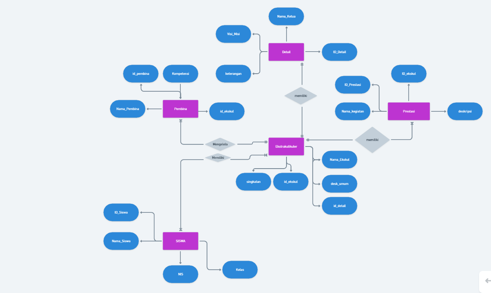
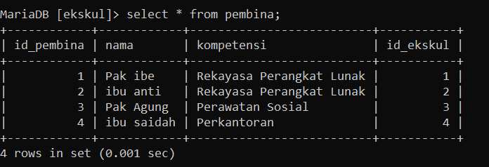
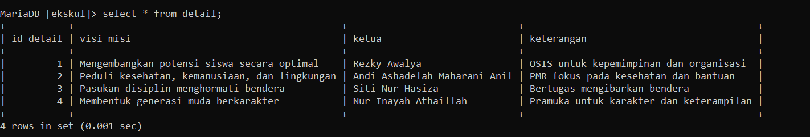

| No  | Nama                       | Skor Keaktifan | Peran                                            |
| :-: | -------------------------- | -------------- | ------------------------------------------------ |
|  1  | Rezky Awalya               | 3              | membantu membuat ERD                             |
|  2  | A. Ashadelah M.A           | 3              | membantu membuat struktur                        |
|  3  | Fatsa Akhwani              | 3              | Mengerjakan penjelasan dan analisis soal nomor 1 |
|  4  | Nur Afni Ramadani          | 3              | mengerjakan penjelasan dan analisis soal nomor 2 |
|  5  | Nur Inayah Athaillah Abadi | 2              | mengerjakan di Obsidian                          |
|  6  | Siti Nur Hasiza. A         | 3              | mengerjakan soal nomor 1 dan 2                   |
# Diagram ERD
  


## Analisis Diagram ERD

Diagram ERD ini menggambarkan hubungan antara tiga entitas utama dalam sistem informasi yang mengelola data siswa dan kegiatan ekstrakurikuler di sebuah sekolah:
 1. **Entitas Siswa**
	- **Deskripsi**: Mewakili data siswa, termasuk informasi pribadi, nomor induk, dan kelas yang mereka ikuti.
	- **Atribut**:
	    - `ID_Siswa`: Identitas unik untuk setiap siswa.
	    - `Nama_Siswa`: Nama lengkap siswa.
	    - `NIS`: Nomor Induk Siswa.
	    - `Kelas`: Kelas siswa.
	- **Hubungan**:
	    - Terhubung dengan entitas `Ekstrakurikuler` melalui hubungan mengikuti.
2. Entitas Ekstrakurikuler
	- **Deskripsi**: Mewakili kegiatan ekstrakurikuler yang tersedia di sekolah.
	- **Atribut**:
	    - `ID_Ekstrakurikuler`: Identitas unik untuk setiap kegiatan ekstrakurikuler.
	    - `Nama_Ekstrakurikuler`: Nama ekstrakurikuler.
	    - `Desk_Umum`: Deskripsi umum mengenai kegiatan ekstrakurikuler.
	    - `ID_Detail`: Menghubungkan dengan detail tambahan tentang ekstrakurikuler.
	- **Hubungan**:
	    - **Memiliki** hubungan dengan entitas `Prestasi`.
	    - **Dikelola** oleh entitas `Guru Pembina`.
	    - **Diikuti** oleh entitas `Siswa`.
3. Entitas Guru Pembina
	- **Deskripsi**: Mewakili data guru yang bertanggung jawab atas kegiatan ekstrakurikuler.
	- **Atribut**:
	    - `ID_Pembina`: Identitas unik untuk setiap pembina.
	    - `Nama_Pembina`: Nama lengkap guru pembina.
	    - `Kompetensi`: Keahlian atau kompetensi pembina.
	    - `ID_Ekstrakurikuler`: Menghubungkan pembina dengan ekstrakurikuler yang mereka kelola.
	- **Hubungan**:
	    - **Mengelola** entitas `Ekstrakurikuler`.
4. Entitas Detail
	- **Deskripsi**: Mewakili informasi tambahan tentang ekstrakurikuler, termasuk visi, misi, dan ketua.
	- **Atribut**:
	    - `ID_Detail`: Identitas unik untuk setiap detail.
	    - `Nama_Ketua`: Nama ketua ekstrakurikuler.
	    - `Visi_Misi`: Informasi tentang visi dan misi kegiatan.
	    - `Keterangan`: Informasi tambahan.
5. Entitas Prestasi
	- **Deskripsi**: Mewakili catatan prestasi yang diraih oleh kegiatan ekstrakurikuler.
	- **Atribut**:
	    - `ID_Prestasi`: Identitas unik untuk setiap prestasi.
	    - `ID_Ekstrakurikuler`: Menghubungkan prestasi dengan ekstrakurikuler terkait.
	    - `Nama_Kegiatan`: Nama kegiatan yang menghasilkan prestasi.
	    - `Deskripsi`: Penjelasan mengenai prestasi.
# Hasil Relasi


## Hubungan Antar Entitas
1. **Hubungan Siswa dan Ekstrakurikuler**
- **Tipe Relasi**: `Many-to-Many`
- **Melalui**: Entitas `Siswa_Ekskul`.
- **Deskripsi**:
	- Satu siswa (`Siswa`) dapat mengikuti lebih dari satu ekstrakurikuler (`Ekskul`).
    - Satu ekstrakurikuler dapat diikuti oleh banyak siswa.
- **Implementasi**:
    - Relasi ini diimplementasikan dengan tabel perantara `Siswa_Ekskul`, yang memiliki `id_siswa` dan `id_ekskul` sebagai kunci tamu untuk menghubungkan kedua entitas.
2. **Hubungan Guru Pembina dan Ekstrakurikuler**
- **Tipe Relasi**: `One-to-Many`
- **Deskripsi**:
	- Setiap guru pembina (`Pembina`) dapat membimbing beberapa ekstrakurikuler (`Ekskul`).
	- Satu ekstrakurikuler hanya memiliki satu guru pembina.
- **Implementasi**:
	- Relasi ini diimplementasikan dengan menambahkan kolom `id_pembina` di tabel `Ekskul` sebagai kunci tamu yang mengacu pada `Pembina`.
3. **Hubungan Ekstrakurikuler dan Detail**
- **Tipe Relasi**: `One-to-One`
- **Deskripsi**:
	- Setiap ekstrakurikuler (`Ekskul`) memiliki satu entitas detail (`Detail`) yang terkait untuk memberikan informasi lebih lanjut seperti visi, misi, dan ketua.
- **Implementasi**:
	- Relasi ini diimplementasikan dengan kolom `id_detail` di tabel `Ekskul` yang mengacu pada entitas `Detail`.
4. **Hubungan Ekstrakurikuler dan Prestasi**
- **Tipe Relasi**: `One-to-Many`
- **Deskripsi**:
	- Satu ekstrakurikuler (`Ekskul`) dapat memiliki beberapa catatan prestasi (`Prestasi`).
- **Implementasi**:
	- Relasi ini diimplementasikan dengan kolom `id_ekskul` di tabel `Prestasi` sebagai kunci tamu yang mengacu pada entitas `Ekskul`.

## Kesimpulan
Desain relasi database ini menciptakan struktur yang fleksibel dan terorganisir. Hubungan `Many-to-Many` antara siswa dan ekstrakurikuler memungkinkan siswa mengikuti banyak kegiatan, sedangkan hubungan `One-to-Many` dengan guru pembina memastikan setiap kegiatan memiliki pengelola yang jelas. Relasi ini mendukung pencatatan prestasi, skalabilitas, dan manajemen data ekstrakurikuler secara efisien.
# Soal 1
Setiap kelompok merancang database di MySQL dari hasil perencanaan ERD-nya masing-masing. Di dalam database tersebut wajib menjadikan tabel berelasi, dengan menambah foreign key.

## Tabel Pembina
### Query
```mysql
CREATE TABLE pembina (
	id_pembina INT(11) AUTO_INCREMENT PRIMARY KEY,
	nama VARCHAR(50) NOT NULL,
	kompetensi VARCHAR(100),
	id_ekskul INT(11),
	FOREIGN KEY (id_ekskul) REFERENCES ekskul(id_ekskul)
);
```

### Tujuan Query
Tabel `pembina` bertujuan untuk menyimpan data mengenai pembina ekstrakurikuler di suatu institusi. Dengan tabel ini, Anda dapat:
- Mengelola informasi pembina, termasuk nama dan kompetensinya.
- Menyimpan relasi antara pembina dan jenis ekstrakurikuler yang mereka bimbing.

### Cara Relasi
Tabel `pembina` memiliki relasi dengan tabel `ekskul` melalui kolom `id_ekskul`. Berikut adalah cara relasinya:
- **Relasi One-to-Many**:
    - Satu ekstrakurikuler (`ekskul`) dapat memiliki banyak pembina (`pembina`).
    - Namun, satu pembina hanya dapat membina satu ekstrakurikuler.
- Relasi ini diimplementasikan melalui `FOREIGN KEY (id_ekskul) REFERENCES ekskul(id_ekskul)`, yang menghubungkan `id_ekskul` di tabel `pembina` dengan `id_ekskul` di tabel `ekskul`.

### Hasil

## Tabel Siswa
### Query
```mysql
CREATE TABLE siswa (
	id_siswa INT(25) AUTO_INCREMENT PRIMARY KEY,
	nama VARCHAR(50) NOT NULL,
	NIS INT(15) NOT NULL,
	kelas VARCHAR(11) NOT NULL 
);
```

### Tujuan Query
Tabel `siswa` digunakan untuk menyimpan data mengenai siswa di suatu institusi pendidikan. Setiap entri dalam tabel ini mencakup informasi penting tentang siswa, yang meliputi:
- **id_siswa**: Identifikasi unik untuk setiap siswa.
- **nama**: Nama lengkap siswa.
- **NIS**: Nomor Induk Siswa, yang merupakan identifikasi resmi siswa.
- **kelas**: Kelas atau kelompok dimana siswa tersebut tergabung.

### Cara Relasi
Tabel `siswa` dapat dihubungkan dengan tabel lain dalam sistem, seperti tabel `siswa_ekskul` yang menghubungkan siswa dengan ekstrakurikuler yang mereka ikuti. Berikut adalah cara relasinya:
- **Relasi Many-to-Many**: Satu siswa dapat mengikuti banyak ekstrakurikuler, dan satu ekstrakurikuler dapat diikuti oleh banyak siswa. Untuk mewujudkan relasi ini, Anda perlu membuat tabel penghubung (pivot table) yang biasa dinamakan `siswa_ekskul`.
### Hasil


## Tabel Ekskul
```mysql
CREATE TABLE ekskul (
	id_ekskul INT(11) AUTO_INCREMENT PRIMARY KEY,
	nama_ekskul VARCHAR(25) NOT NULL,
	desk_umum VARCHAR(100), singkatan VARCHAR(50), 
	id_detail INT(11), FOREIGN KEY (id_detail) REFERENCES detail(id_detail) 
);
```

###  Tujuan Query
Tabel `ekskul` digunakan untuk menyimpan informasi mengenai ekstrakurikuler di suatu institusi pendidikan. Setiap entri dalam tabel ini mencakup informasi penting tentang ekstrakurikuler, yang meliputi:
- **id_ekskul**: Identifikasi unik untuk setiap ekstrakurikuler.
- **nama_ekskul**: Nama lengkap ekstrakurikuler.
- **desk_umum**: Deskripsi umum mengenai ekstrakurikuler tersebut.
- **singkatan**: Singkatan dari nama ekstrakurikuler.
- **id_detail**: Kode yang merujuk ke detail tambahan mengenai ekstrakurikuler.

### Cara Relasi
Tabel `ekskul` memiliki relasi dengan tabel lain, seperti tabel `detail`, melalui kolom `id_detail`. Berikut adalah cara relasinya:
- **Relasi One-to-Many**: Satu kategori detail dapat memiliki banyak ekstrakurikuler, tetapi satu ekstrakurikuler hanya dapat memiliki satu detail.
- Relasi ini diimplementasikan melalui `FOREIGN KEY (id_detail) REFERENCES detail(id_detail)`, yang menghubungkan `id_detail` di tabel `ekskul` dengan `id_detail` di tabel `detail`.
### Hasil


## Tabel Siswa_Ekskul
```mysql
CREATE TABLE siswa_ekskul (
	id_siswa_ekskul INT(11) AUTO_INCREMENT PRIMARY KEY,
	id_siswa INT(11), 
	id_ekskul INT(11),
	FOREIGN KEY (id_siswa) REFERENCES siswa(id_siswa),
	FOREIGN KEY (id_ekskul) REFERENCES ekskul(id_ekskul) 
);
```

### Tujuan Query
Tabel `siswa_ekskul` digunakan untuk menyimpan hubungan antara siswa dan ekstrakurikuler. Karena relasi antara siswa dan ekstrakurikuler adalah **Many-to-Many**, tabel ini berfungsi sebagai tabel penghubung (junction table) yang memungkinkan satu siswa untuk terlibat dalam banyak ekstrakurikuler dan satu ekstrakurikuler untuk diikuti oleh banyak siswa.
 - Struktur Tabel
	- **id_siswa_ekskul**: Identifikasi unik untuk setiap entri dalam tabel ini.
	- **id_siswa**: ID siswa yang merujuk ke tabel `siswa`.
	- **id_ekskul**: ID ekstrakurikuler yang merujuk ke tabel `ekskul`.

### Cara Relasi
Tabel `siswa_ekskul` menghubungkan tabel `siswa` dan `ekskul` melalui kolom `id_siswa` dan `id_ekskul`. Berikut adalah cara relasinya:
- **Relasi Many-to-Many**:
    - Satu siswa dapat mengikuti banyak ekstrakurikuler.
    - Satu ekstrakurikuler dapat diikuti oleh banyak siswa.
    - 
Relasi ini diimplementasikan melalui dua `FOREIGN KEY`:
- `FOREIGN KEY (id_siswa) REFERENCES siswa(id_siswa)`: Menghubungkan `id_siswa` ke tabel `siswa`.
- `FOREIGN KEY (id_ekskul) REFERENCES ekskul(id_ekskul)`: Menghubungkan `id_ekskul` ke tabel `ekskul`.
### Hasil


## Tabel Detail
```mysql
CREATE TABLE detail (
	id_detail INT(11) AUTO_INCREMENT PRIMARY KEY,
	visi_misi VARCHAR(100), 
	ketua VARCHAR(50),
	keterangan VARCHAR(100) 
);
```

### Tujuan Query
Tabel `detail` digunakan untuk menyimpan informasi tambahan tentang ekstrakurikuler yang lebih spesifik. Setiap entri dalam tabel ini mencakup:
- **id_detail**: Identifikasi unik untuk setiap detail.
- **visi_misi**: Pernyataan visi dan misi dari ekstrakurikuler.
- **ketua**: Nama ketua atau pengurus ekstrakurikuler.
- **keterangan**: Keterangan tambahan mengenai ekstrakurikuler.

### Cara Relasi
Tabel `detail` memiliki relasi dengan tabel `ekskul` melalui kolom `id_detail`. Berikut adalah cara relasinya:
- **Relasi One-to-Many**: Satu detail dapat dikaitkan dengan banyak ekstrakurikuler, tetapi satu ekstrakurikuler hanya dapat memiliki satu detail.
- Relasi ini diimplementasikan melalui `FOREIGN KEY` di tabel `ekskul`, yang menghubungkan `id_detail` di tabel `ekskul` dengan `id_detail` di tabel `detail`.
### Hasil


## Tabel Prestasi
```mysql
CREATE TABLE prestasi (
	id_prestasi INT(11) AUTO_INCREMENT PRIMARY KEY,
	nama_kegiatan VARCHAR(50) NOT NULL,
	deskripsi VARCHAR(100),
	id_ekskul INT(11),
	FOREIGN KEY (id_ekskul) REFERENCES ekskul(id_ekskul) 
);
```

### Tujuan Query
Tabel `prestasi` digunakan untuk menyimpan informasi mengenai prestasi yang diraih oleh ekstrakurikuler. Ini bisa mencakup lomba, penghargaan, atau kegiatan lain yang menunjukkan keberhasilan ekstrakurikuler.
 - Struktur Tabel
	- **id_prestasi**: Identifikasi unik untuk setiap prestasi.
	- **nama_kegiatan**: Nama kegiatan atau lomba yang diikuti.
	- **deskripsi**: Deskripsi singkat mengenai kegiatan atau prestasi.
	- **id_ekskul**: ID ekstrakurikuler yang merujuk ke tabel `ekskul`.

### Cara Relasi
Tabel `prestasi` terhubung dengan tabel `ekskul` melalui kolom `id_ekskul`. Ini juga menciptakan hubungan satu-ke-banyak:
- **Relasi One-to-Many**: Satu ekstrakurikuler dapat memiliki banyak prestasi, tetapi satu prestasi hanya dapat terkait dengan satu ekstrakurikuler.
### Hasil


## Hasil Tabel Keseluruhan







# Query Kontekstual: Agregasi Lanjutan dan Relasi JOIN
- Selanjutnya tampilkan datanya secara kontekstual dengan menggunakan query relasi, group by, dan having secara bersamaan *dalam satu query*. Buatlah minimal sebanyak 2 contoh.
## CONTOH 1
### Query

```mysql
SELECT
    -> S.nama AS Nama_Siswa,
    -> COUNT(SE.id_ekskul) AS Jumlah_Ekstrakurikuler
    -> FROM siswa S
    -> LEFT JOIN siswa_ekskul SE ON S.id_siswa = SE.id_siswa
    -> GROUP BY S.id_siswa
    -> HAVING COUNT(SE.id_ekskul) > 2;
    ```
  
### Tujuan Query
Query ini bertujuan untuk menampilkan daftar siswa yang mengikuti lebih dari dua ekstrakurikuler. Outputnya mencakup nama siswa dan jumlah ekstrakurikuler yang diikuti.
### Cara Relasi
- **Relasi antara tabel `siswa` dan `siswa_ekskul`**:
    - Tabel `siswa` memiliki **`id_siswa`** sebagai primary key.
    - Tabel `siswa_ekskul` memiliki **`id_siswa`** sebagai foreign key untuk menghubungkan siswa dengan ekstrakurikuler yang diikuti.
- **Jenis Join**:
    - Menggunakan **`LEFT JOIN`** agar semua siswa ditampilkan, meskipun mereka tidak mengikuti ekstrakurikuler apa pun. Jika tidak ada data di tabel `siswa_ekskul`, hasil `COUNT` akan menjadi 0.
### Cara Agregasi
1. **Menghitung Jumlah Ekstrakurikuler**:
    - Fungsi agregasi **`COUNT(SE.id_ekskul)`** menghitung jumlah ekstrakurikuler yang diikuti oleh setiap siswa.
2. **Pengelompokkan Data**:
    - Data dikelompokkan berdasarkan **`S.id_siswa`** untuk memastikan setiap siswa dihitung secara individu.
    - Kolom nama (`S.nama`) juga diambil dari tabel `siswa`.
3. **Filter Siswa dengan Lebih dari 2 Ekstrakurikuler**:
    - Menggunakan **`HAVING COUNT(SE.id_ekskul) > 2`** untuk menyaring siswa yang mengikuti lebih dari dua ekstrakurikuler.
### Hasil


### Analisis
1. **Kompleksitas**:
    - Relatif rendah, karena hanya melibatkan dua tabel dengan fungsi agregasi sederhana (`COUNT`).
    - Penggunaan `LEFT JOIN` memastikan semua siswa, termasuk yang tidak memiliki relasi di `siswa_ekskul`, tetap dimasukkan dalam hasil.
2. **Manfaat**:
    - Memberikan informasi penting untuk mengetahui siswa yang aktif dalam banyak ekstrakurikuler.
    - Dapat digunakan untuk menganalisis tingkat partisipasi siswa.
3. **Kelebihan**:
    - Menggunakan `LEFT JOIN` sehingga siswa yang tidak mengikuti ekstrakurikuler juga dipertimbangkan (meskipun dikeluarkan oleh kondisi `HAVING`).
4. **Kekurangan**:
    - Query ini bergantung pada integritas data di tabel `siswa_ekskul`. Jika ada duplikasi atau data tidak akurat, hasilnya bisa salah.
    - Jika terdapat banyak siswa tanpa ekstrakurikuler, `LEFT JOIN` dapat menghasilkan baris kosong yang tidak diperlukan.
5. **Optimasi yang Mungkin**:
    - Gunakan **`INNER JOIN`** jika hanya siswa yang terdaftar dalam `siswa_ekskul` yang relevan.
    - Indexing kolom `id_siswa` di kedua tabel untuk meningkatkan kinerja pada dataset besar.
### Kesimpulan
Query ini efektif untuk menampilkan siswa yang aktif mengikuti banyak ekstrakurikuler (lebih dari dua). Dengan menggunakan `LEFT JOIN` dan `COUNT` dalam agregasi, query menyaring siswa berdasarkan kriteria jumlah ekstrakurikuler yang diikuti. Meskipun hasilnya akurat untuk data kecil atau terstruktur dengan baik, optimasi mungkin diperlukan untuk dataset besar.
## CONTOH 2
### Query
```mysql
 SELECT e.id_ekskul, e.nama_ekskul, COUNT(se.id_siswa) AS jumlah_anggota
    -> FROM ekskul e
    -> JOIN siswa_ekskul se ON e.id_ekskul = se.id_ekskul
    -> GROUP BY e.id_ekskul, e.nama_ekskul
    -> HAVING COUNT(se.id_siswa) > (
    ->     SELECT AVG(jumlah_anggota)
    ->     FROM (
    ->         SELECT COUNT(se.id_siswa) AS jumlah_anggota
    ->         FROM ekskul e
    ->         JOIN siswa_ekskul se ON e.id_ekskul = se.id_ekskul
    ->         GROUP BY e.id_ekskul
    ->     ) AS rata_rata_anggota
    -> )
    -> ORDER BY jumlah_anggota DESC;
```

### Tujuan Query
Query ini bertujuan untuk menampilkan daftar ekskul yang **populer**, yaitu ekskul dengan jumlah anggota lebih besar daripada rata-rata jumlah anggota dari semua ekskul. Hasil query mengurutkan ekskul berdasarkan jumlah anggotanya secara menurun.

### Cara Relasi
- Tabel **`ekskul`** dan **`siswa_ekskul`** dihubungkan menggunakan **relasi N:N** melalui kolom `id_ekskul`:
	- `ekskul.id_ekskul` adalah primary key pada tabel `ekskul`.
	- `siswa_ekskul.id_ekskul` adalah foreign key yang menghubungkan setiap siswa ke ekskul tertentu.
### Cara Agregasi
- **Level Ekskul**:
    - Menggunakan fungsi **`COUNT(se.id_siswa)`** untuk menghitung jumlah siswa (`id_siswa`) di setiap ekskul.
    - Data dikelompokkan berdasarkan `e.id_ekskul` dan `e.nama_ekskul` menggunakan **`GROUP BY`**:
- **Level Global (Rata-rata Anggota)**:
    - Subquery pertama menghitung jumlah anggota untuk setiap ekskul menggunakan fungsi **`COUNT(se.id_siswa)`**.
    - Subquery kedua menghitung **rata-rata jumlah anggota** dari hasil subquery pertama menggunakan **`AVG()`**.
- **Filter Ekskul Populer**:
    - Menggunakan **`HAVING`** untuk menyaring ekskul dengan jumlah anggota lebih besar daripada rata-rata anggota:
- **Sorting**:
    - Mengurutkan ekskul berdasarkan jumlah anggota secara menurun menggunakan **`ORDER BY jumlah_anggota DESC`**.

### Hasil


### Analisis
1. **Kompleksitas**:
    - Query ini memproses data dalam dua level agregasi:
        - Agregasi pertama menghitung jumlah anggota per ekskul.
        - Agregasi kedua menghitung rata-rata anggota dari hasil agregasi pertama.
    - Ini melibatkan **nested query**, sehingga kompleksitasnya lebih tinggi dibandingkan query biasa.
2. **Kelebihan**:
    - Efisien dalam memanfaatkan fungsi agregasi SQL.
    - Mudah dimodifikasi jika kriteria "populer" berubah.
    - Menyediakan informasi yang berguna untuk analisis popularitas ekskul.
3. **Kekurangan**:
    - Subquery dalam `HAVING` membuat kinerja lambat jika jumlah data besar.
    - Bergantung pada keakuratan data relasi antara `ekskul` dan `siswa_ekskul`.
4. **Optimasi yang Mungkin**:
    - Menggunakan **Common Table Expressions (CTE)** untuk meningkatkan keterbacaan dan performa query jika database mendukung fitur ini.
### Kesimpulan
Query ini adalah solusi yang efektif untuk menentukan ekskul populer berdasarkan jumlah anggota. Dengan menggunakan fungsi agregasi SQL seperti `COUNT` dan `AVG`, query memberikan informasi yang relevan untuk analisis data terkait ekskul. Relasi yang benar antara tabel sangat penting agar hasil query akurat.