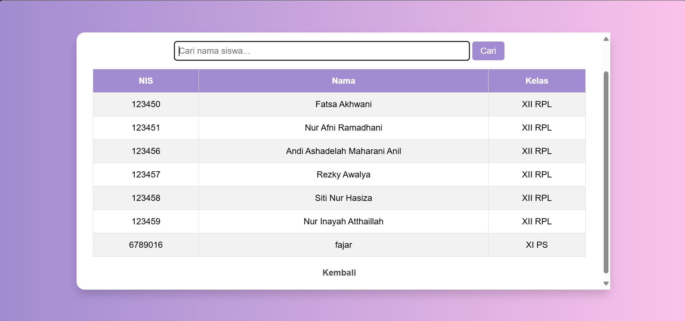
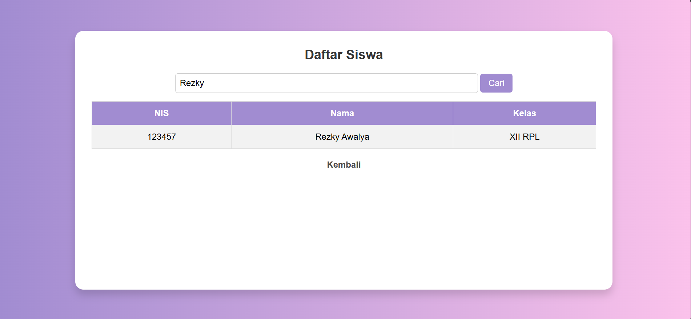

| No  | Nama                 | Skor Keaktifan | Peran                       |
| --- | -------------------- | -------------- | --------------------------- |
| 1   | Rezky Awalya         | 3              | Mengerjakan laporan fitur 1 |
| 2   | A. Ashadelah M.A     | 3              | Sakit                       |
| 3   | Fatsa Akhwani        | 3              | Mengerjakan fitur 1         |
| 4   | Nur Afni Ramadani    | 3              | Mengerjakan laporan fitur 2 |
| 5   | Nur Inayah Athaillah | 2              | Mengerjakan fitur 2         |
| 6   | Siti Nur Hasiza.A    | 3              | Mengerjakan laporan fitur 2 |
# 1. Fitur Pencarian Nama Siswa

Fitur pencarian pada gambar memungkinkan pengguna untuk mencari siswa berdasarkan **nama**. Berikut adalah cara kerja fitur ini:

1. **Input Pencarian**
    - Pengguna dapat mengetikkan **nama siswa** yang ingin dicari di dalam kolom pencarian yang tersedia di bagian atas tabel.
    - Placeholder dalam input membantu pengguna dengan teks petunjuk seperti _"Cari nama siswa..."_.

2. **Tombol "Cari"**
    - Setelah mengetikkan nama, pengguna dapat mengklik tombol **"Cari"** untuk memulai pencarian.
    - Kemungkinan, tombol ini menjalankan fungsi **filtering**, sehingga hanya menampilkan siswa yang namanya sesuai dengan kata kunci yang diketikkan.

3. **Hasil Pencarian Ditampilkan di Tabel**
    - Saat pencarian dilakukan, tabel di bawahnya akan diperbarui dan hanya menampilkan **baris yang sesuai dengan kata kunci pencarian**.
    - Jika tidak ada hasil yang cocok, tabel bisa menampilkan pesan seperti _"Data tidak ditemukan"_.

# 2. Fitur Pendaftaran

 Formulir Pendaftaran Siswa
 
1. **Input Nama Lengkap**
    
    - Pengguna dapat mengetikkan **nama lengkap siswa** yang ingin didaftarkan di dalam kolom input yang tersedia.
    - Input ini sudah memiliki placeholder atau value awal sebagai contoh (_"Rezky Awalya"_).
    - Pastikan pengguna mengisi nama lengkap sesuai dengan format yang benar.
2. **Input NIS (Nomor Induk Siswa)**
    
    - Kolom ini digunakan untuk memasukkan **Nomor Induk Siswa (NIS)**.
    - Pengguna harus menginput **angka** yang valid, seperti contoh _"123457"_.
    - Disarankan untuk menambahkan validasi agar hanya menerima angka dan menghindari duplikasi data.
3. **Dropdown Kelas**
    
    - Pengguna dapat memilih kelas siswa yang akan didaftarkan melalui menu **dropdown**.
    - Opsi yang tersedia, seperti _"XII"_, memungkinkan pengguna memilih tingkat kelas yang sesuai.
    - Memudahkan pengelompokan siswa berdasarkan jenjang kelas mereka.
4. **Tombol "Daftar"**
    
    - Setelah mengisi semua kolom, pengguna dapat mengklik tombol **"Daftar"** untuk mengirim data.
    - Kemungkinan tombol ini akan menjalankan **proses penyimpanan data ke database** dan menampilkan konfirmasi jika pendaftaran berhasil.
    - Untuk pengalaman pengguna yang lebih baik, bisa ditambahkan **pesan sukses atau error** setelah pendaftaran.
5. **Tombol "Kembali"**
    
    - Jika pengguna ingin membatalkan atau kembali ke halaman sebelumnya, mereka bisa mengklik tombol **"Kembali"**.
    - Tombol ini dapat diarahkan ke **halaman utama atau menu sebelumnya** dalam sistem.

![[Pasted image 20250310093446.png]]

# 3. Fitur Daftar Ekskul 

![[Pasted image 20250313125740.png]]
- **Tabel Daftar Ekskul:** Menampilkan informasi ekstrakurikuler yang tersedia.
- **Kolom Pencarian:** Memungkinkan pengguna mencari ekskul berdasarkan kata kunci tertentu.
- **Tombol "Daftar Ekskul":** Mengarahkan pengguna ke halaman pendaftaran ekskul baru.
- **Tombol "Edit":** Memungkinkan admin untuk mengubah informasi ekskul.
- **Tombol "Hapus":** Memungkinkan admin untuk menghapus ekskul dari database.
- **Tautan "Kembali":** Mengembalikan pengguna ke halaman sebelumnya.

![[Pasted image 20250313132714.png]]
#### **Judul Form**
- **"Tambah Ekskul & Anggota"** → Menunjukkan bahwa pengguna bisa menambahkan ekskul baru sekaligus menambahkan anggota ke ekskul tersebut.

#### **Inputan Form**
**Nama Ekskul**
- Kolom input ini digunakan untuk memasukkan **nama ekstrakurikuler** yang akan ditambahkan.

**Deskripsi**
- Input textarea untuk memberikan **penjelasan atau deskripsi** tentang ekskul.
- Bisa berisi informasi singkat seperti tujuan ekskul, kegiatan utama, atau keunggulan ekskul tersebut.

**Singkatan**
- Field ini memungkinkan pengguna memasukkan **singkatan dari ekskul**.
- Misalnya, **"PMR"** untuk Palang Merah Remaja atau **"PASKIBRA"** untuk Pasukan Pengibar Bendera.

 **Pilih Siswa**
- Berupa **dropdown** yang memungkinkan pengguna memilih siswa yang akan dimasukkan sebagai anggota ekskul.
- Opsi dalam dropdown ini kemungkinan diambil dari database siswa yang sudah terdaftar di sistem.

#### **Tombol Aksi**
**Tombol "Tambah Ekskul & Anggota"**
- Ketika ditekan, akan menyimpan data ekskul baru beserta anggota yang dipilih ke dalam database.

 **Tombol "Kembali"**
- Jika pengguna ingin membatalkan atau kembali ke halaman sebelumnya, mereka bisa mengklik tombol ini.
- Biasanya akan diarahkan ke **halaman utama** atau **daftar ekskul yang sudah terdaftar**.

![[Pasted image 20250313133704.png]]
#### **Judul Form**
- **"Edit Ekskul"** → Menunjukkan bahwa pengguna sedang melakukan pengeditan data ekskul yang sudah ada.

#### **Inputan Form**
**Nama Ekskul**
- Kolom ini berisi **nama ekskul yang sedang diedit**.
- Dalam contoh ini, ekskul yang diedit adalah **"basket"**.

**Deskripsi**
- Kolom textarea ini digunakan untuk **menjelaskan ekskul** secara lebih rinci.
- Dalam contoh ini, deskripsi ekskul **"basket ball"** ditampilkan.

**Singkatan**
- Field ini digunakan untuk mengisi **singkatan ekskul**.
- Contohnya, **"basket"** sebagai singkatan dari ekstrakurikuler basket ball.

 **Pilih Siswa**
- Dropdown ini memungkinkan pengguna untuk **menambahkan atau mengubah anggota ekskul**.
- Namun, dalam tampilan ini dropdown masih dalam keadaan default **("Pilih Siswa")**, yang berarti belum ada anggota yang dipilih atau ditampilkan.

#### **Tombol Aksi**
**Tombol "Simpan Perubahan"**

- Digunakan untuk **menyimpan perubahan** yang dilakukan pada ekskul.
- Biasanya setelah menekan tombol ini, data yang diedit akan diperbarui di database dan pengguna akan diarahkan kembali ke halaman daftar ekskul.

