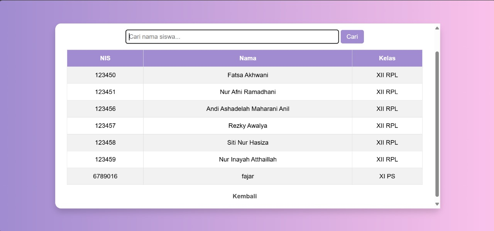
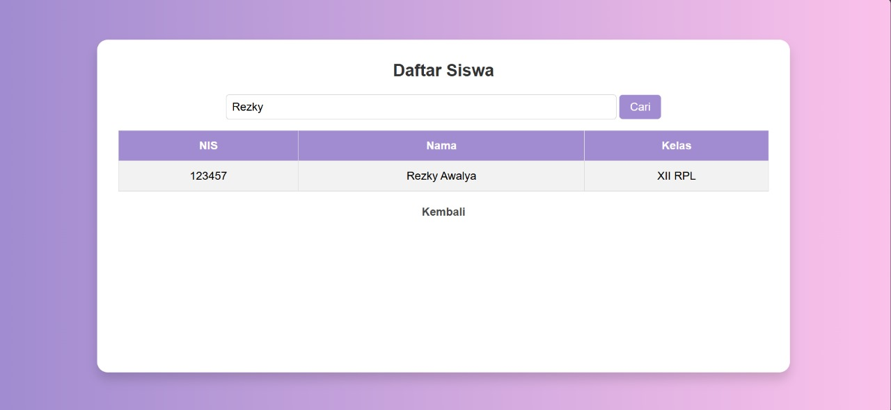
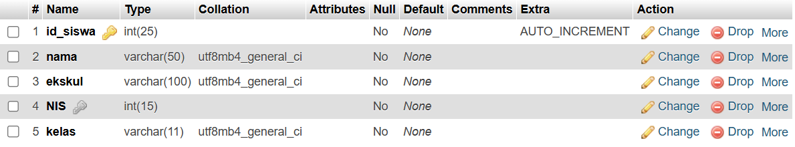
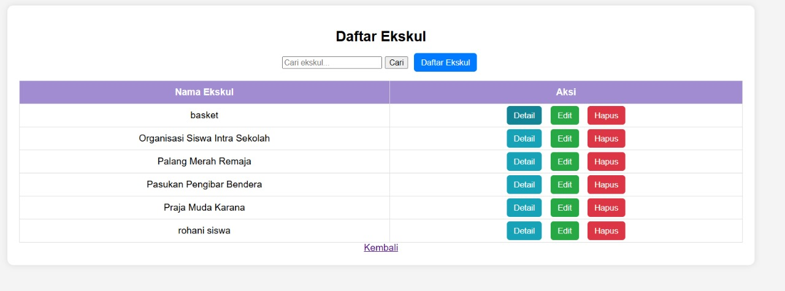
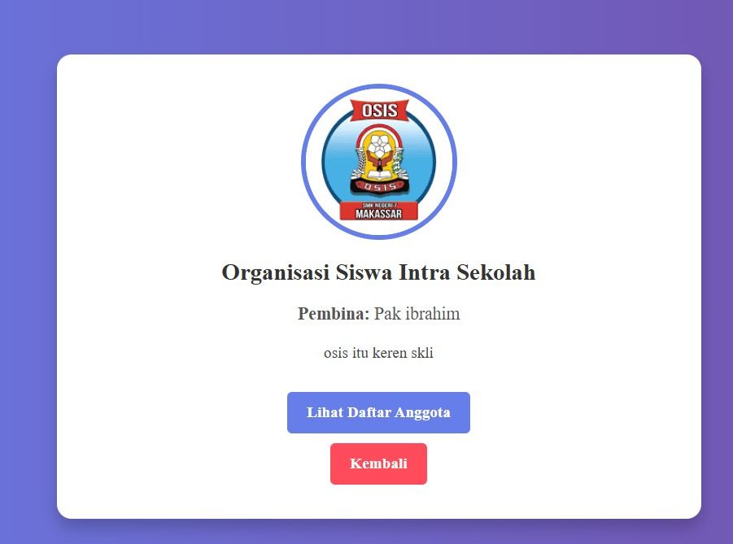
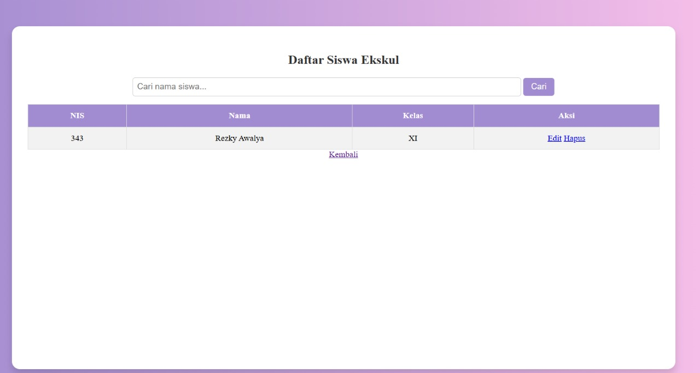
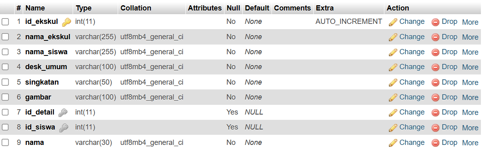
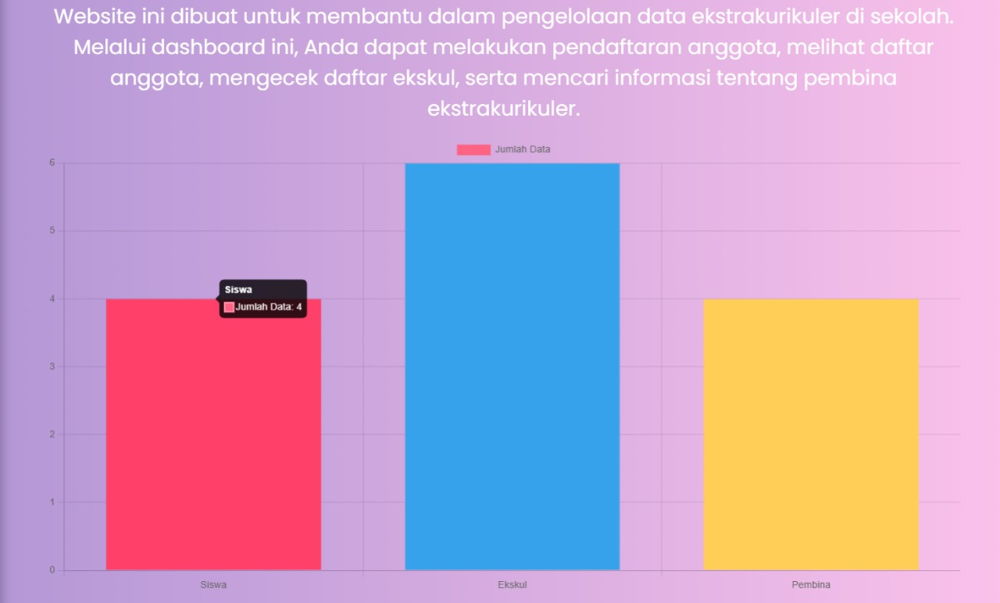
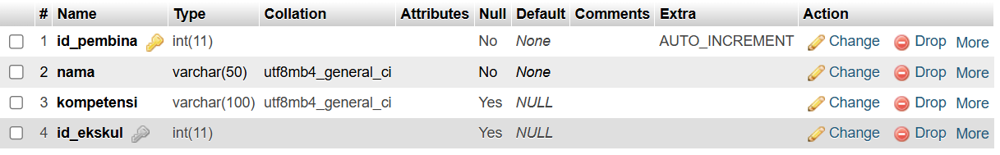

| Nama                         | Keaktifan |
| ---------------------------- | --------- |
| Rezky Awalya                 | 3         |
| Andi Ashadelah Maharani Anil | 3         |
| Nur Inayah Athaillah Abadi   | 3         |
| Siti Nur Hasiza .A           | 3         |
| Nur Afni Ramadhani           | 3         |
| Fatsa Akhwani                | 3         |


# 1. Fitur Pencarian Nama Siswa

Fitur pencarian pada gambar memungkinkan pengguna untuk mencari siswa berdasarkan *nama*. Berikut adalah cara kerja fitur ini:

1. *Input Pencarian*
    - Pengguna dapat mengetikkan *nama siswa* yang ingin dicari di dalam kolom pencarian yang tersedia di bagian atas tabel.
    - Placeholder dalam input membantu pengguna dengan teks petunjuk seperti "Cari nama siswa...".

2. *Tombol "Cari"*
    - Setelah mengetikkan nama, pengguna dapat mengklik tombol *"Cari"* untuk memulai pencarian.
    - Kemungkinan, tombol ini menjalankan fungsi *filtering*, sehingga hanya menampilkan siswa yang namanya sesuai dengan kata kunci yang diketikkan.

3. *Hasil Pencarian Ditampilkan di Tabel*
    - Saat pencarian dilakukan, tabel di bawahnya akan diperbarui dan hanya menampilkan *baris yang sesuai dengan kata kunci pencarian*.
    - Jika tidak ada hasil yang cocok, tabel bisa menampilkan pesan seperti "Data tidak ditemukan".

## Rincian Fitur





## Database


## Kode Program
```php
<?php
include '../koneksi.php';
// Hapus data jika ada permintaan hapus
if (isset($_GET['hapus'])) {
    $nis = $_GET['hapus'];
    $query_hapus = "DELETE FROM siswa WHERE nis = '$nis'";
    if (mysqli_query($conn, $query_hapus)) {
        echo "<script>alert('Data berhasil dihapus!'); window.location.href='daftar_siswa.php';</script>";
    } else {
        echo "<script>alert('Gagal menghapus data!');</script>";
    }
}
// Ambil kata kunci pencarian jika ada
$search = isset($_GET['search']) ? mysqli_real_escape_string($conn, $_GET['search']) : "";
// Query pencarian jika ada input
if ($search) {
    $sql = "SELECT nis, nama, ekskul, kelas FROM siswa WHERE nama LIKE '%$search%' ORDER BY nis ASC";
} else {
    $sql = "SELECT nis, nama, ekskul, kelas FROM siswa ORDER BY nis ASC";
}
$result = mysqli_query($conn, $sql);
// Periksa apakah query berhasil
if (!$result) {
    die("Query Error: " . mysqli_error($conn));
}
?>
```

### **Analisis Kode PHP**

Kode PHP di atas bertujuan untuk melakukan pengelolaan data siswa pada sebuah aplikasi berbasis web, khususnya pada bagian penghapusan data dan pencarian data siswa. Berikut adalah analisis secara mendalam:

#### **1. Koneksi ke Database**

```php
include '../koneksi.php';
```

- **Tujuan:** Menghubungkan file ini dengan konfigurasi koneksi database.
- **Resiko:** Jika file koneksi tidak ditemukan atau terjadi kesalahan konfigurasi, semua proses selanjutnya akan gagal.
- **Saran:** Lakukan pengecekan keberhasilan koneksi sebelum melanjutkan operasi lainnya.

#### **2. Penghapusan Data Siswa**

```php
if (isset($_GET['hapus'])) {
    $nis = $_GET['hapus'];
    $query_hapus = "DELETE FROM siswa WHERE nis = '$nis'";
    if (mysqli_query($conn, $query_hapus)) {
        echo "<script>alert('Data berhasil dihapus!'); window.location.href='daftar_siswa.php';</script>";
    } else {
        echo "<script>alert('Gagal menghapus data!');</script>";
    }
}
```

**Analisis:**

- **Pengecekan Parameter:**
    
    - Menggunakan `isset()` untuk mengecek apakah ada parameter `hapus` pada URL.
    - Misalnya, URL: `daftar_siswa.php?hapus=12345`
- **Keamanan:**
    
    - Terdapat potensi serangan **SQL Injection** karena nilai NIS langsung dimasukkan ke dalam query tanpa validasi.
    - Misalnya, jika URL berisi:
        
        ```
        daftar_siswa.php?hapus=12345' OR '1'='1
        ```
        
        Maka akan menghapus semua data siswa.
- **Solusi:**
    
    - Gunakan fungsi `mysqli_real_escape_string()` atau _prepared statement_ untuk menghindari serangan:
        
        ```php
        $nis = mysqli_real_escape_string($conn, $_GET['hapus']);
        ```
        
- **Feedback Keberhasilan/Gagal:**
    
    - Memberikan notifikasi menggunakan JavaScript untuk menginformasikan apakah penghapusan berhasil atau gagal.

#### **3. Pencarian Data Siswa**

```php
$search = isset($_GET['search']) ? mysqli_real_escape_string($conn, $_GET['search']) : "";
```

**Analisis:**

- **Mengambil Input:**
    - Jika ada kata kunci pencarian pada URL (`search`), maka akan disimpan dalam variabel `$search`.
    - Menggunakan `mysqli_real_escape_string()` untuk menghindari SQL Injection.

#### **4. Query Pencarian Data Siswa**

```php
if ($search) {
    $sql = "SELECT nis, nama, ekskul, kelas FROM siswa WHERE nama LIKE '%$search%' ORDER BY nis ASC";
} else {
    $sql = "SELECT nis, nama, ekskul, kelas FROM siswa ORDER BY nis ASC";
}
```

**Analisis:**

- **Logika Pencarian:**
    
    - Jika ada input pencarian, melakukan query dengan kondisi `LIKE` pada kolom `nama`.
    - Jika tidak ada input pencarian, mengambil semua data siswa.
- **Potensi Masalah:**
    
    - Jika kata kunci mengandung karakter khusus (misalnya `%` atau `_`), hasil pencarian bisa tidak sesuai.
    - Perlu validasi lebih lanjut untuk memastikan pencarian berjalan optimal.

#### **5. Eksekusi Query dan Validasi**

```php
$result = mysqli_query($conn, $sql);
if (!$result) {
    die("Query Error: " . mysqli_error($conn));
}
```

**Analisis:**

- **Eksekusi Query:**
    
    - Menggunakan fungsi `mysqli_query()` untuk menjalankan perintah SQL yang telah dibuat sebelumnya.
- **Validasi Hasil:**
    
    - Jika terjadi kesalahan dalam eksekusi query, program akan berhenti dan menampilkan pesan error.
    - Pesan error ini bermanfaat untuk proses debugging saat pengembangan.

### **Potensi Masalah dan Rekomendasi**

1. **SQL Injection pada Penghapusan Data:**
    
    - Potensi serangan bisa diminimalisir dengan menggunakan _prepared statement_ sebagai berikut:
        
        ```php
        $stmt = $conn->prepare("DELETE FROM siswa WHERE nis = ?");
        $stmt->bind_param("s", $nis);
        $stmt->execute();
        ```
        
    - Hal ini mencegah masukan dari pengguna dimasukkan langsung ke dalam query SQL.
2. **Validasi Input Pencarian:**
    
    - Karakter khusus pada pencarian bisa mengacaukan hasil.
    - Gunakan fungsi untuk _escaping_ karakter wildcard:
        
        ```php
        $search = str_replace(['%', '_'], ['\\%', '\\_'], $search);
        ```
        
3. **Penggunaan Prepared Statement untuk Pencarian:**
    
    - Untuk meningkatkan keamanan, bisa menggunakan _prepared statement_:
        
        ```php
        $stmt = $conn->prepare("SELECT nis, nama, ekskul, kelas FROM siswa WHERE nama LIKE ? ORDER BY nis ASC");
        $search = "%$search%";
        $stmt->bind_param("s", $search);
        $stmt->execute();
        ```
        
4. **Optimisasi Feedback Notifikasi:**
    
    - Selain menggunakan _alert_, lebih baik gunakan _toast notification_ agar tampilan lebih modern dan interaktif.


```html
<!DOCTYPE html>

<html lang="id">

<head>

    <meta charset="UTF-8">

    <meta name="viewport" content="width=device-width, initial-scale=1.0">

    <title>Daftar Siswa</title>

    <style>

        * {

            margin: 0;

            padding: 0;

            box-sizing: border-box;

            font-family: 'Poppins', sans-serif;

        }

        body {

            background: linear-gradient(to right, #a18cd1, #fbc2eb);

            display: flex;

            justify-content: center;

            align-items: center;

            height: 100vh;

            padding: 20px;

        }

        .container {

            background: #fff;

            padding: 30px;

            border-radius: 15px;

            box-shadow: 0 10px 15px rgba(0, 0, 0, 0.15);

            width: 80%;

            max-width: 1200px;

            text-align: center;

            height: 80vh;

            overflow-y: auto;

        }

        h2 {

            margin-bottom: 20px;

            color: #333;

        }

        form {

            margin-bottom: 15px;

            display: flex;

            justify-content: center;

            align-items: center;

            gap: 10px;

        }

        input[type="text"] {

            width: 60%;

            padding: 8px;

            border: 1px solid #ccc;

            border-radius: 5px;

            font-size: 16px;

        }

        button {

            padding: 8px 15px;

            border: none;

            background: #a18cd1;

            color: white;

            font-size: 16px;

            cursor: pointer;

            border-radius: 5px;

            transition: 0.3s;

        }

        button:hover {

            background: #8e78c4;

        }

        table {

            width: 100%;

            border-collapse: collapse;

            margin-top: 15px;

        }

        th, td {

            border: 1px solid #ddd;

            padding: 12px;

            text-align: center;

        }

        th {

            background-color: #a18cd1;

            color: white;

        }

        tr:nth-child(even) {

            background-color: #f2f2f2;

        }

        .not-found {

            color: red;

            font-weight: bold;

            margin-top: 20px;

        }

        .btn-daftar, .btn-edit, .btn-hapus {

            display: inline-block;

            padding: 8px 12px;

            margin: 2px;

            border: none;

            color: white;

            font-size: 14px;

            cursor: pointer;

            border-radius: 5px;

            transition: 0.3s;

            text-decoration: none;

        }

        .btn-daftar {

            background: #a18cd1;

        }

        .btn-daftar:hover {

            background: #8e78c4;

        }

        .btn-edit {

            background: #28a745;

        }

        .btn-edit:hover {

            background: #218838;

        }

        .btn-hapus {

            background: #dc3545;

        }

        .btn-hapus:hover {

            background: #c82333;

        }

    </style>

</head>

<body>

  

    <div class="container">

        <h2>Daftar Siswa</h2>

  

        <!-- Form Pencarian -->

        <form method="GET" action="">

            <input type="text" name="search" placeholder="Cari nama siswa..." value="<?php echo htmlspecialchars($search); ?>">

            <button type="submit">Cari</button>

            <a href="pendaftaran.php" class="btn-daftar">Daftar</a>

        </form>

  

        <table>

            <tr>

                <th>NIS</th>

                <th>Nama</th>

                <th>Ekskul</th>

                <th>Kelas</th>

                <th>Aksi</th>

            </tr>

            <?php

            if (mysqli_num_rows($result) > 0) {

                while ($row = mysqli_fetch_assoc($result)) {

                    echo "<tr>";

                    echo "<td>" . htmlspecialchars($row['nis']) . "</td>";

                    echo "<td>" . htmlspecialchars($row['nama']) . "</td>";

                    echo "<td>" . htmlspecialchars($row['ekskul']) . "</td>";

                    echo "<td>" . htmlspecialchars($row['kelas']) . "</td>";

                    echo "<td>

                            <a href='edit_siswa.php?nis={$row['nis']}' class='btn-edit'>Edit</a>

                            <a href='daftar_siswa.php?hapus={$row['nis']}' class='btn-hapus' onclick='return confirm(\"Yakin ingin menghapus?\")'>Hapus</a>

                          </td>";

                    echo "</tr>";

                }

            } else {

                echo "<tr><td colspan='5' class='not-found'>Data tidak ditemukan</td></tr>";

            }

            ?>

        </table>

  

        <a href="../dashboard.php">Kembali</a>

    </div>

  

</body>

</html>
```

### **Analisis Kode HTML dan PHP**

Kode di atas merupakan **halaman web** berbasis HTML dan PHP yang berfungsi untuk **menampilkan daftar siswa**, **melakukan pencarian**, **menghapus data**, serta **mengakses halaman pendaftaran dan pengeditan data siswa**. Berikut adalah analisis mendetailnya:

#### **1. Struktur HTML dan Pengaturan CSS**

##### **a. Struktur Dasar HTML**

- Menggunakan doctype HTML5:
    
    ```html
    <!DOCTYPE html>
    <html lang="id">
    ```
    
- Atribut `lang="id"` menunjukkan bahwa bahasa halaman adalah **Bahasa Indonesia**.
- Bagian **head** memuat pengaturan meta dan judul halaman:
    
    ```html
    <head>
        <meta charset="UTF-8">
        <meta name="viewport" content="width=device-width, initial-scale=1.0">
        <title>Daftar Siswa</title>
    </head>
    ```
    
- **Viewport** disesuaikan agar mendukung tampilan **responsif** di perangkat seluler.

#### **2. Gaya Tampilan (CSS)**

##### **a. Global CSS**

- Mengatur **reset CSS** agar margin dan padding nol:
    
    ```css
    * {
        margin: 0;
        padding: 0;
        box-sizing: border-box;
        font-family: 'Poppins', sans-serif;
    }
    ```
    
- Menggunakan font _Poppins_ agar tampilan lebih modern.

##### **b. Tata Letak dan Tampilan**

- Menggunakan **linear gradient** pada latar belakang halaman:
    
    ```css
    body {
        background: linear-gradient(to right, #a18cd1, #fbc2eb);
        display: flex;
        justify-content: center;
        align-items: center;
        height: 100vh;
        padding: 20px;
    }
    ```
    
- **Container** dengan latar putih, sudut melengkung, dan efek bayangan:
    
    ```css
    .container {
        background: #fff;
        padding: 30px;
        border-radius: 15px;
        box-shadow: 0 10px 15px rgba(0, 0, 0, 0.15);
        width: 80%;
        max-width: 1200px;
        text-align: center;
        height: 80vh;
        overflow-y: auto;
    }
    ```
    
- **Tabel data siswa** dibuat dengan border dan tata letak yang rapi:
    
    ```css
    table {
        width: 100%;
        border-collapse: collapse;
        margin-top: 15px;
    }
    th, td {
        border: 1px solid #ddd;
        padding: 12px;
        text-align: center;
    }
    th {
        background-color: #a18cd1;
        color: white;
    }
    tr:nth-child(even) {
        background-color: #f2f2f2;
    }
    ```
    
- **Tombol Aksi (Daftar, Edit, Hapus)** diberi warna dan efek hover yang kontras:
    
    ```css
    .btn-hapus {
        background: #dc3545;
    }
    .btn-hapus:hover {
        background: #c82333;
    }
    ```
    

#### **3. Fitur Pencarian**

Form pencarian diimplementasikan sebagai berikut:

```html
<form method="GET" action="">
    <input type="text" name="search" placeholder="Cari nama siswa..." value="<?php echo htmlspecialchars($search); ?>">
    <button type="submit">Cari</button>
    <a href="pendaftaran.php" class="btn-daftar">Daftar</a>
</form>
```

**Analisis:**

- **Keamanan Input:**
    
    - Menggunakan fungsi `htmlspecialchars()` pada nilai `search` untuk mencegah **XSS (Cross-Site Scripting)**.
- **Navigasi ke Pendaftaran:**
    
    - Tombol **"Daftar"** diarahkan ke halaman pendaftaran siswa.

#### **4. Tabel Data Siswa**

```php
<table>
    <tr>
        <th>NIS</th>
        <th>Nama</th>
        <th>Ekskul</th>
        <th>Kelas</th>
        <th>Aksi</th>
    </tr>
    <?php
    if (mysqli_num_rows($result) > 0) {
        while ($row = mysqli_fetch_assoc($result)) {
            echo "<tr>";
            echo "<td>" . htmlspecialchars($row['nis']) . "</td>";
            echo "<td>" . htmlspecialchars($row['nama']) . "</td>";
            echo "<td>" . htmlspecialchars($row['ekskul']) . "</td>";
            echo "<td>" . htmlspecialchars($row['kelas']) . "</td>";
            echo "<td>
                    <a href='edit_siswa.php?nis={$row['nis']}' class='btn-edit'>Edit</a>
                    <a href='daftar_siswa.php?hapus={$row['nis']}' class='btn-hapus' onclick='return confirm(\"Yakin ingin menghapus?\")'>Hapus</a>
                  </td>";
            echo "</tr>";
        }
    } else {
        echo "<tr><td colspan='5' class='not-found'>Data tidak ditemukan</td></tr>";
    }
    ?>
</table>
```

**Analisis:**

- **Keamanan Data:**
    - Setiap data siswa di-_escape_ menggunakan `htmlspecialchars()` untuk mencegah **XSS**.
- **Fitur Hapus:**
    - Link hapus menggunakan konfirmasi sebelum melakukan penghapusan data dengan perintah:
        
        ```javascript
        onclick='return confirm("Yakin ingin menghapus?")'
        ```
        
- **Fitur Edit:**
    - Tombol **"Edit"** akan mengarahkan ke halaman `edit_siswa.php` dengan parameter `nis`.
- **Data Tidak Ditemukan:**
    - Jika tidak ada data yang sesuai dengan pencarian, akan muncul notifikasi dengan teks merah.

#### **5. Navigasi Kembali ke Dashboard**

```html
<a href="../dashboard.php">Kembali</a>
```

- Memberikan akses cepat kembali ke halaman **dashboard**.

### **Potensi Masalah dan Rekomendasi**

1. **Keamanan Penghapusan Data (SQL Injection):**
    
    - Gunakan **prepared statement** pada file PHP yang menangani penghapusan.
2. **User Experience (UX):**
    
    - Tambahkan fitur **loading spinner** saat melakukan pencarian.
    - Berikan **pagination** jika data siswa banyak, agar lebih mudah diakses.
3. **Responsivitas:**
    
    - Pada perangkat kecil, tabel mungkin terlalu lebar. Bisa menggunakan teknik **scrollable table**:
        
        ```css
        .container {
            overflow-x: auto;
        }
        ```
        
4. **Aksesibilitas:**
    
    - Tambahkan **label** pada elemen form pencarian untuk meningkatkan aksesibilitas.

# 2. Fitur Profile Ekskul 

Fitur ini digunakan untuk menampilkan data ekstrakurikuler yang tersedia di sekolah dan memberikan pengguna opsi untuk mencari, melihat detail, mengedit, atau menghapus data ekstrakurikuler.

1. *Judul Halaman*
    - Terdapat judul "Daftar Ekskul" di bagian atas halaman untuk memberikan identitas tentang konten halaman ini.

2. *Kolom Pencarian*
    - Terdapat kolom teks dengan label placeholder "Cari ekskul..." diikuti tombol "Cari". Fitur ini memungkinkan pengguna untuk mencari data ekstrakurikuler berdasarkan nama atau kata kunci tertentu.

3. *Tabel Data*
     - Setiap baris pada tabel menampilkan nama ekstrakurikuler beserta opsi aksi berupa:
        - **Detail**: Tombol berwarna biru untuk melihat detail lebih lanjut mengenai ekstrakurikuler tersebut.
        - **Edit**: Tombol berwarna hijau untuk mengedit informasi ekstrakurikuler.
        - **Hapus**: Tombol berwarna merah untuk menghapus data ekstrakurikuler.

4. *Tombol "Daftar Ekskul"*
    - Terdapat tombol berwarna biru di sebelah kolom pencarian. Tombol ini kemungkinan digunakan untuk menambahkan data ekstrakurikuler baru.

## Rincian Fitur







## Database


## Kode Program

```php
<?php
include 'koneksi.php';
// Ambil kata kunci pencarian jika ada
$search = isset($_GET['search']) ? mysqli_real_escape_string($conn, $_GET['search']) : "";
// Query untuk menampilkan daftar ekskul dengan nama siswa yang sesuai
$sql = "SELECT ekskul.id_ekskul, ekskul.nama_ekskul, ekskul.singkatan, ekskul.desk_umum,
               siswa.id_siswa, siswa.nama AS nama_siswa
        FROM ekskul
        LEFT JOIN siswa ON ekskul.id_siswa = siswa.id_siswa";
// Tambahkan kondisi pencarian jika ada input dari user
if (!empty($search)) {
    $sql .= " WHERE ekskul.nama_ekskul LIKE '%$search%'
              OR ekskul.singkatan LIKE '%$search%'
              OR siswa.nama LIKE '%$search%'";
}
$sql .= " ORDER BY ekskul.nama_ekskul ASC";
// Jalankan query
$result = mysqli_query($conn, $sql);
// Periksa apakah query berhasil
if (!$result) {
    die("Query Error: " . mysqli_error($conn));
}
?>
```

### Analisis Kode PHP: Daftar Ekstrakurikuler dan Siswa

Kode PHP ini bertujuan untuk menampilkan daftar ekstrakurikuler (ekskul) beserta nama siswa yang terhubung, dengan fitur pencarian data. Berikut adalah analisisnya secara mendetail:

#### 1. Menghubungkan dengan Database

Pada bagian awal, kode melakukan **include** file koneksi:

```php
include 'koneksi.php';
```

- Tujuan: Menghubungkan ke database melalui file `koneksi.php`.
- Asumsi: File `koneksi.php` berisi koneksi dengan fungsi `mysqli_connect()` untuk terhubung ke database

#### 2. Mengambil Kata Kunci Pencarian

```php
$search = isset($_GET['search']) ? mysqli_real_escape_string($conn, $_GET['search']) : "";
```

- Tujuan: Mengambil kata kunci pencarian dari URL (dengan metode `GET`).
- Keamanan: Menggunakan `mysqli_real_escape_string()` untuk mencegah SQL Injection.

**Penjelasan Detail:**

- Jika ada parameter `search` pada URL, maka nilainya akan disimpan di variabel `$search`.
- Jika tidak ada, variabel `$search` akan berisi string kosong.

#### 3. Membuat Query untuk Menampilkan Data Ekskul dan Siswa

Kode membuat query SQL untuk mengambil data ekskul beserta siswa:

```php
$sql = "SELECT ekskul.id_ekskul, ekskul.nama_ekskul, ekskul.singkatan, ekskul.desk_umum, 
               siswa.id_siswa, siswa.nama AS nama_siswa
        FROM ekskul
        LEFT JOIN siswa ON ekskul.id_siswa = siswa.id_siswa";
```

**Analisis:**

1. Menggunakan JOIN:
    
    - `LEFT JOIN` digunakan agar data ekskul tetap ditampilkan meskipun tidak ada siswa yang terkait.
2. Pemilihan Kolom:
    
    - `ekskul.id_ekskul`, `ekskul.nama_ekskul`, `ekskul.singkatan`, `ekskul.desk_umum`: Mengambil data ekskul seperti ID, nama ekskul, singkatan, dan deskripsi umum.
    - `siswa.id_siswa`, `siswa.nama AS nama_siswa`: Mengambil data siswa yang terhubung dengan ekskul tersebut.

#### 4. Menambahkan Kondisi Pencarian Jika Ada Input

```php
if (!empty($search)) {
    $sql .= " WHERE ekskul.nama_ekskul LIKE '%$search%' 
              OR ekskul.singkatan LIKE '%$search%' 
              OR siswa.nama LIKE '%$search%'";
}
```

**Analisis:**

- Jika pengguna memasukkan kata kunci pencarian:
    - Query akan mencari data ekskul atau siswa yang namanya mengandung kata kunci tersebut.
    - Pencarian dilakukan pada kolom:
        - `ekskul.nama_ekskul`
        - `ekskul.singkatan`
        - `siswa.nama`

#### 5. Urutan Data Berdasarkan Nama Ekskul

```php
$sql .= " ORDER BY ekskul.nama_ekskul ASC";
```

- Mengurutkan data berdasarkan nama ekskul secara **ascending (A-Z)**.
- Memberikan tampilan yang lebih terstruktur dan mudah dicari

#### 6. Menjalankan Query dan Menangani Kesalahan

```php
$result = mysqli_query($conn, $sql);

if (!$result) {
    die("Query Error: " . mysqli_error($conn));
}
```

**Analisis:**

- Eksekusi Query:
    - Menggunakan `mysqli_query()` untuk menjalankan perintah SQL.
- Validasi Hasil Query:
    - Jika terjadi kesalahan dalam eksekusi, akan ditampilkan pesan error dengan detail.
- Keamanan:
    - Menampilkan pesan kesalahan langsung dapat memberikan informasi sensitif.

```html
<!DOCTYPE html>

<html lang="id">

<head>

    <meta charset="UTF-8">

    <meta name="viewport" content="width=device-width, initial-scale=1.0">

    <title>Daftar Ekskul</title>

    <style>

        body {

            font-family: Arial, sans-serif;

            background: #f4f4f4;

            text-align: center;

            padding: 20px;

        }

        .container {

            background: white;

            padding: 20px;

            border-radius: 10px;

            box-shadow: 0 0 10px rgba(0,0,0,0.1);

            width: 80%;

            margin: auto;

        }

        table {

            width: 100%;

            border-collapse: collapse;

            margin-top: 20px;

        }

        th, td {

            border: 1px solid #ddd;

            padding: 10px;

            text-align: center;

        }

        th {

            background: #a18cd1;

            color: white;

        }

        .btn {

            padding: 8px 12px;

            margin: 5px;

            border: none;

            color: white;

            font-size: 14px;

            cursor: pointer;

            border-radius: 5px;

            text-decoration: none;

        }

        .btn-edit { background: #28a745; }

        .btn-edit:hover { background: #218838; }

        .btn-hapus { background: #dc3545; }

        .btn-hapus:hover { background: #c82333; }

        .btn-daftar { background: #007bff; }

        .btn-daftar:hover { background: #0056b3; }

        .btn-detail { background: #17a2b8; }

        .btn-detail:hover { background: #138496; }

    </style>

</head>

<body>

    <div class="container">

        <h2>Daftar Ekskul</h2>

        <form method="GET" action="">

            <input type="text" name="search" placeholder="Cari ekskul..." value="<?php echo htmlspecialchars($search); ?>">

            <button type="submit">Cari</button>

            <a href="tambah_ekskul.php" class="btn btn-daftar">Daftar Ekskul</a>

        </form>

        <table>

            <tr>

                <th>Nama Ekskul</th>

                <th>Aksi</th>

            </tr>

            <?php

            if (mysqli_num_rows($result) > 0) {

                while ($row = mysqli_fetch_assoc($result)) {

                    echo "<tr>";

                    echo "<td>" . htmlspecialchars($row['nama_ekskul']) . "</td>";

                    echo "<td>

                        <a href='siswa/daftar_detail.php?id_ekskul=" . urlencode($row['id_ekskul']) . "' class='btn btn-detail'>Detail</a>

                        <a href='edit_ekskul.php?id_ekskul=" . urlencode($row['id_ekskul']) . "' class='btn btn-edit'>Edit</a>

                        <a href='hapus_ekskul.php?id_ekskul=" . urlencode($row['id_ekskul']) . "' class='btn btn-hapus' onclick=\"return confirm('Yakin ingin menghapus ekskul ini?')\">Hapus</a>

                    </td>";

                    echo "</tr>";

                }

            } else {

                echo "<tr><td colspan='5'>Data tidak ditemukan</td></tr>";

            }

            ?>

        </table>

  

        <a href="dashboard.php">Kembali</a>

    </div>

</body>

</html>
```

### Analisis Kode HTML dan PHP: Daftar Ekskul

Kode ini merupakan bagian dari sebuah aplikasi web yang menampilkan daftar ekstrakurikuler (ekskul) pada suatu sekolah atau organisasi, dengan fitur pencarian dan pengelolaan data (tambah, edit, hapus, detail). Berikut adalah analisis lengkapnya:

#### 1. Struktur Dasar HTML
Kode diawali dengan deklarasi HTML standar:
```html
<!DOCTYPE html>
<html lang="id">
<head>
    <meta charset="UTF-8">
    <meta name="viewport" content="width=device-width, initial-scale=1.0">
    <title>Daftar Ekskul</title>
```
- **DOCTYPE HTML5**: Menunjukkan bahwa dokumen ini menggunakan standar HTML5.
- **Bahasa (`lang="id"`)**: Mengatur bahasa halaman menjadi bahasa Indonesia.
- **Meta Charset UTF-8**: Mendukung karakter Unicode.
- **Viewport**: Mengatur tampilan agar responsif pada berbagai perangkat.

#### 2. CSS Inline Styling
Kode CSS langsung dituliskan pada tag `<style>`.
- **Body Styling:**
  ```css
  body {
      font-family: Arial, sans-serif;
      background: #f4f4f4;
      text-align: center;
      padding: 20px;
  }
  ```
  - **Font**: Menggunakan Arial sebagai font utama.
  - **Background**: Warna latar belakang abu-abu muda.
  - **Padding dan Text Alignment**: Memberikan ruang dan tata letak terpusat.

- **Tabel:**
  ```css
  table {
      width: 100%;
      border-collapse: collapse;
      margin-top: 20px;
  }
  th, td {
      border: 1px solid #ddd;
      padding: 10px;
      text-align: center;
  }
  th {
      background: #a18cd1;
      color: white;
  }
  ```
  - **Tampilan Rapi**: Dengan border tipis dan padding.
  - **Header Tabel**: Menggunakan latar belakang ungu dengan teks putih.

- **Tombol Aksi:**
  ```css
  .btn {
      padding: 8px 12px;
      margin: 5px;
      border: none;
      color: white;
      font-size: 14px;
      cursor: pointer;
      border-radius: 5px;
      text-decoration: none;
  }
  ```
  - **Warna Tombol:**
    - **Edit**: Hijau (melambangkan perubahan).
    - **Hapus**: Merah (melambangkan tindakan destruktif).
    - **Daftar**: Biru (melambangkan penambahan data).
    - **Detail**: Biru Muda (informasi lebih lanjut).
  - **Efek Hover**: Mengubah warna latar tombol ketika diarahkan.

#### 3. Struktur Tampilan dan Form Pencarian
Pada bagian ini terdapat form pencarian dan tombol tambah ekskul:
```html
<form method="GET" action="">
    <input type="text" name="search" placeholder="Cari ekskul..." value="<?php echo htmlspecialchars($search); ?>">
    <button type="submit">Cari</button>
    <a href="tambah_ekskul.php" class="btn btn-daftar">Daftar Ekskul</a>
</form>
```
- **Pencarian**:
  - Menggunakan metode `GET` agar kata kunci terlihat pada URL.
  - Input pencarian menggunakan fungsi `htmlspecialchars()` untuk mencegah **XSS**

#### 4. Tabel Daftar Ekskul
Tabel berisi nama ekskul dan tombol aksi:
```html
<table>
    <tr>
        <th>Nama Ekskul</th>
        <th>Aksi</th>
    </tr>
```
- Menampilkan daftar ekskul dengan nama dan aksi.

#### 5. PHP untuk Menampilkan Data Ekskul
Bagian ini merupakan hasil pemrosesan data dari server:
```php
if (mysqli_num_rows($result) > 0) {
    while ($row = mysqli_fetch_assoc($result)) {
        echo "<tr>";
        echo "<td>" . htmlspecialchars($row['nama_ekskul']) . "</td>";
        echo "<td>
            <a href='siswa/daftar_detail.php?id_ekskul=" . urlencode($row['id_ekskul']) . "' class='btn btn-detail'>Detail</a>
            <a href='edit_ekskul.php?id_ekskul=" . urlencode($row['id_ekskul']) . "' class='btn btn-edit'>Edit</a>
            <a href='hapus_ekskul.php?id_ekskul=" . urlencode($row['id_ekskul']) . "' class='btn btn-hapus' onclick=\"return confirm('Yakin ingin menghapus ekskul ini?')\">Hapus</a>
        </td>";
        echo "</tr>";
    }
} else {
    echo "<tr><td colspan='5'>Data tidak ditemukan</td></tr>";
}
```

**Analisis:**
- **Validasi Jumlah Data:**
  - Mengecek apakah hasil query memiliki data (`mysqli_num_rows($result) > 0`).
  - Jika data ditemukan, dilakukan iterasi menggunakan `while` untuk menampilkan setiap data ekskul.

- **Penanganan Data:**
  - Setiap data ekskul ditampilkan dalam baris tabel.
  - Menggunakan fungsi `htmlspecialchars()` untuk mencegah **Cross-Site Scripting (XSS)**.
  - Tombol aksi mencakup:
    - **Detail**: Melihat rincian ekskul.
    - **Edit**: Mengedit informasi ekskul.
    - **Hapus**: Menghapus data ekskul dengan konfirmasi.

#### 6. Tombol Kembali ke Dashboard
Pada bagian bawah halaman terdapat tombol kembali ke dashboard:
```html
<a href="dashboard.php">Kembali</a>
```
- Fungsionalitas: Mengarahkan pengguna kembali ke halaman utama atau dashboard.

### Analisis Kode PHP: Detail Ekskul

Kode PHP ini bertujuan untuk **mengambil dan menampilkan detail ekskul** dari database, termasuk informasi **nama ekskul**, **gambar**, **deskripsi umum**, dan **nama pembina**. Berikut adalah analisis lengkap dari kode tersebut:

#### 1. Inisialisasi Session

```php
session_start(); // Memulai session
```

- **Fungsi**: Memulai sesi agar data dapat disimpan dan diakses selama pengguna berada dalam aplikasi.
- **Pentingnya**: Sesi digunakan untuk menyimpan **ID ekskul** yang dipilih oleh pengguna.

#### 2. Koneksi ke Database

```php
include '../koneksi.php';
```

- **Fungsi**: Menghubungkan ke database menggunakan file **koneksi.php**.
- **Keamanan**: Pastikan file koneksi memiliki pengamanan yang cukup agar tidak mudah diekspos.

#### 3. Validasi Parameter `id_ekskul`

```php
if (isset($_GET['id_ekskul'])) {
    $id_ekskul = mysqli_real_escape_string($conn, $_GET['id_ekskul']);
```

- **Validasi**: Mengecek apakah parameter **`id_ekskul`** ada pada URL.
- **Keamanan**: Menggunakan fungsi **`mysqli_real_escape_string()`** untuk mencegah **SQL Injection** dengan menghilangkan karakter khusus.

#### 4. Menyimpan `id_ekskul` ke dalam Session

```php
// Simpan id_ekskul ke dalam session
$_SESSION['id_ekskul'] = $id_ekskul;
```

- **Fungsi**: Menyimpan **ID ekskul** ke dalam variabel sesi sehingga dapat digunakan di halaman lain.
- **Manfaat**: Mempermudah akses data ekskul di halaman selanjutnya tanpa perlu mengirim ulang data dari URL.

#### 5. Query untuk Mengambil Detail Ekskul dan Pembina

```php
$query = "SELECT ekskul.nama_ekskul, ekskul.gambar, ekskul.desk_umum, pembina.nama AS nama_pembina 
          FROM ekskul 
          LEFT JOIN pembina ON ekskul.id_ekskul = pembina.id_ekskul
          WHERE ekskul.id_ekskul = '$id_ekskul'";
```

- **Deskripsi Query**:
    
    - Mengambil data dari tabel **`ekskul`** dan **`pembina`** menggunakan **`LEFT JOIN`**.
    - Berguna untuk menampilkan nama pembina, meskipun pembina mungkin tidak ada (tidak akan menyebabkan data kosong).
    - Menggunakan kondisi `WHERE` untuk mengambil data berdasarkan **ID ekskul**.
- **Fungsi `LEFT JOIN`**:
    
    - Berguna ketika data pembina mungkin tidak tersedia.
    - Jika pembina tidak ada, tetap menampilkan data ekskul.

#### 6. Eksekusi Query dan Validasi Data

```php
$result = mysqli_query($conn, $query);

if (mysqli_num_rows($result) > 0) {
    $row = mysqli_fetch_assoc($result);
} else {
    die("Ekskul tidak ditemukan!");
}
```

- **Eksekusi Query**:
    
    - Menggunakan **`mysqli_query()`** untuk menjalankan query.
    - Menyimpan hasil query dalam variabel `$result`.
- **Validasi Hasil Query**:
    
    - **`mysqli_num_rows()`** mengecek apakah ada data yang dihasilkan.
    - Jika ada, data diambil menggunakan **`mysqli_fetch_assoc()`** yang mengembalikan hasil dalam bentuk **array asosiatif**.
    - Jika tidak ada hasil, maka **skrip dihentikan** dengan pesan **"Ekskul tidak ditemukan!"**.

#### 7. Validasi Parameter `id_ekskul` Tidak Tersedia

```php
} else {
    die("ID ekskul tidak valid!");
}
```

- **Logika**: Jika parameter `id_ekskul` tidak ada pada URL, skrip akan dihentikan.
- **Tingkat Keamanan**: Cukup aman untuk mencegah akses langsung tanpa parameter yang sesuai.

```php
<?php

session_start(); // Memulai session
include '../koneksi.php';
if (isset($_GET['id_ekskul'])) {
    $id_ekskul = mysqli_real_escape_string($conn, $_GET['id_ekskul']);
    // Simpan id_ekskul ke dalam session
    $_SESSION['id_ekskul'] = $id_ekskul;
    // Query JOIN untuk mendapatkan data ekskul beserta pembinanya
    $query = "SELECT ekskul.nama_ekskul, ekskul.gambar, ekskul.desk_umum, pembina.nama AS nama_pembina
              FROM ekskul
              LEFT JOIN pembina ON ekskul.id_ekskul = pembina.id_ekskul
              WHERE ekskul.id_ekskul = '$id_ekskul'";
    $result = mysqli_query($conn, $query);
    if (mysqli_num_rows($result) > 0) {
        $row = mysqli_fetch_assoc($result);
    } else {
        die("Ekskul tidak ditemukan!");
    }
} else {
    die("ID ekskul tidak valid!");
}
?>
```

### Analisis Kode HTML + PHP: Detail Ekskul

Kode ini bertujuan untuk menampilkan detail ekskul dengan informasi berupa gambar ekskul, nama ekskul, pembina, dan deskripsi ekskul. Selain itu, terdapat tombol untuk melihat daftar anggota ekskul dan kembali ke halaman daftar ekskul.
#### Struktur Kode

Kode ini terbagi menjadi dua bagian utama:

1. **Bagian HTML dan CSS**: Mengatur tampilan halaman.
2. **Bagian PHP**: Menampilkan data dari database.

### 1. Struktur HTML

#### Deklarasi Dasar HTML

```html
<!DOCTYPE html>
<html lang="id">
<head>
    <meta charset="UTF-8">
    <meta name="viewport" content="width=device-width, initial-scale=1.0">
    <title>Detail Ekskul</title>
```

- Menggunakan doctype HTML5.
- Bahasa Indonesia dengan atribut `lang="id"`.
- Meta viewport untuk responsivitas pada perangkat seluler.

### 2. Bagian CSS

#### Styling Dasar

```html
<style>
    body {
        background: linear-gradient(to right, #667eea, #764ba2);
        display: flex;
        justify-content: center;
        align-items: center;
        height: 100vh;
        padding: 20px;
    }
```

- Latar belakang gradien untuk tampilan modern.
- Tata letak menggunakan flexbox agar konten berada di tengah halaman secara vertikal dan horizontal.

#### Gaya Kontainer

```html
    .container {
        background: #fff;
        padding: 30px;
        border-radius: 15px;
        box-shadow: 0 10px 15px rgba(0, 0, 0, 0.2);
        width: 80%;
        max-width: 600px;
        text-align: center;
    }
```

- Latar belakang putih agar kontras dengan gradien.
- Bayangan halus untuk memberikan efek kedalaman.
- Lebar maksimal untuk menjaga proporsi tampilan pada berbagai ukuran layar.

#### Gaya Gambar Ekskul

```html
    img {
        width: 150px;
        height: 150px;
        object-fit: cover;
        border-radius: 50%;
        border: 5px solid #667eea;
    }
```

- Ukuran gambar tetap agar seragam.
- Gambar tampil dengan bentuk bulat dan objek terpusat.

### 3. Bagian PHP

#### Mengambil Gambar Ekskul

```php
" alt="Logo Ekskul">
```

- Menggunakan fungsi `htmlspecialchars()` untuk menghindari serangan XSS.
- Mengambil gambar dari folder `../img/`.

#### Menampilkan Nama dan Pembina Ekskul

```php
<h2><?php echo htmlspecialchars($row['nama_ekskul']); ?></h2>
<p><strong>Pembina:</strong> <?php echo htmlspecialchars($row['nama_pembina'] ?? 'Tidak Ada'); ?></p>
```

- Validasi data pembina dengan operator `??` agar menampilkan teks "Tidak Ada" jika data tidak tersedia.

#### Menampilkan Deskripsi Ekskul

```php
<p class="desc"><?php echo nl2br(htmlspecialchars($row['desk_umum'])); ?></p>
```

- Fungsi `nl2br()` digunakan untuk mengubah baris baru menjadi tag HTML `<br>` agar format teks lebih rapi.
- Menggunakan `htmlspecialchars()` untuk menghindari serangan XSS.

### 4. Bagian Tombol Aksi

#### Tombol Lihat Daftar Anggota

```php
<a href="daftar_anggota.php?id_ekskul=<?php echo $_SESSION['id_ekskul']; ?>" class="btn">Lihat Daftar Anggota</a>
```

- Menggunakan ID ekskul dari sesi untuk mengarahkan ke halaman daftar anggota.

#### Tombol Kembali

```php
<a href="../daftar_ekskul.php" class="btn back-btn">Kembali</a>
```

- Mengarahkan pengguna kembali ke daftar ekskul.

```php
<!DOCTYPE html>

<html lang="id">

<head>

    <meta charset="UTF-8">

    <meta name="viewport" content="width=device-width, initial-scale=1.0">

    <title>Detail Ekskul</title>

    <style>

        body {

            background: linear-gradient(to right, #667eea, #764ba2);

            display: flex;

            justify-content: center;

            align-items: center;

            height: 100vh;

            padding: 20px;

        }

        .container {

            background: #fff;

            padding: 30px;

            border-radius: 15px;

            box-shadow: 0 10px 15px rgba(0, 0, 0, 0.2);

            width: 80%;

            max-width: 600px;

            text-align: center;

        }

        img {

            width: 150px;

            height: 150px;

            object-fit: cover;

            border-radius: 50%;

            border: 5px solid #667eea;

        }

        h2 {

            color: #333;

            margin-top: 15px;

        }

        p {

            font-size: 18px;

            color: #555;

            margin: 10px 0;

        }

        .desc {

            text-align: center;

            font-size: 16px;

            color: #444;

            margin-top: 15px;

            line-height: 1.8;

            padding: 0 20px;

        }

        .btn-container {

            margin-top: 20px;

        }

        .btn {

            display: inline-block;

            text-decoration: none;

            background: #667eea;

            color: white;

            padding: 12px 20px;

            border-radius: 5px;

            transition: 0.3s;

            font-size: 16px;

            font-weight: bold;

            margin: 5px;

        }

        .btn:hover {

            background: #5555cc;

        }

        .back-btn {

            background: #ff4b5c;

        }

        .back-btn:hover {

            background: #cc3a4a;

        }

    </style>

</head>

<body>

    <div class="container">

        " alt="Logo Ekskul">

        <h2><?php echo htmlspecialchars($row['nama_ekskul']); ?></h2>

        <p><strong>Pembina:</strong> <?php echo htmlspecialchars($row['nama_pembina'] ?? 'Tidak Ada'); ?></p>

        <!-- Menampilkan deskripsi ekskul -->

        <p class="desc"><?php echo nl2br(htmlspecialchars($row['desk_umum'])); ?></p>

  

        <!-- Tombol untuk melihat daftar anggota ekskul dan kembali -->

        <div class="btn-container">

            <a href="daftar_anggota.php?id_ekskul=<?php echo $_SESSION['id_ekskul']; ?>" class="btn">Lihat Daftar Anggota</a> <br>

            <a href="../daftar_ekskul.php" class="btn back-btn">Kembali</a>

        </div>

    </div>

</body>

</html>
```

### Analisis Kode PHP: Daftar Siswa Berdasarkan Ekskul

Kode ini bertujuan untuk menampilkan daftar siswa yang tergabung dalam suatu ekskul tertentu. Selain itu, pengguna dapat mencari siswa berdasarkan nama dan menghapus data siswa dari daftar ekskul.
#### Struktur Kode

Kode ini terbagi menjadi beberapa bagian utama:

1. **Inklusi Koneksi Database**
2. **Validasi ID Ekskul**
3. **Mengambil Nama Ekskul**
4. **Menghapus Data Siswa**
5. **Pencarian Data Siswa**
6. **Menampilkan Data Siswa**

### 1. Inklusi Koneksi Database

```php
include '../koneksi.php';
```

Kode ini menyertakan file `koneksi.php` untuk menghubungkan dengan database MySQL. Pastikan file koneksi sudah dikonfigurasi dengan benar agar tidak terjadi kesalahan koneksi.

### 2. Validasi ID Ekskul

```php
if (!isset($_GET['id_ekskul'])) {
    echo "<script>alert('ID ekskul tidak ditemukan!'); window.location.href='../dashboard.php';</script>";
    exit;
}
```

- Kode ini memastikan bahwa parameter `id_ekskul` ada pada URL.
- Jika tidak ada, ditampilkan pesan peringatan dan diarahkan ke halaman `dashboard.php`.

### 3. Mengambil Nama Ekskul

```php
$id_ekskul = mysqli_real_escape_string($conn, $_GET['id_ekskul']);

$query_ekskul = "SELECT nama_ekskul FROM ekskul WHERE id_ekskul = '$id_ekskul'";
$result_ekskul = mysqli_query($conn, $query_ekskul);

if (mysqli_num_rows($result_ekskul) > 0) {
    $data_ekskul = mysqli_fetch_assoc($result_ekskul);
    $nama_ekskul = $data_ekskul['nama_ekskul'];
} else {
    echo "<script>alert('Ekskul tidak ditemukan!'); window.location.href='../dashboard.php';</script>";
    exit;
}
```

- Melakukan sanitasi input dengan `mysqli_real_escape_string()` untuk menghindari **SQL Injection**.
- Mengambil nama ekskul dari tabel `ekskul` berdasarkan `id_ekskul`.
- Jika data tidak ditemukan, pengguna diarahkan kembali ke halaman dashboard.

### 4. Menghapus Data Siswa

```php
if (isset($_GET['hapus'])) {
    $nis = $_GET['hapus'];
    $query_hapus = "DELETE FROM siswa WHERE nis = '$nis' AND id_ekskul = '$id_ekskul'";

    if (mysqli_query($conn, $query_hapus)) {
        echo "<script>alert('Data berhasil dihapus!'); window.location.href='daftar_siswa.php?id_ekskul=$id_ekskul';</script>";
    } else {
        echo "<script>alert('Gagal menghapus data!');</script>";
    }
}
```

- Jika ada parameter `hapus` pada URL, data siswa akan dihapus berdasarkan NIS dan ID ekskul.
- Jika penghapusan berhasil, ditampilkan pesan sukses dan halaman direfresh.
- Jika gagal, muncul pesan kesalahan.

### 5. Pencarian Data Siswa

```php
$search = isset($_GET['search']) ? mysqli_real_escape_string($conn, $_GET['search']) : "";
```

- Mengambil kata kunci pencarian dari parameter `search`.
- Melakukan sanitasi input untuk mencegah **SQL Injection**.

### 6. Menampilkan Data Siswa

#### Query Pengambilan Data

```php
$sql = "SELECT siswa.nis, siswa.nama, siswa.kelas 
        FROM siswa 
        JOIN detail_ekskul ON siswa.id_siswa = detail_ekskul.id_siswa
        WHERE detail_ekskul.id_ekskul = '$id_ekskul'";

if ($search) {
    $sql .= " AND siswa.nama LIKE '%$search%'";
}

$sql .= " ORDER BY siswa.nis ASC";
```

- Mengambil data siswa yang terdaftar pada ekskul tertentu.
- Menggunakan klausa `JOIN` untuk menghubungkan tabel `siswa` dengan `detail_ekskul`.
- Mengurutkan data berdasarkan NIS secara **ascending**.

#### Eksekusi Query

```php
$result = mysqli_query($conn, $sql);

if (!$result) {
    die("Query Error: " . mysqli_error($conn));
}
```

- Menjalankan query dan memeriksa apakah ada kesalahan dalam eksekusi.
- Jika terjadi kesalahan, program akan berhenti dan menampilkan pesan kesalahan.

```php
<?php
include '../koneksi.php';
// Pastikan ID ekskul diterima
if (!isset($_GET['id_ekskul'])) {
    echo "<script>alert('ID ekskul tidak ditemukan!'); window.location.href='../dashboard.php';</script>";
    exit;
}
$id_ekskul = mysqli_real_escape_string($conn, $_GET['id_ekskul']);
// Ambil nama ekskul berdasarkan id_ekskul
$query_ekskul = "SELECT nama_ekskul FROM ekskul WHERE id_ekskul = '$id_ekskul'";
$result_ekskul = mysqli_query($conn, $query_ekskul);
if (mysqli_num_rows($result_ekskul) > 0) {
    $data_ekskul = mysqli_fetch_assoc($result_ekskul);
    $nama_ekskul = $data_ekskul['nama_ekskul'];
} else {
    echo "<script>alert('Ekskul tidak ditemukan!'); window.location.href='../dashboard.php';</script>";
    exit;
}
// Hapus data jika ada permintaan hapus
if (isset($_GET['hapus'])) {
    $nis = $_GET['hapus'];
    $query_hapus = "DELETE FROM siswa WHERE nis = '$nis' AND id_ekskul = '$id_ekskul'";
    if (mysqli_query($conn, $query_hapus)) {
        echo "<script>alert('Data berhasil dihapus!'); window.location.href='daftar_siswa.php?id_ekskul=$id_ekskul';</script>";
    } else {
        echo "<script>alert('Gagal menghapus data!');</script>";
    }
}
// Ambil kata kunci pencarian jika ada
$search = isset($_GET['search']) ? mysqli_real_escape_string($conn, $_GET['search']) : "";
// Query untuk menampilkan siswa berdasarkan ekskul dan pencarian
$sql = "SELECT siswa.nis, siswa.nama, siswa.kelas
        FROM siswa
        JOIN detail_ekskul ON siswa.id_siswa = detail_ekskul.id_siswa
        WHERE detail_ekskul.id_ekskul = '$id_ekskul'";
if ($search) {
    $sql .= " AND siswa.nama LIKE '%$search%'";
}
$sql .= " ORDER BY siswa.nis ASC";
$result = mysqli_query($conn, $sql);
// Periksa apakah query berhasil
if (!$result) {
    die("Query Error: " . mysqli_error($conn));
}
?>
```

### Analisis Kode HTML dan PHP: Daftar Siswa Ekskul

Kode ini merupakan tampilan halaman daftar siswa yang tergabung dalam sebuah ekskul. Fungsionalitas utama halaman ini adalah:

1. Menampilkan daftar siswa yang tergabung dalam ekskul.
2. Pencarian siswa berdasarkan nama.
3. Edit dan hapus data siswa.
4. Navigasi kembali ke halaman daftar ekskul.

### Struktur Kode

Kode dibagi menjadi beberapa bagian utama:

1. **Markup HTML dan CSS**
2. **Formulir Pencarian**
3. **Tabel Daftar Siswa**
4. **Navigasi**

## 1. Markup HTML dan CSS

### a. Struktur Dasar HTML

```html
<!DOCTYPE html>
<html lang="id">
<head>
    <meta charset="UTF-8">
    <meta name="viewport" content="width=device-width, initial-scale=1.0">
    <title>Daftar Siswa Ekskul</title>
```

- Menggunakan standar HTML5 dengan deklarasi `<!DOCTYPE html>`.
- Mengatur bahasa (`lang="id"`) dan set karakter UTF-8.
- Judul halaman diatur dengan `<title>`.

### b. Gaya CSS

CSS ditulis langsung pada bagian `<style>` di dalam `<head>`.

**Body Styling:**

```css
body {
    background: linear-gradient(to right, #a18cd1, #fbc2eb);
    display: flex;
    justify-content: center;
    align-items: center;
    height: 100vh;
    padding: 20px;
}
```

- Menggunakan background dengan gradien warna ungu ke pink.
- Mengatur tata letak agar konten berada di tengah halaman secara vertikal dan horizontal.

**Container Styling:**

```css
.container {
    background: #fff;
    padding: 30px;
    border-radius: 15px;
    box-shadow: 0 10px 15px rgba(0, 0, 0, 0.15);
    width: 80%;
    max-width: 1200px;
    text-align: center;
    height: 80vh;
    overflow-y: auto;
}
```

- Tampilan container bersih dan modern dengan latar belakang putih dan bayangan lembut.
- **Overflow-y: auto;** memungkinkan scrolling pada tabel ketika datanya banyak.

**Tabel Styling:**

```css
table {
    width: 100%;
    border-collapse: collapse;
    margin-top: 15px;
}

th, td {
    border: 1px solid #ddd;
    padding: 12px;
    text-align: center;
}

th {
    background-color: #a18cd1;
    color: white;
}

tr:nth-child(even) {
    background-color: #f2f2f2;
}
```

- Menggunakan **border-collapse** untuk menggabungkan garis tepi.
- Baris tabel diberi warna berbeda pada baris genap untuk memudahkan pembacaan.

## 2. Formulir Pencarian

```html
<form method="GET" action="">
    <input type="hidden" name="id_ekskul" value="<?php echo $id_ekskul; ?>">
    <input type="text" name="search" placeholder="Cari nama siswa..." value="<?php echo htmlspecialchars($search); ?>">
    <button type="submit">Cari</button>
</form>
```

- Formulir pencarian menggunakan metode **GET** sehingga kata kunci pencarian tampil pada URL.
- **Input Hidden** menyimpan ID ekskul agar tetap tersedia saat melakukan pencarian.
- **Fungsi Pencarian:** Mencari siswa berdasarkan nama.

## 3. Tabel Daftar Siswa

### a. Menampilkan Data Siswa

```php
if (mysqli_num_rows($result) > 0) {
    while ($row = mysqli_fetch_assoc($result)) {
        echo "<tr>";
        echo "<td>" . htmlspecialchars($row['nis']) . "</td>";
        echo "<td>" . htmlspecialchars($row['nama']) . "</td>";
        echo "<td>" . htmlspecialchars($row['kelas']) . "</td>";
        echo "<td>
                <a href='edit_siswa.php?nis={$row['nis']}&id_ekskul={$id_ekskul}' class='btn-edit'>Edit</a>
                <a href='daftar_siswa.php?hapus={$row['nis']}&id_ekskul={$id_ekskul}' class='btn-hapus' onclick='return confirm(\"Yakin ingin menghapus?\")'>Hapus</a>
              </td>";
        echo "</tr>";
    }
} else {
    echo "<tr><td colspan='4' class='not-found'>Data tidak ditemukan</td></tr>";
}
```

- Data siswa diambil dari variabel **$result** dan ditampilkan dalam tabel.
- Setiap siswa memiliki tombol **Edit** dan **Hapus**.
- Link **Edit** diarahkan ke halaman `edit_siswa.php` dengan parameter NIS dan ID ekskul.
- Link **Hapus** memuat konfirmasi dengan **JavaScript `confirm()`**.

### b. Handling Data Kosong

```php
if (mysqli_num_rows($result) > 0) {
    // Menampilkan data siswa
} else {
    echo "<tr><td colspan='4' class='not-found'>Data tidak ditemukan</td></tr>";
}
```

- Apabila tidak ada data siswa, akan muncul pesan **"Data tidak ditemukan"**

## 4. Navigasi

```html
<a href="../daftar_ekskul.php">Kembali</a>
```

- Tombol kembali mengarahkan pengguna ke halaman daftar ekskul utama.

## Analisis Fungsionalitas

1. **Pencarian Data Siswa**
    
    - Memungkinkan pengguna mencari siswa berdasarkan nama.
    - Fitur ini membantu pengguna mengelola data lebih cepat ketika jumlah siswa banyak.
2. **Aksi Edit dan Hapus**
    
    - Tombol **Edit** mengarahkan ke halaman form untuk memperbarui data siswa.
    - Tombol **Hapus** menghapus data siswa dengan konfirmasi terlebih dahulu agar mengurangi risiko penghapusan tidak sengaja.
3. **Tampilan Responsif dan User-Friendly**
    
    - Desain responsif dengan penggunaan **Flexbox** dan **Media Query**.
    - Tampilan tabel rapi dengan warna latar berbeda pada setiap baris genap.

```php
<!DOCTYPE html>

<html lang="id">

<head>

    <meta charset="UTF-8">

    <meta name="viewport" content="width=device-width, initial-scale=1.0">

    <title>Daftar Siswa Ekskul</title>

    <style>

        body {

            background: linear-gradient(to right, #a18cd1, #fbc2eb);

            display: flex;

            justify-content: center;

            align-items: center;

            height: 100vh;

            padding: 20px;

        }

        .container {

            background: #fff;

            padding: 30px;

            border-radius: 15px;

            box-shadow: 0 10px 15px rgba(0, 0, 0, 0.15);

            width: 80%;

            max-width: 1200px;

            text-align: center;

            height: 80vh;

            overflow-y: auto;

        }

        h2 {

            margin-bottom: 20px;

            color: #333;

        }

        form {

            margin-bottom: 15px;

        }

        input[type="text"] {

            width: 60%;

            padding: 8px;

            border: 1px solid #ccc;

            border-radius: 5px;

            font-size: 16px;

        }

        button {

            padding: 8px 15px;

            border: none;

            background: #a18cd1;

            color: white;

            font-size: 16px;

            cursor: pointer;

            border-radius: 5px;

            transition: 0.3s;

        }

        button:hover {

            background: #8e78c4;

        }

        table {

            width: 100%;

            border-collapse: collapse;

            margin-top: 15px;

        }

        th, td {

            border: 1px solid #ddd;

            padding: 12px;

            text-align: center;

        }

        th {

            background-color: #a18cd1;

            color: white;

        }

        tr:nth-child(even) {

            background-color: #f2f2f2;

        }

        .not-found {

            color: red;

            font-weight: bold;

            margin-top: 20px;

        }

    </style>

</head>

<body>

    <div class="container">

        <h2>Daftar Siswa Ekskul</h2>

        <!-- Form Pencarian -->

        <form method="GET" action="">

            <input type="hidden" name="id_ekskul" value="<?php echo $id_ekskul; ?>">

            <input type="text" name="search" placeholder="Cari nama siswa..." value="<?php echo htmlspecialchars($search); ?>">

            <button type="submit">Cari</button>

        </form>

  

        <table>

            <tr>

                <th>NIS</th>

                <th>Nama</th>

                <th>Kelas</th>

                <th>Aksi</th>

            </tr>

            <?php

            if (mysqli_num_rows($result) > 0) {

                while ($row = mysqli_fetch_assoc($result)) {

                    echo "<tr>";

                    echo "<td>" . htmlspecialchars($row['nis']) . "</td>";

                    echo "<td>" . htmlspecialchars($row['nama']) . "</td>";

                    echo "<td>" . htmlspecialchars($row['kelas']) . "</td>";

                    echo "<td>

                            <a href='edit_siswa.php?nis={$row['nis']}&id_ekskul={$id_ekskul}' class='btn-edit'>Edit</a>

                            <a href='daftar_siswa.php?hapus={$row['nis']}&id_ekskul={$id_ekskul}' class='btn-hapus' onclick='return confirm('Yakin ingin menghapus?')'>Hapus</a>

                          </td>";

                    echo "</tr>";

                }

            } else {

                echo "<tr><td colspan='4' class='not-found'>Data tidak ditemukan</td></tr>";

            }

            ?>

        </table>

  

        <a href="../daftar_ekskul.php">Kembali</a>

    </div>

</body>

</html>
```

# 3. Fitur Grafik 

pengguna dapat mengakses berbagai fitur penting, seperti pendaftaran anggota, pencatatan data ekstrakurikuler, monitoring data siswa, dan informasi pembina ekstrakurikuler.

1. *Dashboard Utama*
- **Deskripsi:** Tampilan utama yang menampilkan grafik statistik data ekstrakurikuler.
- **Fungsi:**
    - Menampilkan jumlah data siswa, ekskul, dan pembina dalam bentuk grafik batang.
    - Memberikan gambaran visual secara cepat terkait data yang sudah terdaftar.
- **Manfaat:**
    - Memudahkan pemantauan data secara real-time.
    - Mengurangi risiko kesalahan dalam interpretasi data.

2.  *Laporan dan Statistik*
- **Deskripsi:** Fitur untuk melihat laporan data ekstrakurikuler secara lengkap.
- **Fungsi:**
    - Menampilkan jumlah anggota, ekskul, dan pembina dalam bentuk grafik.
    - Mengunduh laporan dalam format PDF atau Excel.
- **Manfaat:**
    - Mempermudah pembuatan laporan secara otomatis.
    - Menghemat waktu dalam penyusunan laporan periodik.

3. *Pencarian dan Filter Data*
- **Deskripsi:** Fitur pencarian cepat pada data siswa, ekskul, dan pembina.
- **Fungsi:**
    - Menggunakan kata kunci atau kategori untuk mencari data.
    - Filter berdasarkan kelas, ekskul, atau nama pembina.
- **Manfaat:**
    - Menghemat waktu dalam menemukan data spesifik.
    - Meningkatkan efisiensi dalam pencarian data.

## Rincian Fitur



## Database




## Kode Program
### Analisis Kode PHP: Menghitung Jumlah Data dari Setiap Tabel

Kode PHP ini berfungsi untuk menghitung jumlah data dari beberapa tabel dalam sebuah database. Berikut adalah analisisnya:

#### **1. Mengimpor Koneksi Database**

```php
include 'koneksi.php';
```

Kode ini digunakan untuk menyertakan file `koneksi.php`, yang berisi konfigurasi koneksi ke database. Dengan adanya file ini, semua fungsi dan variabel koneksi ke database dapat digunakan di dalam kode ini.

#### **2. Menghitung Jumlah Data dari Setiap Tabel**

Pada bagian ini, terdapat tiga query untuk menghitung jumlah data pada tabel `siswa`, `ekskul`, dan `pembina`.

##### **a. Menghitung Jumlah Siswa**

```php
$jumlah_siswa = mysqli_fetch_assoc(mysqli_query($conn, "SELECT COUNT(*) AS total FROM siswa"))['total'];
```

- **Fungsi `mysqli_query()`:** Melakukan eksekusi query SQL pada database.
- **Query SQL:**
    
    ```sql
    SELECT COUNT(*) AS total FROM siswa
    ```
    
    Query ini akan menghitung jumlah baris pada tabel `siswa` dan mengembalikannya dengan alias `total`.
- **Fungsi `mysqli_fetch_assoc()`:** Mengambil hasil query dalam bentuk array asosiatif.
- **Pengambilan Nilai:**
    
    ```php
    ['total']
    ```
    
    Digunakan untuk mengakses jumlah total siswa dari array asosiatif.

##### **b. Menghitung Jumlah Ekskul**

```php
$jumlah_ekskul = mysqli_fetch_assoc(mysqli_query($conn, "SELECT COUNT(*) AS total FROM ekskul"))['total'];
```

- Sama seperti sebelumnya, query ini menghitung jumlah data pada tabel `ekskul`.
- Hasilnya disimpan dalam variabel `$jumlah_ekskul`.

##### **c. Menghitung Jumlah Pembina**

```php
$jumlah_pembina = mysqli_fetch_assoc(mysqli_query($conn, "SELECT COUNT(*) AS total FROM pembina"))['total'];
```

- Query ini menghitung jumlah data pada tabel `pembina`.
- Hasilnya disimpan dalam variabel `$jumlah_pembina`.

### **Analisis Efisiensi**

1. **Efisiensi Penggunaan Query:**
    
    - Kode ini menggunakan tiga query terpisah untuk menghitung jumlah data pada setiap tabel.
    - Meskipun ini sudah cukup efisien, ada kemungkinan untuk menggabungkan semua query menjadi satu untuk mengurangi beban pada database.
2. **Menggabungkan Query (Opsional):**
    
    - Agar lebih efisien, query dapat digabungkan seperti berikut:
        
        ```php
        $query = "SELECT 
                    (SELECT COUNT(*) FROM siswa) AS total_siswa, 
                    (SELECT COUNT(*) FROM ekskul) AS total_ekskul, 
                    (SELECT COUNT(*) FROM pembina) AS total_pembina";
        $result = mysqli_fetch_assoc(mysqli_query($conn, $query));
        
        $jumlah_siswa = $result['total_siswa'];
        $jumlah_ekskul = $result['total_ekskul'];
        $jumlah_pembina = $result['total_pembina'];
        ```
        
    - Dengan cara ini, hanya satu kali melakukan eksekusi query, sehingga lebih cepat dan efisien.

### **Keamanan Kode**

1. **Potensi SQL Injection:**
    
    - Meskipun kode ini tidak menggunakan input dari pengguna, tetap disarankan untuk menggunakan **Prepared Statements** pada aplikasi secara keseluruhan.
2. **Penanganan Error:**
    
    - Kode tidak melakukan penanganan kesalahan jika terjadi error saat menjalankan query.
    - Bisa ditambahkan pengecekan seperti ini:
        
        ```php
        if (!$result) {
            die("Query Error: " . mysqli_error($conn));
        }
        ```
        
    - Dengan cara ini, jika terjadi kesalahan pada query, informasi error dapat ditampilkan.

```php
<?php
include 'koneksi.php';
// Mengambil jumlah data dari setiap tabel
$jumlah_siswa = mysqli_fetch_assoc(mysqli_query($conn, "SELECT COUNT(*) AS total FROM siswa"))['total'];
$jumlah_ekskul = mysqli_fetch_assoc(mysqli_query($conn, "SELECT COUNT(*) AS total FROM ekskul"))['total'];
$jumlah_pembina = mysqli_fetch_assoc(mysqli_query($conn, "SELECT COUNT(*) AS total FROM pembina"))['total'];
?>
```

### Analisis Kode HTML + PHP: Dashboard Ekstrakurikuler

Kode ini adalah **Dashboard Pengelolaan Data Ekstrakurikuler** berbasis web yang menggunakan **HTML**, **PHP**, **CSS**, **Bootstrap**, dan **Chart.js**. Berikut analisis lengkapnya:

#### **1. Struktur Umum**

Kode terdiri dari tiga bagian utama:

1. **Header (head)**: Berisi link CSS, font, dan style.
2. **Body**: Terdiri dari sidebar navigasi dan kontainer utama untuk tampilan data.
3. **Script**: Menggunakan **Chart.js** untuk membuat grafik batang.

### **2. Header (head)**

#### a. **Tag Meta dan Judul**

```html
<head>
    <meta charset="UTF-8">
    <meta name="viewport" content="width=device-width, initial-scale=1.0">
    <title>Dashboard Ekstrakurikuler</title>
```

- **Meta Charset UTF-8**: Mendukung karakter Unicode.
- **Viewport**: Agar tampilan responsif di berbagai perangkat.
- **Title**: Judul halaman.

#### b. **Mengimpor Library dan Font**

```html
<link href="https://cdn.jsdelivr.net/npm/bootstrap@5.3.0/dist/css/bootstrap.min.css" rel="stylesheet">
<link href="https://fonts.googleapis.com/css2?family=Poppins:wght@300;400;600&display=swap" rel="stylesheet">
```

- **Bootstrap**: Untuk mendukung tata letak dan komponen modern.
- **Google Fonts (Poppins)**: Memberikan tampilan font yang lebih menarik.

### **3. Styling dengan CSS**

#### a. **Background dan Font**

```css
body {
    background: linear-gradient(to right, #a18cd1, #fbc2eb);
    font-family: 'Poppins', sans-serif;
    color: white;
    display: flex;
}
```

- **Linear Gradient**: Memberikan efek warna gradasi pada latar belakang.
- **Font Poppins**: Memberikan kesan modern dan ringan.

#### b. **Sidebar Styling**

```css
.sidebar {
    width: 450px;
    height: 120vh;
    background: rgba(255, 255, 255, 0.1);
    backdrop-filter: blur(10px);
    padding: 20px;
    box-shadow: 5px 0 15px rgba(0, 0, 0, 0.3);
}
```

- **Backdrop Blur**: Memberikan efek kaca buram (glassmorphism).
- **Box Shadow**: Menambahkan efek bayangan agar tampak modern.

#### c. **Button dan Card Styling**

```css
.btn-custom {
    background: #8e78c4;
    border: none;
    color: white;
    padding: 10px 20px;
    border-radius: 25px;
    font-weight: bold;
}
```

- **Button Custom**: Desain tombol modern dengan warna ungu lembut.

### **4. Body (Isi Dashboard)**

#### a. **Sidebar Navigasi**

```html
<div class="sidebar">
    <h2>Ekskul</h2>
    <a href="#">Dashboard</a>
    <a href="siswa/daftar_siswa.php">Daftar Anggota</a>
    <a href="daftar_ekskul.php">Daftar Ekskul</a>
    <a href="pembina/daftar_pembina.php">Daftar Pembina</a>
</div>
```

- **Navigasi**: Sidebar menyediakan link ke halaman penting, seperti daftar siswa, ekskul, dan pembina.

#### b. **Kontainer Utama**

```html
<div class="container">
    <h2>🌟 Dashboard Ekstrakurikuler 🌟</h2>
    <p>Website ini dibuat untuk membantu dalam pengelolaan data ekstrakurikuler di sekolah...</p>
    <canvas id="grafikEkskul" width="400" height="200"></canvas>
</div>
```

- **Judul dan Deskripsi**: Memberikan gambaran tentang fungsi dashboard.
- **Grafik**: Ditempatkan dalam elemen `canvas` dengan id `grafikEkskul`.

### **5. Grafik dengan Chart.js**

#### a. **Mengimpor Chart.js**

```html
<script src="https://cdn.jsdelivr.net/npm/chart.js"></script>
```

- Menggunakan CDN untuk memuat Chart.js agar dapat membuat grafik interaktif.

#### b. **Grafik Batang (Bar Chart)**

```javascript
// Ambil data dari PHP
var jumlahSiswa = <?php echo $jumlah_siswa; ?>;
var jumlahEkskul = <?php echo $jumlah_ekskul; ?>;
var jumlahPembina = <?php echo $jumlah_pembina; ?>;
```

- **PHP ke JavaScript**: Data dari PHP dikirimkan ke JavaScript melalui penggunaan `echo`.

#### c. **Pengaturan Grafik**

```javascript
var ctx = document.getElementById('grafikEkskul').getContext('2d');
var myChart = new Chart(ctx, {
    type: 'bar',
    data: {
        labels: ['Siswa', 'Ekskul', 'Pembina'],
        datasets: [{
            label: 'Jumlah Data',
            data: [jumlahSiswa, jumlahEkskul, jumlahPembina],
            backgroundColor: ['#ff6384', '#36a2eb', '#ffce56'],
            borderColor: ['#ff6384', '#36a2eb', '#ffce56'],
            borderWidth: 1
        }]
    },
    options: {
        responsive: true,
        scales: {
            y: {
                beginAtZero: true
            }
        }
    }
});
```

- **Tipe Grafik**: Grafik batang (bar chart).
- **Data dan Warna**: Warna latar dan garis batas berbeda untuk setiap kategori.
- **Responsif**: Grafik dapat menyesuaikan ukuran dengan perangkat.

### **6. Bootstrap Bundle**

```html
<script src="https://cdn.jsdelivr.net/npm/bootstrap@5.3.0/dist/js/bootstrap.bundle.min.js"></script>
```

- **Bootstrap Bundle**: Mengaktifkan komponen interaktif Bootstrap.

## **7. Analisis Efisiensi dan Keamanan**

### **a. Efisiensi**

- Kode ini sudah cukup efisien karena memanfaatkan CDN untuk memuat library.
- Menggunakan **Chart.js** secara langsung tanpa perlu instalasi lokal.

### **b. Keamanan**

- **Potensi XSS**: Data dari PHP langsung dimasukkan ke JavaScript tanpa validasi. Sebaiknya dilakukan escape khusus.
- **SQL Injection**: Pastikan semua data dari server sudah aman dan bebas dari injeksi.

## **8. Peningkatan Kode**

1. **Validasi Data PHP**:
    
    - Menambahkan pengecekan apakah data `$jumlah_siswa`, `$jumlah_ekskul`, dan `$jumlah_pembina` benar-benar tersedia.
    
    ```php
    $jumlah_siswa = isset($jumlah_siswa) ? $jumlah_siswa : 0;
    $jumlah_ekskul = isset($jumlah_ekskul) ? $jumlah_ekskul : 0;
    $jumlah_pembina = isset($jumlah_pembina) ? $jumlah_pembina : 0;
    ```
    
2. **Keamanan JavaScript**:
    - Melakukan validasi pada sisi klien untuk mencegah data kosong atau tidak valid.

```php
<!DOCTYPE html>

<html lang="id">

<head>

    <meta charset="UTF-8">

    <meta name="viewport" content="width=device-width, initial-scale=1.0">

    <title>Dashboard Ekstrakurikuler</title>

    <link href="https://cdn.jsdelivr.net/npm/bootstrap@5.3.0/dist/css/bootstrap.min.css" rel="stylesheet">

    <link href="https://fonts.googleapis.com/css2?family=Poppins:wght@300;400;600&display=swap" rel="stylesheet">

    <style>

        body {

            background: linear-gradient(to right, #a18cd1, #fbc2eb);

            font-family: 'Poppins', sans-serif;

            color: white;

            display: flex;

        }

        .sidebar {

            width: 250px;

            height: 120vh;

            background: rgba(255, 255, 255, 0.1);

            backdrop-filter: blur(10px);

            padding: 20px;

            box-shadow: 5px 0 15px rgba(0, 0, 0, 0.3);

            width: 450px;

        }

        .sidebar a {

            display: block;

            color: white;

            padding: 10px;

            text-decoration: none;

            font-weight: bold;

            margin-bottom: 10px;

            border-radius: 5px;

            transition: 0.3s;

            font-size: 25px;

        }

        .sidebar a:hover {

            background: rgba(255, 255, 255, 0.2);

        }

        .container {

            flex-grow: 1;

            margin: 50px;

            text-align: center;

            font-size: 25px;

        }

        .glass-card {

            background: rgba(255, 255, 255, 0.1);

            border-radius: 15px;

            padding: 30px;

            backdrop-filter: blur(10px);

            box-shadow: 0 10px 30px rgba(0, 0, 0, 0.3);

            transition: transform 0.3s ease;

        }

        .glass-card:hover {

            transform: translateY(-5px);

        }

        .btn-custom {

            background: #8e78c4;

            border: none;

            color: white;

            padding: 10px 20px;

            border-radius: 25px;

            font-weight: bold;

            text-decoration: none;

            transition: 0.3s;

        }

        .btn-custom:hover {

            background: #8e78c4;

        }

        h2 {

            font-weight: 600;

            margin-bottom: 20px;

            font-size: 30px;

        }

        .chart-container {

            width: 300px;

            height: 200px;

            margin: auto;

        }

    </style>

</head>

<body>

    <div class="sidebar">

        <h2>Ekskul</h2>

        <a href="#">Dashboard</a>

        <a href="siswa/daftar_siswa.php">Daftar Anggota</a>

        <a href="daftar_ekskul.php">Daftar Ekskul</a>

        <a href="pembina/daftar_pembina.php">Daftar Pembina</a>

    </div>

    <div class="container">

        <h2>🌟 Dashboard Ekstrakurikuler 🌟</h2>

        <p>Website ini dibuat untuk membantu dalam pengelolaan data ekstrakurikuler di sekolah.

           Melalui dashboard ini, Anda dapat melakukan pendaftaran anggota, melihat daftar anggota,

           mengecek daftar ekskul, serta mencari informasi tentang pembina ekstrakurikuler.</p>

           <canvas id="grafikEkskul" width="400" height="200"></canvas>

<script src="https://cdn.jsdelivr.net/npm/chart.js"></script>

<script>

    // Ambil data dari PHP

    var jumlahSiswa = <?php echo $jumlah_siswa; ?>;

    var jumlahEkskul = <?php echo $jumlah_ekskul; ?>;

    var jumlahPembina = <?php echo $jumlah_pembina; ?>;

  

    var ctx = document.getElementById('grafikEkskul').getContext('2d');

    var myChart = new Chart(ctx, {

        type: 'bar', // Jenis grafik (bar chart)

        data: {

            labels: ['Siswa', 'Ekskul', 'Pembina'],

            datasets: [{

                label: 'Jumlah Data',

                data: [jumlahSiswa, jumlahEkskul, jumlahPembina],

                backgroundColor: ['#ff6384', '#36a2eb', '#ffce56'],

                borderColor: ['#ff6384', '#36a2eb', '#ffce56'],

                borderWidth: 1

            }]

        },

        options: {

            responsive: true,

            scales: {

                y: {

                    beginAtZero: true

                }

            }

        }

    });

</script>

  

    </div>

  

    <script src="https://cdn.jsdelivr.net/npm/bootstrap@5.3.0/dist/js/bootstrap.bundle.min.js"></script>

</body>

</html>
```

# 9. Relasi Fitur Daftar Ekskul-Detail Ekskul-Daftar Anggotta
## **Tampilan Web**


## **Struktur Relasi Tabel**

#### **a. Tabel Daftar Ekskul**

Tabel ini menyimpan data tentang ekstrakurikuler yang ada di sekolah.

|id_ekskul|nama_ekskul|
|---|---|
|1|Basket|
|2|OSIS (Organisasi Siswa Intra Sekolah)|
|3|PMR (Palang Merah Remaja)|
|4|Paskibra (Pasukan Pengibar Bendera)|
|5|Pramuka (Praja Muda Karana)|
|6|Rohis (Rohani Siswa)|

- **Primary Key**: `id_ekskul`

---

#### **b. Tabel Detail Ekskul**

Tabel ini menyimpan informasi lebih rinci tentang masing-masing ekskul, seperti deskripsi, pembina, atau lokasi kegiatan.

- **Primary Key**: `id_detail`
- **Foreign Key**: `id_ekskul` (berelasi dengan tabel daftar ekskul)

---

#### **c. Tabel Daftar Anggota**

Tabel ini menyimpan data siswa yang bergabung pada setiap ekskul.

- **Primary Key**: `id_anggota`
- **Foreign Key**: `id_ekskul` (berelasi dengan tabel daftar ekskul)

---

### **2. Relasi Antar Tabel**
- **Relasi 1 ke Banyak (One to Many)** antara tabel **Daftar Ekskul** dan **Daftar Anggota**.
    
    - Satu ekskul bisa memiliki banyak anggota.
    - Relasi ini dilakukan melalui kolom `id_ekskul` pada tabel **Daftar Anggota**.
- **Relasi 1 ke 1 (One to One)** antara tabel **Daftar Ekskul** dan **Detail Ekskul**.
    
    - Satu ekskul memiliki satu detail ekskul.
    - Relasi ini dilakukan melalui kolom `id_ekskul` pada tabel **Detail Ekskul**.

---

### **3. Diagram ER (Entity Relationship)**

Jika digambarkan dalam bentuk ERD, relasinya akan tampak seperti berikut:

`Daftar Ekskul (1) ----< (M) Daftar Anggota           |          (1)           |           V     Detail Ekskul`

---

### **4. Query Relasi**

#### **a. Menampilkan Daftar Anggota Ekskul Beserta Detail Ekskulnya**
```sql
SELECT anggota.nama_siswa, ekskul.nama_ekskul, detail.pembina FROM daftar_anggota AS anggota JOIN daftar_ekskul AS ekskul ON anggota.id_ekskul = ekskul.id_ekskul JOIN detail_ekskul AS detail ON ekskul.id_ekskul = detail.id_ekskul;`
```
- **Hasil Query:**
    - Nama Siswa, Nama Ekskul, dan Nama Pembina

---

#### **b. Menghitung Jumlah Anggota per Ekskul**

```sql
SELECT ekskul.nama_ekskul, COUNT(anggota.id_anggota) AS jumlah_anggota FROM daftar_ekskul AS ekskul LEFT JOIN daftar_anggota AS anggota ON ekskul.id_ekskul = anggota.id_ekskul GROUP BY ekskul.nama_ekskul;`
```
- **Hasil Query:**
    - Nama Ekskul dan Jumlah Anggota pada setiap ekskul

# Agregasi
```mysql
SELECT 
    p.id_pembina, 
    p.nama, 
    p.kompetensi, 
    GROUP_CONCAT(e.nama_ekskul SEPARATOR ', ') AS ekskul
FROM 
    pembina p
LEFT JOIN 
    pembina_ekskul pe 
ON 
    p.id_pembina = pe.id_pembina
LEFT JOIN 
    ekskul e 
ON 
    pe.id_ekskul = e.id_ekskul
WHERE 
    p.nama LIKE '%keyword%' OR e.nama_ekskul LIKE '%keyword%'
GROUP BY 
    p.id_pembina
ORDER BY 
    p.id_pembina ASC;

```

---

### **Fungsi Utama Query**

Query ini bertujuan untuk:

1. Mengambil **data pembina** beserta daftar ekstrakurikuler (ekskul) yang mereka bimbing.
    
2. Menyediakan kemampuan pencarian berdasarkan **nama pembina** atau **nama ekskul**.
    
3. Menampilkan semua ekskul yang terkait dengan setiap pembina dalam satu baris, dengan ekskul digabungkan menggunakan koma.
    

---

### **Penjelasan Bagian Query**

#### **1. SELECT Clause**

```sql
SELECT p.id_pembina, p.nama, p.kompetensi, 
       GROUP_CONCAT(e.nama_ekskul SEPARATOR ', ') AS ekskul
```

- `p.id_pembina`, `p.nama`, `p.kompetensi`:
    
    - Mengambil data pembina seperti ID, nama, dan kompetensi dari tabel `pembina`.
        
- `GROUP_CONCAT(e.nama_ekskul SEPARATOR ', ') AS ekskul`:
    
    - Menggabungkan semua nama ekskul yang dibimbing oleh seorang pembina menjadi satu string, dipisahkan dengan koma.
        
    - Contoh: Jika pembina membimbing "Basket", "Futsal", dan "Volleyball", hasilnya akan menjadi `Basket, Futsal, Volleyball`.
        

---

#### **2. FROM dan JOIN**

```sql
FROM pembina p
LEFT JOIN pembina_ekskul pe ON p.id_pembina = pe.id_pembina
LEFT JOIN ekskul e ON pe.id_ekskul = e.id_ekskul
```

- **Tabel `pembina` (alias `p`)**:
    
    - Merupakan tabel utama yang menyimpan data pembina.
        
- **LEFT JOIN**:
    
    - Tabel `pembina_ekskul` digunakan untuk menghubungkan pembina dengan ekskul.
        
    - Tabel `ekskul` digunakan untuk mendapatkan detail ekskul berdasarkan ID ekskul.
        
- **LEFT JOIN memastikan**:
    
    - Jika seorang pembina tidak membimbing ekskul mana pun, data pembina tetap muncul, tetapi kolom `ekskul` akan kosong.
        

---

#### **3. Kondisi Pencarian (WHERE Clause)**

```sql
WHERE p.nama LIKE '%$search%' OR e.nama_ekskul LIKE '%$search%'
```

- **`WHERE`**:
    
    - Digunakan untuk menyaring hasil berdasarkan kata kunci pencarian.
        
- **`p.nama LIKE '%$search%'`**:
    
    - Menyaring pembina berdasarkan nama mereka.
        
- **`e.nama_ekskul LIKE '%$search%'`**:
    
    - Menyaring berdasarkan nama ekskul.
        
- **`LIKE '%$search%'`**:
    
    - Menyaring data yang mengandung kata kunci (case-insensitive).
        

---

#### **4. Pengelompokan (GROUP BY)**

```sql
GROUP BY p.id_pembina
```

- **`GROUP BY`**:
    
    - Mengelompokkan hasil berdasarkan pembina (`p.id_pembina`).
        
- Penting untuk digunakan bersama dengan fungsi agregasi seperti `GROUP_CONCAT`, agar ekskul untuk setiap pembina ditampilkan dalam satu baris.
    

---

#### **5. Pengurutan (ORDER BY)**

```sql
ORDER BY p.id_pembina ASC
```

- **`ORDER BY`**:
    
    - Mengurutkan hasil berdasarkan ID pembina (`p.id_pembina`) secara menaik.
        

---

### **Peran Agregasi**

- **`GROUP_CONCAT`** adalah fungsi agregasi yang digunakan untuk menggabungkan semua ekskul yang dibimbing oleh pembina ke dalam satu kolom.
    
- **Hubungan dengan `GROUP BY`**:
    
    - Tanpa `GROUP BY`, fungsi agregasi seperti `GROUP_CONCAT` tidak akan bekerja dengan benar, karena pengelompokan data tidak terjadi.
        

---

### **Hasil Query**

Contoh hasil ketika query dijalankan:

|**ID Pembina**|**Nama Pembina**|**Kompetensi**|**Ekskul**|
|---|---|---|---|
|1|Budi Santoso|Olahraga|Basket, Futsal, Volleyball|
|2|Siti Aminah|Seni|Tari, Musik|
|3|Joko Widodo|Kepemimpinan|(kosong jika tidak ada ekskul)|

- Jika seorang pembina tidak membimbing ekskul mana pun, kolom `ekskul` akan kosong.
    

---

### **Keunggulan Query**

1. **Efisien**:
    
    - Semua ekskul yang terkait dengan pembina disatukan dalam satu baris, membuat data lebih mudah dibaca.
        
2. **Fleksibel**:
    
    - Query mendukung pencarian berdasarkan nama pembina atau ekskul.
        
3. **Komprehensif**:
    
    - Tetap menampilkan pembina yang tidak memiliki ekskul dengan menggunakan `LEFT JOIN`.
        
