# Tabel 1 (Customers)
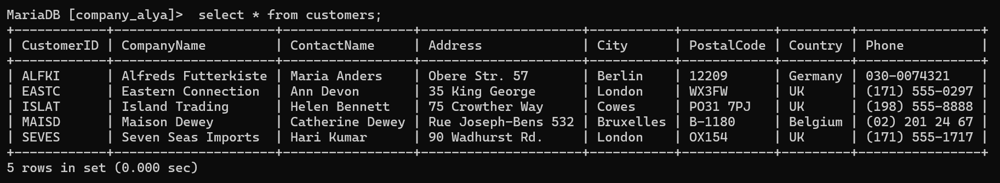
# Tabel 2 (Employees)
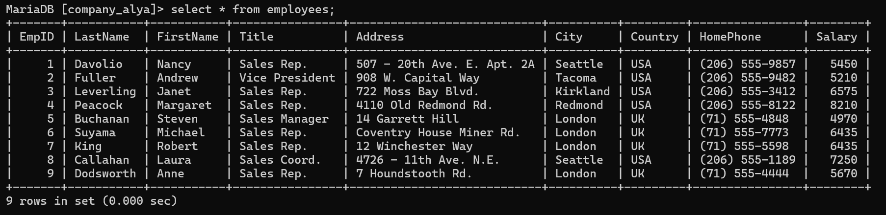

# Tabel 3 (Products)
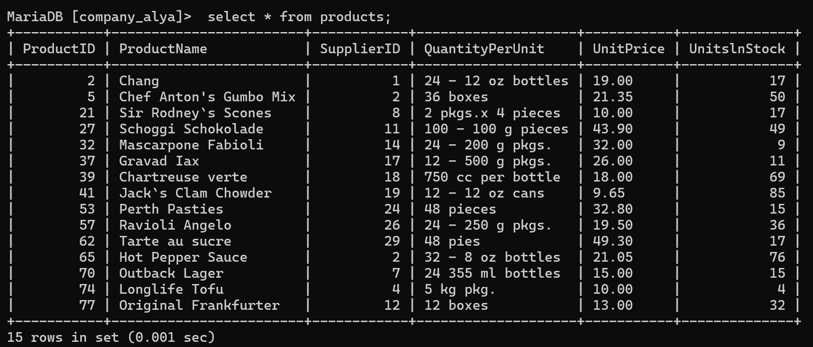

# Tabel 4 (Orders)
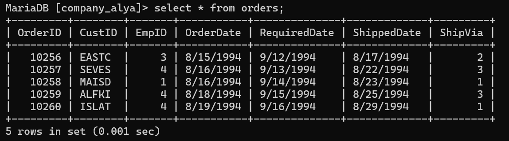

# Tabel 5 (OrderDetails)
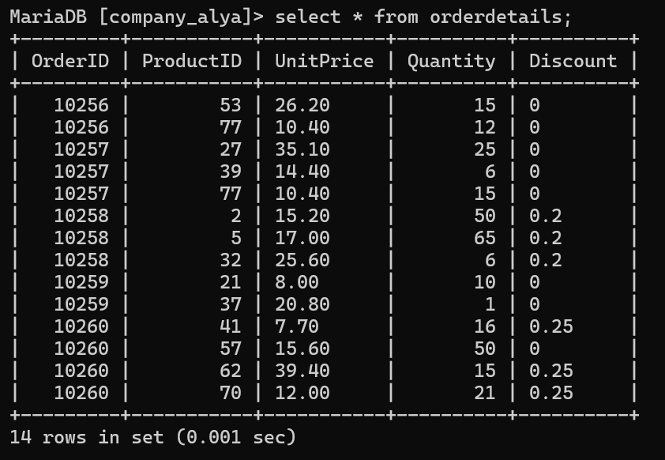

# Query 1
## Contoh Query
```sql
SELECT orders.OrderID, orders.OrderDate, orders.CustID,
    -> customers.CompanyName, customers.ContactName, customers.City,
    -> customers.Phone
    -> FROM orders, customers
    -> WHERE orders.CustID = customers.CustomerID;
```
## Hasil
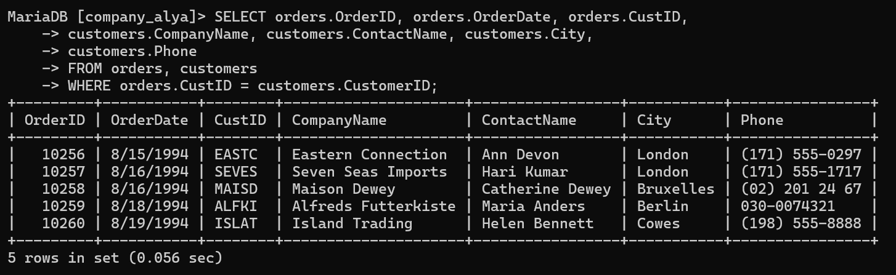

## Analisis
- orders.OrderID: Mengambil ID order dari tabel orders.
- orders.OrderDate: Mengambil tanggal order dari tabel orders.
- orders.CustID: Mengambil ID pelanggan dari tabel orders.
- customers.CompanyName: Mengambil nama perusahaan dari tabel customers.
- customers.ContactName: Mengambil nama kontak dari tabel customers.
- customers.City: Mengambil kota dari tabel customers.
- customers.Phone: Mengambil nomor telepon dari tabel customers.
- FROM orders, customers : Tabel yang digunakan dalam query adalah orders dan customers.
-  Kondisi yang digunakan untuk menghubungkan tabel orders dan customers adalah orders.CustID = customers.CustomerID. : Ini query hanya akan menampilkan data order yang memiliki hubungan dengan data pelanggan berdasarkan ID pelanggan.

# Query 2
## Contoh Query
```SQL
SELECT o.OrderID, o.OrderDate, o.CustID,
    -> c.CompanyName, c.ContactName, c.City,
    -> c.Phone
    -> FROM orders o,customers c
    -> WHERE o.CustID = c.CustomerID AND c.City = "London";
```
## Hasil
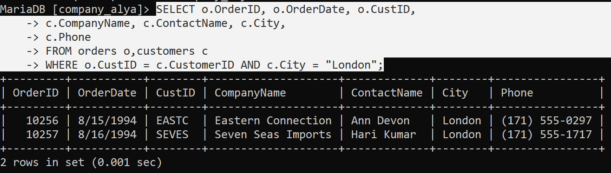

## Analisis
- o.OrderID: Mengambil ID order dari tabel orders.
- o.OrderDate: Mengambil tanggal order dari tabel orders.
- o.CustID: Mengambil ID pelanggan dari tabel orders.
- c.CompanyName: Mengambil nama perusahaan dari tabel customers.
- c.ContactName: Mengambil nama kontak dari tabel customers.
- c.City: Mengambil kota dari tabel customers.
- c.Phone: Mengambil nomor telepon dari tabel customers.
- FROM orders o, customers c : Tabel yang digunakan dalam query adalah orders dengan alias o dan customers dengan alias c.
- where o.CustID = c.CustomerID : Kondisi yang digunakan untuk menghubungkan tabel orders dan customers adalah o.CustID=c.CustomerID, yang berarti query hanya akan menampilkan data order yang memiliki hubungan dengan data pelanggan berdasarkan ID pelanggan.
- AND c.City = "London" : Kondisi tambahan yang digunakan adalah c.City="London", sehingga query hanya akan menampilkan data order yang terkait dengan pelanggan yang berasal dari kota London

# Query 3
## Contoh Query
```SQL
SELECT o.OrderID, o.OrderDate, c.CompanyName,
    -> c.ContactName, c.Phone, e.LastName, e.Title
    -> FROM orders o, customers c, employees e
    -> WHERE o.CustID = c.CustomerID AND o.EmpID = e.EmpID;
```
## Hasil
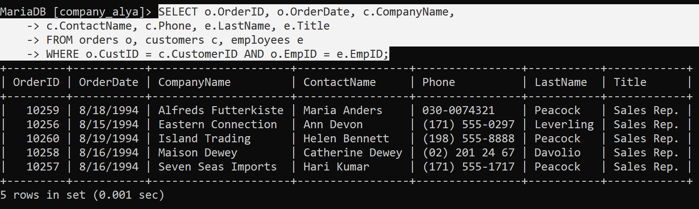
## Analisis
- o.OrderID: Mengambil ID order dari tabel orders.
- o.OrderDate: Mengambil tanggal order dari tabel orders.
- CompanyName: Mengambil nama perusahaan dari tabel customers.
- c.ContactName: Mengambil nama kontak dari tabel customers.
- c.Phone: Mengambil nomor telepon dari tabel customers.
- e.LastName: Mengambil nama belakang karyawan dari tabel employees.
- e.Title: Mengambil jabatan karyawan dari tabel employees.
- FROM orders o, customer c, employees e : Tabel yang digunakan dalam query adalah orders dengan alias o, customers dengan alias c, dan employees dengan alias e.
- Kondisi yang digunakan untuk menghubungkan tabel orders dan customers adalah o.CustID = c.CustomerID, yang berarti query hanya akan menampilkan data order yang memiliki hubungan dengan data pelanggan berdasarkan ID pelanggan.
- Kondisi tambahan yang digunakan adalah o.EmpID = e.Empid, yang berarti query juga akan menampilkan informasi karyawan yang terkait dengan order tersebut.
# Query 4
## Contoh Query
```SQL
SELECT o.OrderID, o.OrderDate, c.CompanyName,
    -> c.ContactName, c.Phone, e.LastName, e.Title
    -> FROM orders o, customers c, employees e
    -> WHERE o.CustID = c.CustomerID AND o.EmpID = e.EmpID AND
    -> e.FirstName = "Margaret";
```
## Hasil
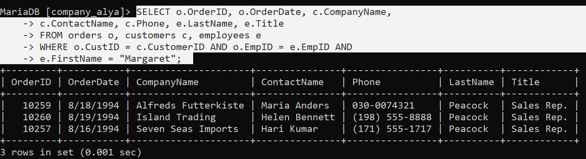
## Analisis
- Ini adalah sebuah query SQL yang menggunakan SELECT untuk mengambil data dari beberapa tabel: orders, customers, dan employees.
- Query ini menggunakan JOIN implisit (dengan WHERE) untuk menghubungkan tabel-tabel tersebut.
- orders: Tabel yang menyimpan informasi tentang order yang dibuat oleh pelanggan.
- customers: Tabel yang menyimpan informasi tentang pelanggan.
- employees: Tabel yang menyimpan informasi tentang karyawan.
- o.CustID = c.CustomerID: Menghubungkan tabel orders dengan customers berdasarkan ID pelanggan.
- o.EmpID = e.Empid: Menghubungkan tabel orders dengan employees berdasarkan ID karyawan.
- e.FirstName = "Margaret": Memfilter data hanya untuk karyawan dengan nama depan "Margaret".
# Query 5
## Contoh Query
```SQL
SELECT c.CustomerID, c.CompanyName, o.OrderID,
    -> o.OrderDate, od.ProductID, p.ProductName,
    -> od.Quantity AS Qty, od.UnitPrice
    -> FROM customers c, orders o, orderdetails od, products p
    -> WHERE c.CustomerID = o.CustID AND o.OrderID = od.OrderID
    -> AND p.ProductID = od.ProductID
    -> ORDER BY c.CustomerID;
```
## Hasil
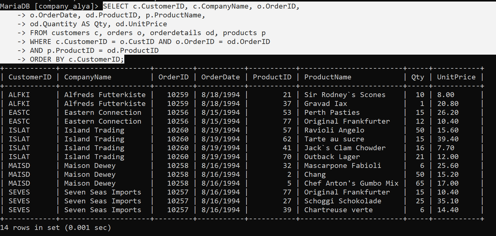
## Analisis
- Ini adalah sebuah query SQL yang menggunakan SELECT untuk mengambil data dari tabel orders, customers, dan employees.
- Query ini menggunakan JOIN implisit (dengan WHERE) untuk menghubungkan tabel-tabel tersebut.
- orders: Tabel yang menyimpan informasi tentang order yang dibuat oleh pelanggan.
- customers: Tabel yang menyimpan informasi tentang pelanggan.
- employees: Tabel yang menyimpan informasi tentang karyawan.
- o.CustID = c.CustomerID: Menghubungkan tabel orders dengan customers berdasarkan ID pelanggan.
- o.EmpID = e.EmpID: Menghubungkan tabel orders dengan employees berdasarkan ID karyawan.
- e.FirstName = "Margaret": Memfilter data hanya untuk karyawan dengan nama depan "Margaret".
# Query 6
## Contoh Query
```SQL
SELECT c.CustomerID, c.CompanyName, o.OrderID as OrdID,o.OrderDate,
    -> CONCAT(e.LastName,',',e.FirstName) AS EmployeeName, od.ProductID AS ProdID,
    -> P.ProductName, od.Quantity AS Qty
    -> FROM Customers c, Orders o, OrderDetails od, Products p, Employees e
    -> WHERE c.CustomerID = o.CustID AND o.OrderID = od.OrderID AND p.ProductID = od.ProductID AND e.EmpID = o.EmpID
    -> ORDER BY o.OrderID;
```
## Hasil
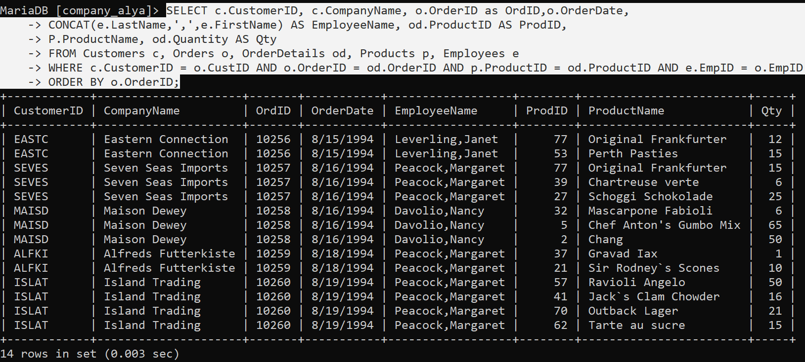
## Analisis
- Ini adalah sebuah query SQL yang menggunakan SELECT untuk mengambil data dari beberapa tabel: customers, orders, orderdetails, dan products.
- Query ini menggunakan JOIN implisit (dengan WHERE) untuk menghubungkan tabel-tabel tersebut.
- Hasil query disortir berdasarkan c.CustomerID menggunakan ORDER BY.
- customers: Tabel yang menyimpan informasi tentang pelanggan.
- orders: Tabel yang menyimpan informasi tentang order yang dibuat oleh pelanggan.
- orderdetails: Tabel yang menyimpan detail-detail order, seperti produk yang dibeli dan kuantitasnya.
- products: Tabel yang menyimpan informasi tentang produk.
- c.CustomerID = o.CustID: Menghubungkan tabel customers dengan orders berdasarkan ID pelanggan.
- o.OrderID = od.OrderID: Menghubungkan tabel orders dengan orderdetails berdasarkan ID order.
- p.ProductID = od.ProductID: Menghubungkan tabel products dengan orderdetails berdasarkan ID produk.
# Query 7
## Contoh Query
```SQL
CREATE VIEW CustOrderEmp
    -> AS
    -> SELECT c.CustomerID, c.CompanyName, c.ContactName,
    -> o.OrderID, o.OrderDate, e.EmpID, e.LastName, e.FirstName
    -> FROM Customers c, Orders o, Employees e
    -> WHERE c.CustomerID = o.CustID AND o.EmpID = e.EmpID;
```
## Hasil
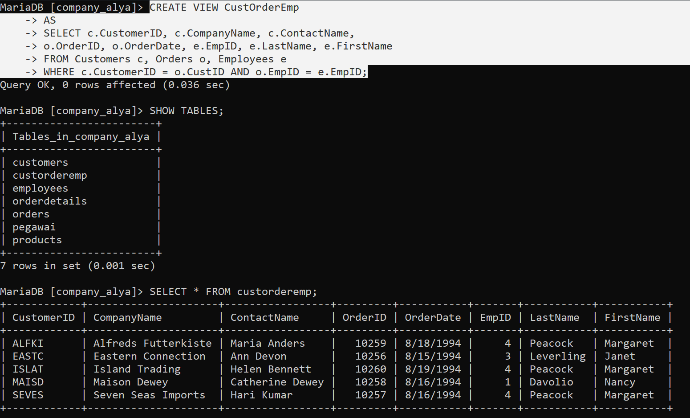
## Analisis
- Ini adalah sebuah query SQL yang menggunakan SELECT untuk mengambil data dari beberapa tabel: customers, orders, orderdetails, products, dan employees.
- Query ini menggunakan JOIN implisit (dengan WHERE) untuk menghubungkan tabel-tabel tersebut.
- Hasil query disortir berdasarkan o.OrderID menggunakan ORDER BY.
- customers: Tabel yang menyimpan informasi tentang pelanggan.
- orders: Tabel yang menyimpan informasi tentang order yang dibuat oleh pelanggan.
- orderdetails: Tabel yang menyimpan detail-detail order, seperti produk yang dibeli dan kuantitasnya.
- products: Tabel yang menyimpan informasi tentang produk.
- employees: Tabel yang menyimpan informasi tentang karyawan.
- c.CustomerID=o.CustID: Menghubungkan tabel customers dengan orders berdasarkan ID pelanggan.
- o.orderID: Seluruh order ID (tidak ada kondisi tambahan)
- p.ProductID=od.ProductID: Menghubungkan tabel products dengan orderdetails berdasarkan ID produk.
- e.EmpID=o.EmpID: Menghubungkan tabel employees dengan orders berdasarkan ID karyawan.

# Query 8
## Contoh Query
```SQL
CREATE VIEW odproducts
    -> AS
    -> SELECT od.OrderID, od.ProductID, p.ProductName,
    -> od.Quantity, od.UnitPrice
    -> FROM OrderDetails od, Products p
    -> WHERE p.ProductID = od.ProductID;
```
## Hasil
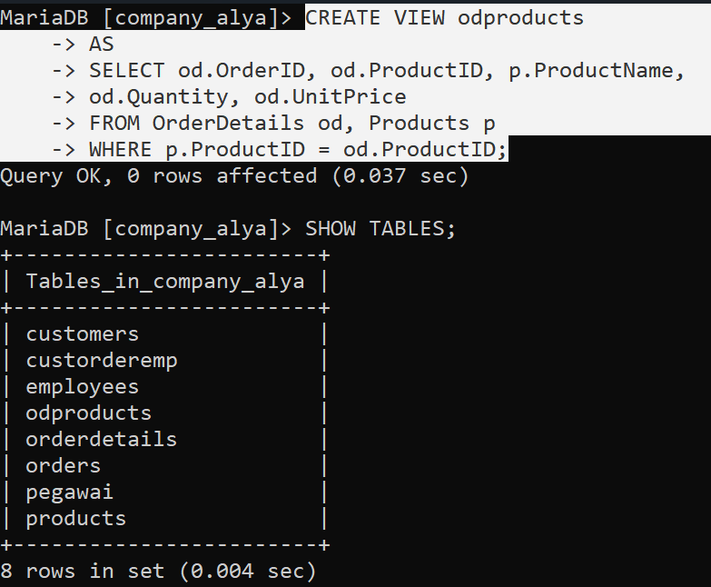

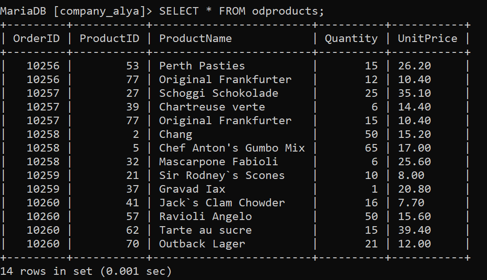
## Analisis
- Ini adalah sebuah query SQL yang menggunakan CREATE VIEW untuk membuat sebuah view bernama CustOrderEmp.
- Query ini mengambil data dari tabel customers, orders, dan employees.
- View ini menggabungkan informasi pelanggan, order, dan karyawan yang terkait
- customers: Tabel yang menyimpan informasi tentang pelanggan.
- orders: Tabel yang menyimpan informasi tentang order yang dibuat oleh pelanggan.
- employees: Tabel yang menyimpan informasi tentang karyawan.
- c.CustomerID = o.CustID: Menghubungkan tabel customers dengan orders berdasarkan ID pelanggan.
- o.EmpID = e.EmpID: Menghubungkan tabel orders dengan employees berdasarkan ID karyawan.
# Query 9
## Contoh Query
```SQL
SELECT c.CustomerID, c.CompanyName, o.OrderID, od.ProductID, ROUND(od.UnitPrice,2), od.Quantity,
    -> od.Discount, ROUND(((1-od.Discount)*od.UnitPrice*od.Quantity),2) AS Jumlah
    -> FROM Customers c, Orders o, OrderDetails od WHERE c.CustomerID = o.CustID AND o.OrderID = od.OrderID
    -> ORDER BY c.CustomerID;
```
## Hasil
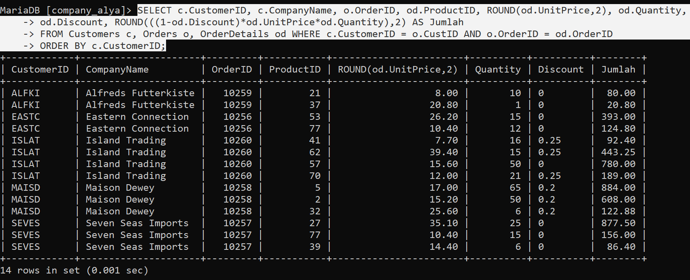
## Analisis
- Ini adalah sebuah query SQL yang menggunakan CREATE VIEW untuk membuat sebuah view bernama CustOrderEmp.
- Query ini mengambil data dari tabel customers, orders, dan employees.
- View ini menggabungkan informasi pelanggan, order, dan karyawan yang terkait.
- customers: Tabel yang menyimpan informasi tentang pelanggan.
- orders: Tabel yang menyimpan informasi tentang order yang dibuat oleh pelanggan.
- employees: Tabel yang menyimpan informasi tentang karyawan.
- c.CustomerID = o.CustID: Menghubungkan tabel customers dengan orders berdasarkan ID pelanggan.
- o.EmpID = e.EmpID: Menghubungkan tabel orders dengan employees berdasarkan ID karyawan.
# Query 10
## Contoh Query
```SQL
SELECT c.customerid, c.companyname, ROUND(SUM((1-od.discount)*od.unitprice*od.quantity),2) AS TotalJumlah
    -> FROM customers c, orders o, orderdetails od WHERE c.customerid=o.custid AND o.orderid=od.orderid
    -> GROUP BY c.customerid, c.companyname order by c.customerid;
```
## Hasil
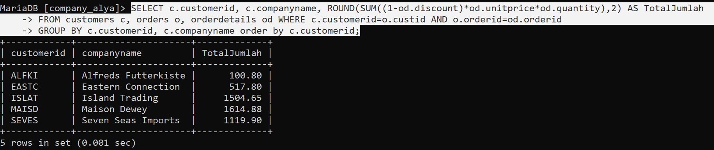
## Analisis
- Ini adalah sebuah query SQL yang mengambil data dari tabel customers, orders, dan orderdetails.
- Query ini menghitung total jumlah pembelian untuk setiap pelanggan dan menampilkannya dalam view yang diurutkan berdasarkan ID pelanggan.
- customers: Tabel yang menyimpan informasi tentang pelanggan.
- orders: Tabel yang menyimpan informasi tentang order yang dibuat oleh pelanggan.
- orderdetails: Tabel yang menyimpan detail dari setiap order.
- customers: Tabel yang menyimpan informasi tentang pelanggan.
- orders: Tabel yang menyimpan informasi tentang order yang dibuat oleh pelanggan.
- orderdetails: Tabel yang menyimpan detail dari setiap order.
- c.customerid=o.custid: Menghubungkan tabel customers dengan orders berdasarkan ID pelanggan.
- o.orderid=od.orderid: Menghubungkan tabel orders dengan orderdetails berdasarkan ID order.
- GROUP BY c.customerid, c.companyname: Mengelompokkan data berdasarkan ID pelanggan dan nama perusahaan pelanggan.
- SUM((1-od.discount)*od.unitprice*od.quantity): Menghitung total jumlah pembelian untuk setiap kelompok pelanggan.