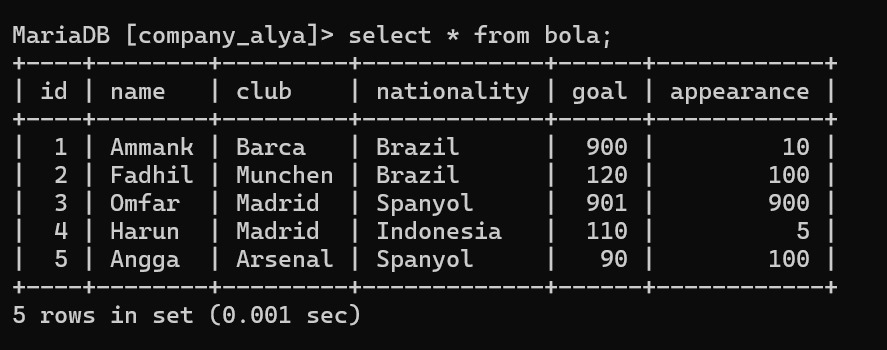
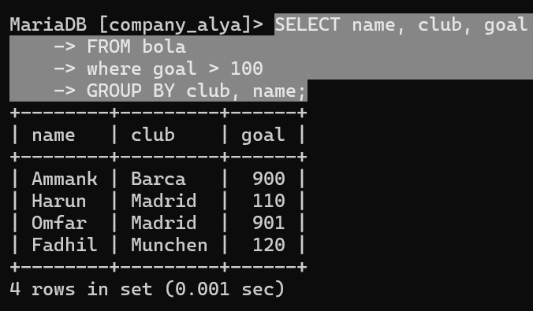
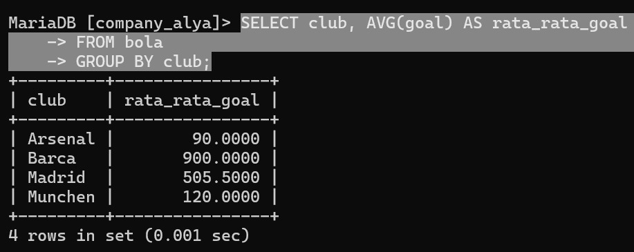
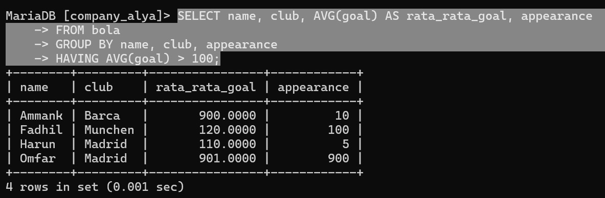

| No  | Nama                 | Skor Keaktifan | Peran                   |
| --- | -------------------- | -------------- | ----------------------- |
| 1   | Rezky Awalya         | 3              | Membuat Data Base       |
| 2   | A. Ashadelah M.A     | 3              | Cari Jawaban            |
| 3   | Fatsa Akhwani        | 3              | SAKIT BANTU DOA         |
| 4   | Nur Afni Ramadani    | 3              | Memberikan Hospot       |
| 5   | Nur Inayah Athaillah | 3              | Mengerjakan di Obsidian |
| 6   | Siti Nur Hasiza.A    | 3              | Cari Jawaban            |

**Diberikan sebuah soal yaitu:**
#  Soal 1
```MYSQL
(A/B/C) AVG (GAJI) > 10.000.000
```
**Manakah jawaban yang benar :**
A) WHERE 
B) HAVING
C) GROUP BY 

**Jawaban : B. HAVING**

***Penjelasan:***
* Klausa HAVING digunakan untuk memfilter hasil agregasi (seperti AVG, SUM, COUNT, dll.) setelah data dikelompokkan menggunakan GROUP BY. 
* Dalam kasus ini, kita ingin menampilkan grup (A, B, atau C) yang memiliki rata-rata gaji (AVG(gaji)) lebih besar dari 10.000. 
* Klausa WHERE digunakan untuk memfilter baris sebelum pengelompokan, sehingga tidak bisa digunakan untuk kondisi agregasi.

#  Soal 2
```MYSQL
(A/B/C) GAJI > 10.000.000
```
**Manakah jawaban yang benar :**
A) WHERE 
B) HAVING
C) GROUP BY 

**Jawaban : A. WHERE**

***Penjelasan:***
*  Klausa WHERE digunakan untuk memfilter baris individual berdasarkan kondisi tertentu.
*  Di sini, kita ingin menampilkan baris-baris di mana gaji lebih besar dari 10.000.000, tanpa melibatkan fungsi agregasi. 
*  Karena tidak ada agregasi, kita tidak perlu menggunakan GROUP BY atau HAVING.

# **Tabel Bola:**


# Soal 3
## Pemain dengan Goal > 100 dan kelompokkan berdasarkan kebangsaannya.

### Query 
```mysql
select name,club, goal
FROM bola
where goal > 100
GROUP BY club, name;
```

### Hasil



### Analisis
- **SELECT Clause**:
    - Kamu memilih kolom `name`, `club`, dan `goal`.
    - Data yang akan diambil adalah nama pemain, klub mereka, dan jumlah gol.
- **FROM Clause**:
    - Mengambil data dari tabel `bola`, yang seharusnya berisi informasi pemain bola, klub, dan jumlah gol.
- **WHERE Clause**:
    - Filter dilakukan sebelum pengelompokan, sehingga hanya data dengan `goal` (jumlah gol) lebih dari 100 yang akan diproses.
    - Artinya, hanya pemain yang mencetak lebih dari 100 gol yang akan dimasukkan dalam hasil.
- **GROUP BY Clause**:
    - Data akan dikelompokkan berdasarkan dua kolom: `club` dan `name`.
    - Karena kamu sudah memfilter data dengan kondisi `WHERE goal > 100`, setiap baris yang ditampilkan dalam hasil akan mewakili kombinasi unik antara pemain dan klub.
- **Penggunaan `GROUP BY`**:
    - Dalam query ini, semua kolom yang ada di `SELECT` juga ada di `GROUP BY`, yaitu `club` dan `name`.
    - Karena kolom `goal` tidak dihitung menggunakan fungsi agregat (seperti `SUM`, `AVG`, dll.), query ini akan berfungsi seperti semestinya jika setiap kombinasi `club` dan `name` adalah unik.
    - Jika terdapat beberapa baris dengan pemain yang sama dan klub yang sama, tetapi dengan nilai `goal` yang berbeda, akan muncul error atau perilaku tidak diinginkan.

# Soal 4
## Rata ratakan gol pemain dan kelompokkan berdasarkan clubnya

### Query
```mysql
SELECT club, AVG(goal) AS rata_rata_goal
FROM bola
GROUP BY club;
```

### Hasil


### Analisis
- **SELECT Clause**:
    - Kamu memilih kolom `club` dan melakukan perhitungan rata-rata (`AVG`) pada kolom `goal`
    - Hasilnya akan menampilkan `club` dan nilai rata-rata gol untuk setiap klub dengan alias `rata_rata_goal`.
- **FROM Clause**:
    - Data diambil dari tabel `bola`, yang seharusnya berisi informasi tentang klub dan gol yang dicetak pemain.
- **GROUP BY Clause**:
    - Data akan dikelompokkan berdasarkan kolom `club`.
    - Ini berarti semua data pemain dalam satu klub akan dikelompokkan bersama, dan rata-rata jumlah gol (`AVG(goal)`) dihitung untuk masing-masing klub.
- **AVG(goal)**:
    - Fungsi agregat `AVG()` menghitung rata-rata nilai gol untuk setiap klub yang dikelompokkan dalam query.
    - Jika ada beberapa pemain di klub yang sama, jumlah gol mereka akan dijumlahkan terlebih dahulu, kemudian dibagi dengan jumlah pemain di klub tersebut untuk mendapatkan nilai rata-rata.

# Soal 5
## Pemain dengan goal rata rata > 100  dan total tampil < 200 kelompokkan berdasarkan clubnya 

### Query
```mysql
 SELECT name, club, AVG(goal) AS rata_rata_goal, appearance
 FROM bola
 GROUP BY name, club, appearance
 HAVING AVG(goal) > 100;
```
### Hasil


### Analisis
- **SELECT Clause**:
    - Kamu memilih kolom `name` (nama pemain), `club` (klub pemain), dan `appearance` (penampilan), serta menghitung rata-rata `goal` menggunakan `AVG(goal)`. Hasilnya akan ditampilkan dengan alias `rata_rata_goal`.
- **FROM Clause**:
    - Data diambil dari tabel `bola`, yang seharusnya berisi informasi pemain bola, klub, jumlah gol, dan penampilan mereka.
- **GROUP BY Clause**:
    - Data dikelompokkan berdasarkan kombinasi dari `name`, `club`, dan `appearance`.
    - Ini berarti setiap kombinasi unik dari nama pemain, klub, dan jumlah penampilan akan menjadi satu grup.
- **AVG(goal)**:
    - Fungsi agregat `AVG(goal)` menghitung rata-rata gol dalam setiap grup yang ditentukan oleh `GROUP BY`.
- **HAVING Clause**:
    - Kondisi `HAVING` digunakan untuk memfilter grup yang memenuhi syarat setelah agregasi. Dalam hal ini, hanya grup yang memiliki rata-rata gol (`AVG(goal)`) lebih dari 100 yang akan ditampilkan.
    - Berbeda dengan `WHERE`, `HAVING` bekerja setelah `GROUP BY`, jadi digunakan untuk memfilter hasil yang telah dihitung menggunakan fungsi agregat.