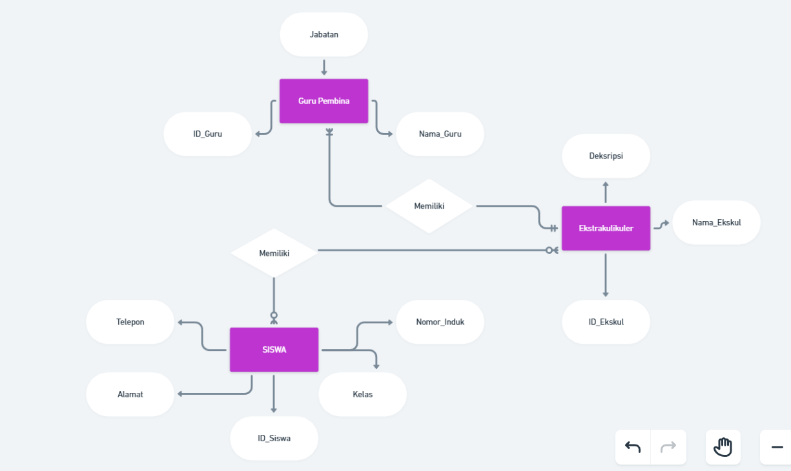

___

| No  | Nama                 | Skor Keaktifan | Peran                    |
| --- | -------------------- | -------------- | ------------------------ |
| 1   | Rezky Awalya         | 3              | Menjelaskan kardinalitas |
| 2   | A. Ashadelah M.A     | 3              | Bantu doa                |
| 3   | Fatsa Akhwani        | 3              | Membantu berpikir        |
| 4   | Nur Afni Ramadani    | 3              | Membantu Hotspot         |
| 5   | Nur Inayah Athaillah | 3              | Membantu Mengerjakan ERD |
| 6   | Siti Nur Hasiza.A    | 3              | Memberi saran            |

# ERD

## Ekskul - to - Siswa
mengapa kardinalitasnya menggunakan `N - to - N`? karena satu atau banyak siswa bisa memasuki satu atau banyak ekstakulikuler, begitupun sebaliknya satu atau banyak ekstrakulikuler bisa di masuki satu atau banyak siswa.

## Ekskul - to - Guru Pembina
mengapa kardinalitasnya menggunakan `1 - to - N`? karena satu atau banyak guru pembina hanya bisa membina pada satu ekstrakulikuler, tetapi satu ekstrakulikuler bisa di bina oleh satu atau banyak guru pembina.