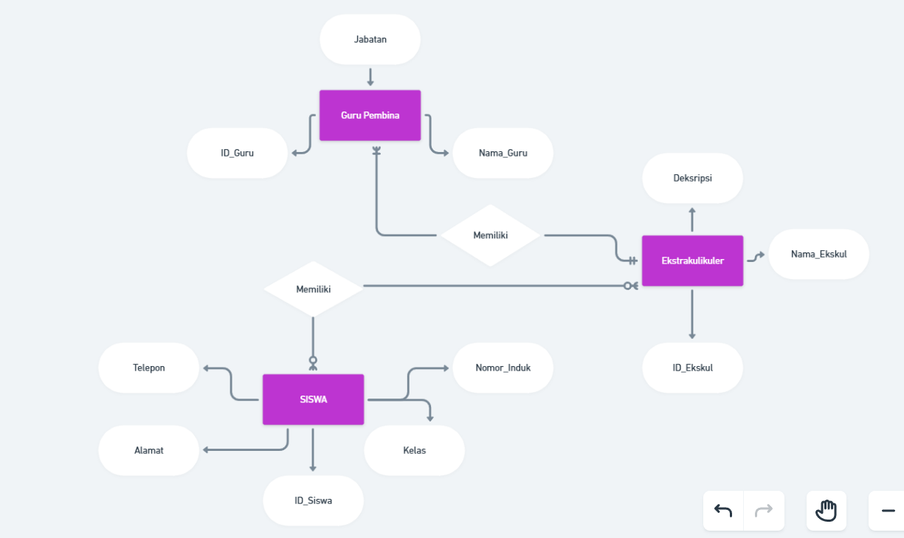

# ERD

## Ekskul - to - Siswa
mengapa kardinalitasnya menggunakan `N - to - N`? karena satu atau banyak siswa bisa memasuki satu atau banyak ekstakulikuler, begitupun sebaliknya satu atau banyak ekstrakulikuler bisa di masuki satu atau banyak siswa.

## Ekskul - to - Guru Pembina
mengapa kardinalitasnya menggunakan `1 - to - N`? karena satu atau banyak guru pembina hanya bisa membina pada satu ekstrakulikuler, tetapi satu ekstrakulikuler bisa di bina oleh satu atau banyak guru pembina.