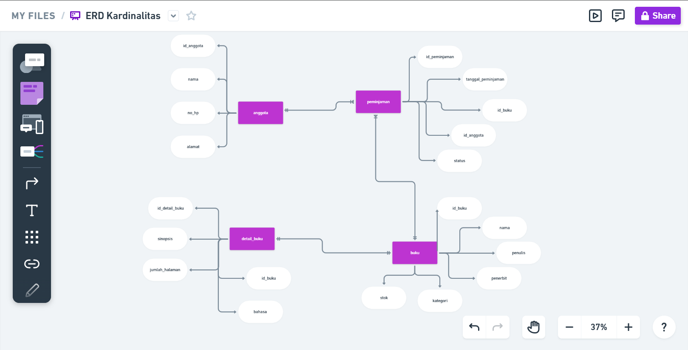
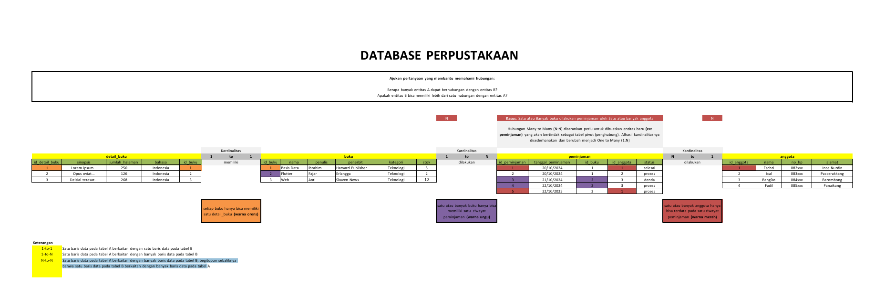
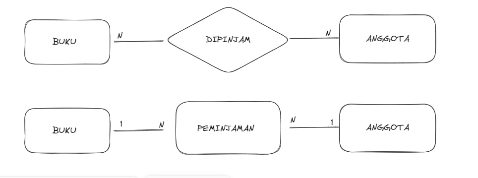

# Penjelasan Kardinalitas
## 1 - to - 1
Satu baris data pada tabel A berkaitan dengan satu baris data pada tabel B
## 1 - to - N
Satu baris data pada tabel A berkaitan dengan banyak baris data pada tabel B
## N - to - N
Satu baris data pada tabel A berkaitan dengan banyak baris data pada tabel B, begitupun sebaliknya bahwa satu baris data pada tabel B berkaitan dengan banyak baris data pada tabel A
# ERD

# Contoh Tabel

# Deskripsi Relasi
## deskripsi 1 - to - 1
Mengapa di sebut `one-to-one`, karena `id_buku` hanya bisa menginput satu id pada entitas `detail_buku` yaitu atribut `id_detail_buku`.
## deskripsi 1 - to - N
Jadi entitas `buku` dan entitas `peminjaman` menggunakan kardinalitas `one_to_many`,karena satu orang peminjam dapat meminjam buku lebih dari dari satu kali. 
## deskripsi N - to - N

kenapa menggunakan kardinalitas `many-to-many`, karena entitas buku dapat dipinjam berulang kali oleh banyak anggota begitupun sebaliknya satu atau lebih anggota dapat meminjam berulang kali banyak buku.
